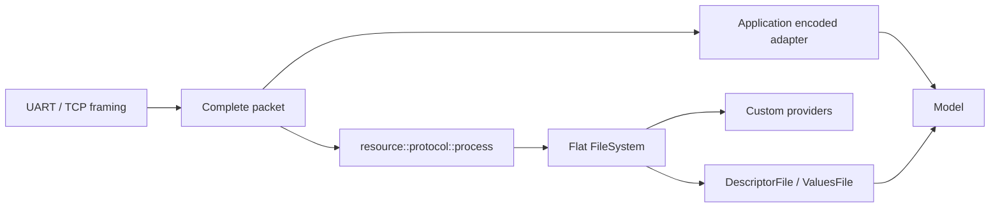

# Telemetry

[](https://github.com/shpegun60/telemetry/actions/workflows/ci.yml)
[](lib/telemetry/README.md)
[](LICENSE)

**Native C++20 телеметрія для мікроконтролерів:** прив'яжіть звичайний getter,
setter або метод класу; типи, wire codec і спільний реєстр формуються автоматично.
Field, Command і Service мають одну модель декларації: **назва + binding**.
Немає генератора коду, virtual base class або динамічного виділення пам'яті
в library core. Qt потрібен лише для демонстраційної програми.

**[Посібник користувача](doc/user/README.md)** ·
[Перша інтеграція](doc/user/GettingStarted.md) ·
[Native API](doc/user/NativeApi.md) ·
[Транспорт і файли](doc/user/TransportAndResources.md) ·
[Приклади](examples/user_guide/README.md) ·
[Перевірки](tests/README.md)

Швидко згадати виклики: [API шпаргалка](doc/user/API-CHEATSHEET.md).

## Як організувати свій протокол

**[Готовий приклад власного протоколу для UART/TCP](examples/device_integration/README.md)**
показує весь шлях: chunks → повний frame → операція → відповідь. У
[Api.cpp](examples/device_integration/Api.cpp) є обробник і збирач потоку, у
[Api.hpp](examples/device_integration/Api.hpp) — коди операцій та runtime facade.
Один маршрут читає/записує Fields і викликає Commands/Services **без файлів**;
інший передає файлові LIST/STAT/READ/WRITE у `resource::protocol::process()`.
Приклад можна зібрати й запустити на host без Qt та пристрою.

[Транспортний посібник](doc/user/TransportWalkthrough.md) пояснює таблиці
операцій, значення статусів, формати пакетів і приклади байтів. Framing цього
прикладу можна замінити своїм; telemetry core від нього не залежить.

## Як пройти першу інтеграцію

1. [Зібрати першу програму](doc/user/GettingStarted.md): залежності, include
   paths, compiled sources, власний клас, таблиці й перші native виклики.
2. [Підключити до свого застосунку](doc/user/ApplicationIntegration.md):
   business validation, status, всі форми binding, slots, snapshots і tasks.
3. [Провести дані через transport](doc/user/TransportWalkthrough.md): UART/TCP
   chunks → complete frame → telemetry або files → reply, у готовому прикладі.
4. [Зібрати multi-file device example](examples/device_integration/README.md):
   `Device.cpp`, приховані каталоги у `Api.cpp`, bounded receiver і host feeder.
5. Якщо щось не працює — [питання та діагностика](doc/user/Troubleshooting.md).

Ці розділи читаються послідовно. [Native API](doc/user/NativeApi.md) і
[Транспорт і ресурси](doc/user/TransportAndResources.md) лишаються довідниками
точних signatures та contracts, до яких можна звернутися за конкретним питанням.

## Почати з готової програми

[QuickStart.cpp](examples/user_guide/QuickStart.cpp) — повна програма без Qt і
приладу. Вона оголошує всі три сімейства, збирає Model і викликає native API.
Межа напруги нижче є бізнес-логікою `Device`, а не metadata бібліотеки.

<!-- quickstart:begin -->
```cpp
#include <telemetry/Telemetry.hpp>
#include <cassert>
#include <cmath>
#include <limits>

namespace ts = telemetry;

struct Config { float voltage; bool enabled; };
struct Snapshot { float voltage; bool enabled; };
struct Device
{
    Config state{230.0f, true};
    Config read() const noexcept { return state; }
    ts::WriteResult write(const Config& next) noexcept
    {
        if (!std::isfinite(next.voltage) || next.voltage < 0.0f || next.voltage > 300.0f)
            return ts::WriteResult::InvalidValue;
        state = next;
        return ts::WriteResult::Applied;
    }
    ts::CommandResult reset() noexcept
    {
        state = {230.0f, true};
        return ts::CommandResult::Executed;
    }
    Snapshot sample() const noexcept { return {state.voltage, state.enabled}; }
};

inline Device device;
inline constexpr ts::FieldTable localFields{
    ts::field<&Device::read, &Device::write>("Config", device)};
inline constexpr ts::CommandTable localCommands{
    ts::command<&Device::reset>("Reset", device)};
inline constexpr ts::ServiceTable localServices{
    ts::service<&Device::sample>("Sample", device)};
inline constexpr ts::FieldCatalogTable fields{ts::group("device", localFields)};
inline constexpr ts::CommandCatalogTable commands{ts::group("device", localCommands)};
inline constexpr ts::ServiceCatalogTable services{ts::group("device", localServices)};
inline constexpr ts::Model model{fields, commands, services};

int main()
{
    assert(localFields.write<0>(Config{240.0f, true}) == ts::WriteResult::Applied);
    const auto value = fields.read<ts::makeId<0, 0>()>();
    assert(value && value->voltage == 240.0f);
    assert(localFields.write<0>(Config{std::numeric_limits<float>::quiet_NaN(), false})
           == ts::WriteResult::InvalidValue);
    const auto unchanged = localFields.read<0>();
    assert(unchanged && unchanged->voltage == 240.0f && unchanged->enabled);
    const auto response = services.call<ts::makeId<0, 0>()>();
    assert(response.hasValue() && response.value().voltage == 240.0f);
    assert(localCommands.call<0>() == ts::CommandResult::Executed);
}
```
<!-- quickstart:end -->

Зберігайте objects і names довше за таблиці. Callback має бути `noexcept`.
Для struct/array values використовуйте звичайні вирівняні DTO: codec передає
members у canonical little-endian формі, не C++ padding або raw memory layout.

## Який API вибрати

| Що відомо у цьому місці | Приклад | Результат / поведінка |
| --- | --- | --- |
| Локальна позиція compile-time | `localFields.read<0>()`, `write<0>(value)` | Exact native type; concrete callback |
| Глобальний ID compile-time | `fields.read<ts::makeId<0, 0>()>()` | Compile-time routing у локальну таблицю |
| ID runtime, потрібен конкретний C++ тип | `fields.readAs<Config>(id)`, `writeAs(id, value)` | Exact structural type або checked numeric conversion |
| Runtime ID з native definition | `fields.visit(id, visitor)` | Typed visitor; перевірка вибраної definition |
| Команда/сервіс compile-time | `commands.call<id>(request)`, `services.call<id>(request)` | Native request/result, без wire encoding |
| ID + bytes отримані з транспорту | `index.readEncoded(...)`, `writeEncoded(...)`, `executeEncoded(...)`, `callEncoded(...)` | Checked canonical decode/callback/encode |
| Обхід concrete definitions | `table.forEach(visitor)`, `catalogs.forEach(visitor)` | Тип callback лишається відомим; getter сам не викликається |
| Обхід erased entries | `for (const auto& entry : table)` | Descriptor metadata без автоматичного виконання |
| Обхід файлів | `for (auto file : fs)` | Lazy `FileView`: `index()`, `path()`, explicit operations |

Глобальний ID — u32 з 16-бітними позиціями catalog/entry. Runtime lookup —
перевірка меж і пряме індексування масивів. Compile-time локальний/глобальний
шлях зберігає конкретну функцію; однаковість із прямим викликом перевіряється
ARM codegen gates для визначених fixtures, а не обіцяється для кожного compiler.

## Типи й прив'язки

- **Field:** getter повертає число, bool, enum, `std::array` або aggregate `T`;
  можливий `const T&`. Setter приймає той самий `T` або `const T&` і повертає
  `WriteResult`.
- **Command:** нуль аргументів або один aggregate Request, результат
  `CommandResult`.
- **Service:** нуль аргументів або один aggregate Request; aggregate Response
  за значенням/`const Response&`, `ServiceResult<Response>`,
  `BorrowedServiceResult<Response>` або void response.
- **Bindings:** free functions, member functions, callable objects, lambdas;
  [п'ять slots](lib/telemetry/slot/README.md) для пізнього вибору object/function.

`const T&` output не копіює payload: application гарантує його lifetime і
стабільність до завершення synchronous encode. `readAs<T>` навмисно повертає
owning copy. Raw pointer і mutable-reference outputs не є payload contract.
Читайте [borrowed outputs](doc/BorrowedNativeValues.md).

Units, limits, defaults, persistence й semantic metadata не входять у поточний
API. Валідація прикладних значень належить callback; structural validation —
codec. Перелік типів, enum dictionaries і callback forms докладно наведений у
[Native API](doc/user/NativeApi.md).

## Файли або прямий доступ — обидва варіанти

`resource` — незалежний flat filesystem. Оголосіть stable provider і додайте
`resource::file("/settings.bin", provider)` до `resource::filesystem(...)`.
Шлях є плоскою назвою: directories, storage або serializer не створюються
автоматично. `BytesFile` надає bytes зі stable array/span; власний provider
реалізує `size()` і `read()` та/або `write()`.



Для файлових packets:

```cpp
#include <resource/protocol/Protocol.hpp>
// request/response — spans повного packet та output storage.
auto result = resource::protocol::process(device::resources::files(), request, response);
// Надіслати response.first(result.written), перевіривши result.
```

`device::resources::files()` — **facade застосунку**, не global library function.
Повний приклад власного table/provider/process є в
[Resources.cpp](examples/user_guide/Resources.cpp). Для прямого керування
телеметрією **без файлів** є [Encoded.cpp](examples/user_guide/Encoded.cpp).
Файловий protocol робить LIST/STAT/READ/WRITE; запис Field або виклик
Command/Service виконує encoded Model adapter. Descriptor/Values providers
саме read-only.

TCP/UART chunks спочатку збираються вашим framing layer у повний packet.
Операції synchronous; retries, connection state і coherent snapshots належать
застосунку. Необов'язковий [Bind/Exchange приклад](examples/structured_protocol/README.md)
показує bounded connection agreement без fingerprint у кожному data packet.

## Пам'ять і build integration

Immutable metadata може лежати у Flash, application/slot state — у RAM.
Encoded local storage budget типово **32 B**
(`TELEMETRY_STRUCTURED_LOCAL_BYTES`). Вибір storage відбувається при компіляції;
більші об'єкти використовують caller-owned `Workspace`. Service враховує
Request + actual result object разом. Budget змінює storage, не wire format
чи validation. Для native owning return великого об'єкта враховуйте stack
застосунку; borrowed outputs уникають result copy.

Для qmake:

```qmake
include(path/to/lib/telemetry/telemetry.pri)
# Необов'язкові telemetry file providers:
CONFIG += resource_telemetry
include(path/to/lib/resource/resource.pri)
```

Для іншого build system додайте include paths і compiled sources з
[telemetry README](lib/telemetry/README.md). Generic resource headers не
залежать від telemetry/PFR/Qt; packet processor компілюється окремо.
`Resource.hpp` не підключає packet protocol або telemetry adapter автоматично.

Qt playground: відкрийте [telemetry.pro](telemetry.pro) встановленим Qt 6
MinGW kit. Він використовує симульовані дані; до приладу не підключається.
Про known clangd issue і перевірений editor executable читайте
[editor checks](tests/editor/README.md).

## Перевірки та вимірювання

```sh
python tests/docs/run.py --cxx g++ --build-dir /tmp/telemetry-docs
python tests/run_checks.py --build-dir /tmp/telemetry-checks
python tests/resources/run.py --build-dir /tmp/telemetry-resources
```

[CI](https://github.com/shpegun60/telemetry/actions/workflows/ci.yml) перевіряє
GCC/Clang C++20, санітайзери, null-check mode, ARM compile/link/codegen/stack,
Qt consumers, API/wire freeze і compile/run приклади. Badge показує published
branch; локальні незапушені зміни мають окремі результати.
[Індекс тестів](tests/README.md) описує точні runners. ARM `.su` frame або
objdump не є виміром cycles/live stack: [H7S qualification](tests/structured/mcu/h7s/README.md)
і [збережені receipts](tests/resources/evidence/README.md) пояснюють source identity
та межі апаратних доказів.

## Структура й ліцензія

| Папка | Призначення |
| --- | --- |
| `lib/telemetry` | Єдиний public namespace `telemetry`: reflection, types, codec, endpoint tables, Model |
| `lib/resource` | Flat files, `resource::protocol`, optional `telemetry/v3` providers |
| `web` | Strict descriptor/value codec для JavaScript |
| `examples` | Native, resource, protocol та Qt/browser clients |
| `doc/user` | Актуальний посібник користувача |
| `tests` | Підтримувані checks та evidence |
| `app` | Qt playground |

Власний код — [MIT](LICENSE). Included dependencies мають свої незмінені
ліцензії: [Boost.PFR](lib/boost_pfr/VERSION.md) — BSL-1.0,
[magic_enum](lib/magic_enum/README.md) і [delegate](lib/delegate/README.md) — MIT.
[Індекс документів](doc/README.md) відділяє user guide від історичних review,
планів і [міграції](doc/StructuredTelemetryV3MigrationGuide.md).
Поточний API не має compatibility adapter для старого Scalar/v2.1.
