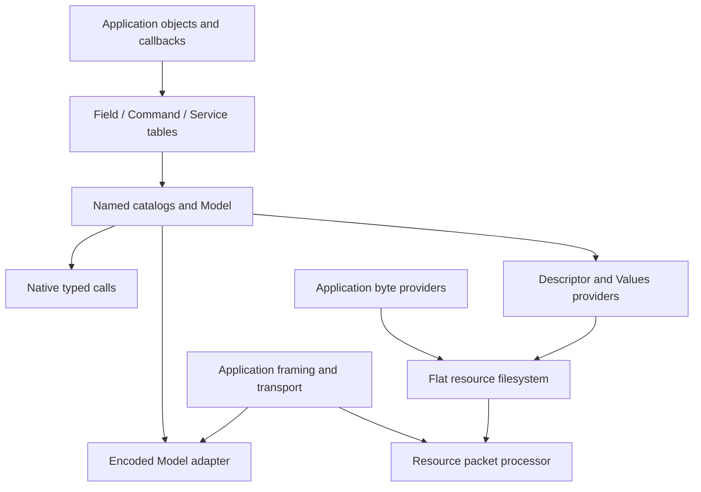

# Архітектура поточного Telemetry v3

Автори: Ruslan Kovtun (shpegun60), codexAi. SPDX-License-Identifier: MIT.

[Індекс](README.md) · [Посібник](user/README.md) · [API](../lib/telemetry/README.md) ·
[Wire v3.0](WireV3.md) · [Перевірки](../tests/README.md)

Це карта чинної реалізації: один C++20 модуль `telemetry`, native
Field/Command/Service та формат descriptor/values v3.0. Приклади, команди
збирання й порядок першого підключення — у [посібнику](user/README.md).

## Навігація

- [Межі модулів](#межі-модулів)
- [Від callback до Model](#від-callback-до-model)
- [Типи, reflection та identity](#типи-reflection-та-identity)
- [Native та encoded виклики](#native-та-encoded-виклики)
- [Пам'ять і lifetime](#память-і-lifetime)
- [Descriptor and Values](#descriptor-and-values)
- [Що додає застосунок](#що-додає-застосунок)
- [Де шукати підтвердження](#де-шукати-підтвердження)

## Межі модулів

| Модуль | Його відповідальність | Вхідний документ |
| --- | --- | --- |
| `lib/telemetry` | Typed declarations, reflection, type registry, canonical codec, native/encoded доступ і slots | [Telemetry](../lib/telemetry/README.md) |
| `lib/resource` | Плоскі імена файлів, providers, opaque cursors та lazy file views | [Resource](../lib/resource/README.md) |
| `lib/resource/protocol` | Обробка одного повного LIST/STAT/READ/WRITE packet | [Resource packets](../lib/resource/protocol/README.md) |
| `lib/resource/telemetry/v3` | Read-only descriptor та live Values providers для Model | [V3 providers](../lib/resource/telemetry/v3/README.md) |
| `examples/structured_protocol` | Приклад transport-owned Bind/Exchange, connection agreement і request correlation | [Optional protocol](../examples/structured_protocol/README.md) |
| `web/telemetry.js` | Structural descriptor/values parser, native payload codec для JS | [Client](../tests/structured/client/README.md) |

Generic resource не залежить від telemetry або reflection бібліотек.
Його filesystem працює з довільними byte providers. `resource_telemetry`
явно додає v3 providers; telemetry manifest підключається окремо.
Bind/Exchange також підключається явно й не є частиною library manifests.

## Від callback до Model

1. Застосунок оголошує звичайні C++ objects, DTO та `noexcept` callbacks.
2. `field`, `command`, `service` приймають **name + binding** і виводять
   native типи з callback signatures.
3. Local tables зберігають definitions у порядку оголошення. Named catalogs
   групують таблиці; один `Model` збирає всі три категорії.
4. Model формує один реєстр типів, досяжних через Field values, Command
   Requests і Service Requests/Responses та їхніх members/elements.
5. Consumer обирає native виклик, encoded доступ або resource provider.

| Endpoint | Request | Native output |
| --- | --- | --- |
| Field | Getter без аргументів; optional setter exact `T` або `const T&` | Owning `optional<T>` або `BorrowedValue<T>`; setter — `WriteResult` |
| Command | Немає або один aggregate Request | `CommandResult` |
| Service | Немає або один aggregate Request | Owning `ServiceResult<Response>`, borrowed `BorrowedServiceResult<Response>` або void result |

Callback визначає owning/borrowed форму. Повернення `const T&` не додає
новий wire type: canonical payload лишається `T`.
Валідація прикладних значень виконується callback. Units, limits значень,
defaults, persistence та UI labels не входять у endpoint declaration чи
структурний descriptor.

## Типи, reflection та identity

Підтримані bool, повноширинні integer 1/2/4/8 B, IEEE float/double,
scoped enum, `std::array` і звичайні підтримані aggregate structs.
Request/Response може бути void. Повні правила та відмови наведені у
[Native API](user/NativeApi.md#2-native-тип-і-wire-тип).

Library reflection facade використовує pinned Boost.PFR і magic_enum та
callable traits. Registry, codec, Model і descriptor використовують цей
facade. Підключення C++26 reflection для MCU не потрібне. Точний словник
enum можна оголосити явно; його наявність не замінює callback validation.

Повторний exact C++ тип має одну TypeId у реєстрі. Дві різні структури з
однаковими members не стають взаємозамінними native types. Numeric
`readAs`/`writeAs` явно дозволяє checked conversion; structural access
потребує exact type.

Local Position — індекс definition у таблиці. Global PackedId — u32:
старші 16 bits вибирають group, молодші 16 — entry. Field, Command і Service
мають окремі ID spaces. Endpoint type/category треба знати разом з ID.
Runtime routing перевіряє межі до narrowing й використовує прямі індекси.
Для зовнішніх wide/signed компонентів використовуйте `tryMakeId`.

## Native та encoded виклики

Чотири рівні доступу мають різні задачі:

| Рівень | API | Consumer |
| --- | --- | --- |
| Compile-time exact | `read<Id>`, `write<Id>`, `call<Id>` | Код застосунку з відомим endpoint |
| Typed traversal | `forEach` | Обхід concrete definitions зі збереженими типами |
| Runtime typed | `visit(id, visitor)`, Field `readAs`/`writeAs` | Runtime вибір із typed branch |
| Runtime bytes | `readFieldEncoded`, `writeFieldEncoded`, `executeCommandEncoded`, `callServiceEncoded` | Transport/backend з ID та payload bytes |

`get`, traversal і range-for самі не викликають endpoint. Native calls
працюють без resource files, transport state чи Workspace для encoded DTO.
Encoded adapter декодує exact canonical payload, перевіряє ID, capability,
output/scratch capacity і виконує callback після відповідних перевірок.

Encoded result розділяє dispatch status, application endpoint status та
committed byte count. Dispatch `Ok` не означає, що setter прийняв значення
або Command виконана. Надсилайте тільки committed `written` bytes.
[API шпаргалка](user/API-CHEATSHEET.md) та [Encoded.cpp](../examples/user_guide/Encoded.cpp)
показують конкретні виклики.

## Пам'ять і lifetime

Names, owners, callable lvalues, slots, tables, catalogs та views позичені.
Їхній backing storage живе до завершення всіх операцій consumers. Побудуйте
об'єкти в порядку owner → bindings/tables → catalogs/Model → providers →
transport. Nonmoving tables й стабільні адреси — частина контракту.

Owning result містить копію; borrowed result містить const view. Застосунок
тримає referent живим і стабільним протягом усього використання, зокрема
encode. Lock лише всередині getter не захищає reference після його return.
`readAs<T>` завжди створює owning copy. Деталі — у
[borrowed contract](BorrowedNativeValues.md#lifetime-and-synchronization).

Encoded default local payload-object budget — 32 B. Великі owning objects
використовують caller-owned Workspace; borrowed output не потребує owning
response copy. `model.maxScratch()` обмежує scratch для однієї серіалізованої
операції, `model.maxFieldScratch()` — для Field access. Це не розмір packet
і не bound усього task stack. Workspace leases мають LIFO lifetime;
concurrent operations потребують окремого Workspace або зовнішнього lock.

In-memory structured ABI revision — 6; це окремо від wire 3.0. Усі translation
units використовують однакову storage configuration. Compiled adapter/ABI
symbols перевіряють exact view layout на межі модулів. Збирайте consumer
і library sources разом; [build steps](user/GettingStarted.md#крок-2-підключіть-source-та-include-paths)
вказують потрібні include paths і `.cpp` files.

## Descriptor and Values

[Wire v3.0](WireV3.md) визначає всі headers, records, коди та порядки bytes.
Descriptor — immutable model structure; його створення/read/hash не читає
getter. FNV-1a-64 fingerprint пов'язує descriptor і Values, включає metadata
та shape, не включає поточні values, pointers чи slot state.

Values містить Field values у descriptor order. Кожний token має status
і цілий canonical payload; provider не розрізає token між READ calls.
Owning getter дає value copy, borrowed getter — stable reference на час
encode. Окремі tokens не гарантують coherent snapshot усього файла.
Потрібна transport READ capacity щонайменше `values.maxTokenSize()`.

DescriptorFile і ValuesFile read-only. Для зміни Field використовуйте
native/encoded write; custom writable provider реалізує власний file format.
Cursor generic resource — opaque u64; правила byte offsets descriptor та
допустимих Values token boundaries належать саме цим providers.

## Що додає застосунок

Transport збирає complete frame зі stream chunks, обмежує buffers,
корелює reply, визначає retries/reconnects і виконує delivery.
Core не володіє connection, peer, Ready або requestId. Повторна передача
Command у processor може повторити callback: deduplication та правила
повторів належать застосунку.

Застосунок також забезпечує synchronized device access, coherent snapshots,
прикладну валідацію, persistent storage й UI semantics.
[Application integration](user/ApplicationIntegration.md) та
[transport walkthrough](user/TransportWalkthrough.md) проходять ці межі
на повних прикладах.

## Де шукати підтвердження

[Test index](../tests/README.md) маршрутизує до підтримуваних runners.
[Freeze contract](../tests/structured/freeze/contract.json) фіксує wire constants,
goldens, 11 default technical ceilings, ABI revision та dependency pins.
Host execution, sanitizer findings, ARM compile/link/disassembly, individual
stack frames та H7S runtime measurements мають різні межі доказів.

[Evidence index](README.md#перевірки-та-вимірювання) відокремлює current-input
receipts від попередніх checkpoints. Dated qualification report описує
власні source identities; status нового commit перевіряють за exact SHA.
Порядок збереження історії й artifacts — у
[Repository maintenance](RepositoryMaintenance.md).
