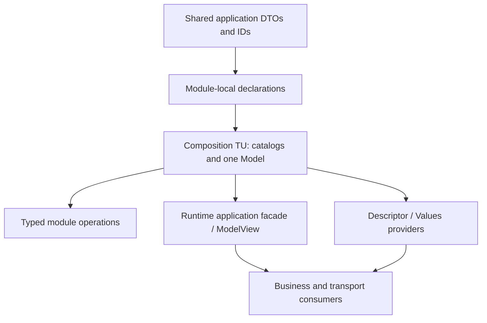

# Масштабування Telemetry у великому проєкті

Автори: Ruslan Kovtun (shpegun60), codexAi. SPDX-License-Identifier: MIT.

[Індекс](README.md) · [Архітектура](Architecture.md) ·
[Tables and catalogs](user/TablesAndCatalogs.md) · [Model](user/Model.md) ·
[Application integration](user/ApplicationIntegration.md)

Документ відділяє кількість endpoints, кількість унікальних C++ типів,
вартість компіляції та вартість виконання. Його призначення — допомогти
організувати великий застосунок і відтворити конкретні межі; це не обіцянка,
що довільні 500–2000 endpoints збираються з типовими прапорцями будь-якого
компілятора або поміщаються у Flash будь-якого STM32.

## Навігація

- [Що вже виміряно](#що-вже-виміряно)
- [Умови compile-time перевірки](#умови-compile-time-перевірки)
- [Одна велика таблиця та кілька каталогів](#одна-велика-таблиця-та-кілька-каталогів)
- [Repeated roots та унікальні типи](#repeated-roots-та-унікальні-типи)
- [Host ELF sections](#host-elf-sections)
- [Межі library contract і компілятора](#межі-library-contract-і-компілятора)
- [Як організувати великий застосунок](#як-організувати-великий-застосунок)
- [Runtime lookup і Workspace](#runtime-lookup-і-workspace)
- [Окремі профілі масштабування](#окремі-профілі-масштабування)
- [Практичний висновок](#практичний-висновок)
- [Як повторити перевірку](#як-повторити-перевірку)

## Що вже виміряно

Compile-time зріз виконано 2026-10-05 на library baseline
`617d037a94e8761a6d70cdc45eafe97232a3c924`. У всіх включених серіях
збігаються SHA-256 **114 library source/header inputs**. Повні generated
sources, compiler commands, logs, object/ELF sections і counters зберігає
runner [compile_tables.py](../tests/scalability/compile_tables.py).

Включено 49 профілів: 43 успішні executions із 63 836 повтореними assertions,
нуль correctness failures і шість окремих compiler-budget rejections.
Це кількість виконаних перевірок у повторюваних профілях, а не 63 836 різних
сценаріїв. Перевіряється кожен endpoint: runtime routing, callback state,
canonical bytes, завершення Workspace lease і спільні TypeIds у full Model.

Результат цього зрізу: **розподіл на невеликі таблиці істотно зменшив час і
пам'ять компіляції, але не усунув recursive root collection у повному Model**.
Успіх таблиць на 1024 Fields і відмова Model на тих самих 1024 Fields — різні
результати, які не можна звести до одного напису «1024 endpoints підтримано».

## Умови compile-time перевірки

| Параметр | Значення |
| --- | --- |
| Host | x86-64 Linux у WSL, без виконання на MCU |
| GCC | Ubuntu GCC 13.3.0, `13.3.0-6ubuntu2~24.04.1` |
| Clang | Ubuntu Clang 18.1.3, `1ubuntu1`, із host libstdc++ |
| Основні flags | C++20, `-O2`, warnings as errors, function/data sections, linker section GC |
| Default budgets | Без підняття template depth, expression depth чи constexpr budget |
| Відтворені default depth limits | GCC template900, Clang template1024; GCC constexpr evaluation512 |
| Окремий diagnostic | GCC `-ftemplate-depth=2048`, лише Field1024/shards32/full Model |
| Build bound | До 240 s на compile або link, до 4096 MiB address space на процес |
| Memory metric | GNU `/usr/bin/time` maximum RSS; це окрема величина від address-space cap |
| Timing metric | GNU time wall seconds для компіляції одного generated translation unit; link виміряно окремо |
| Порядок | Послідовні builds у погодженому вікні без інших compiler runs |
| Статистика | Один sample на профіль; без median, randomization і тверджень про малу різницю часу |
| Binding profile | Один owner class, окремий stable owner instance на кожний рядок, shared method targets |
| DTO profile | Один exact `Payload { uint32_t, uint16_t, bool }`, canonical wire size 7 B |
| Registry | 12 builtins + один `Payload` = 13 unique types у кожному успішному full Model |

`single` означає одну local table на активне сімейство. `shards32` означає
розподіл того самого числа рядків між local tables до 32 endpoints і їх
об'єднання в каталог. **32 тут є виміряним профілем, а не новим library limit**.

Для `Mixed N` створено N Fields, N Commands і N Services: усього **3N
endpoints**. Усі три сімейства використовують той самий exact DTO.
Distinct-target specializations перевірено лише малим smoke; наведені великі
числа не характеризують тисячі різних NTTP targets, DTO чи callback bodies.

Ранню Clang спробу, де приватний helper мав C linkage і повертав C++ view,
відкинуто як помилку harness. Helper виправлено, Clang профілі повторено.
Ранні GCC Model профілі зберігають C linkage цього helper; пізні — C++ linkage.
Цю локальну різницю generated programs позначено в evidence, їхні exact source
hashes збережено. Основний GCC512 table-only rejection взагалі не включає
helper, бо він існує лише у full Model. Runtime source бібліотеки не змінювався.

## Одна велика таблиця та кілька каталогів

У таблиці наведено **compile seconds / peak compiler RSS MiB**. PASS
включає подальший link і correctness execution. Порожня клітинка означає,
що профіль не запускали; вона не означає ні успіху, ні відмови.

| Профіль Fields | GCC 13.3 | Clang 18.1 |
| --- | ---: | ---: |
| 32, single, tables | 1.14 s / 189.4 MiB — PASS | 1.06 s / 170.2 MiB — PASS |
| 128, single, tables | 1.64 s / 326.6 MiB — PASS | 1.58 s / 340.0 MiB — PASS |
| 128, shards32, tables | 0.99 s / 193.1 MiB — PASS | 0.96 s / 172.8 MiB — PASS |
| 256, single, tables | 6.00 s / 756.2 MiB — PASS | 4.39 s / 1107.3 MiB — PASS |
| 256, shards32, tables | 1.12 s / 197.7 MiB — PASS | 0.91 s / 174.2 MiB — PASS |
| 256, single, full Model | 6.20 s / 764.5 MiB — PASS | 4.53 s / 1117.7 MiB — PASS |
| 256, shards32, full Model | 1.24 s / 208.1 MiB — PASS | 1.00 s / 189.8 MiB — PASS |
| 512, single, tables | 64.45 s / 3271.9 MiB — constexpr budget | Не запускали |
| 512, single, full Model | 63.79 s / 3272.1 MiB — constexpr budget | Не запускали |
| 512, shards32, tables | 1.40 s / 207.0 MiB — PASS | 0.99 s / 181.5 MiB — PASS |
| 512, shards32, full Model | 1.52 s / 228.6 MiB — PASS | 1.09 s / 227.9 MiB — PASS |
| 1024, shards32, tables | 1.55 s / 229.2 MiB — PASS | 1.06 s / 200.3 MiB — PASS |
| 1024, shards32, full Model | 1.37 s / 261.2 MiB — template depth | 1.39 s / 360.5 MiB — template depth |
| 1024, shards32, full Model, depth2048 | 1.45 s / 290.7 MiB — PASS | Не запускали |

У [FieldTable](../lib/telemetry/field/FieldTable.hpp),
[CommandTable](../lib/telemetry/command/CommandTable.hpp) та
[ServiceTable](../lib/telemetry/service/ServiceTable.hpp) definitions зберігаються
у `std::tuple<Definitions...>`. Побудова rows розгортає `std::get<I>` для кожної
позиції. Навіть коли exact Definition types повторюються, великий tuple
залишається великою compile-time конструкцією.

Ці виміри узгоджуються з вартістю tuple construction/access. Вони не
встановлюють універсальної асимптотичної формули секунд або RSS: на результат
впливають реалізація стандартної бібліотеки, evaluator компілятора і profile.
GCC512 відмовив через default **constexpr evaluation depth 512**, а не через
`maxTypeCount`, 16-bit position чи недостатній runtime Workspace.

У log буквально `constexpr evaluation depth exceeds maximum of 512`, із
рекомендацією `-fconstexpr-depth=`. Це call depth constexpr evaluator;
diagnostic не повідомляє про вичерпання constexpr operation count.
Підняття лише template depth не змінює цей окремий evaluation limit.
Інші compiler options або новий storage implementation потребують власного
виміру. Важкий 512 single профіль не повторювали на Clang і не продовжували
до 1024 single після вже встановленої вартості; blanket-висновку про його
Clang результат немає.

## Repeated roots та унікальні типи

Перед dependency collection/deduplication кількість root occurrences у Model:

```text
R = FieldCount + CommandCount + 2 × ServiceCount
```

Field додає Value, Command — Request, Service — Request та Response. Void
також є root occurrence, хоча його builtin TypeId вже існує. Root occurrences
і unique types — різні лічильники.

У [Registry.hpp](../lib/telemetry/type/Registry.hpp) повторений exact тип не
отримує другого descriptor і його dependencies повторно не збираються.
Проте `CollectRoots` рекурсивно проходить кожний root occurrence.
[Model](../lib/telemetry/model/Model.hpp) і каталоги спочатку об'єднують повні
root lists local tables. Тому поділ tables не скорочує R повного Model.

| Full Model, shards32 | Endpoints усього | R | Unique types | GCC seconds / RSS MiB | Clang seconds / RSS MiB |
| --- | ---: | ---: | ---: | ---: | ---: |
| Command128 | 128 | 128 | 13 | 1.09 / 196.7 — PASS | 0.85 / 176.5 — PASS |
| Service128 | 128 | 256 | 13 | 1.15 / 202.1 — PASS | 0.94 / 187.5 — PASS |
| Mixed32 | 96 | 128 | 13 | 1.19 / 234.4 — PASS | 1.10 / 206.2 — PASS |
| Mixed128 | 384 | 512 | 13 | 1.28 / 259.0 — PASS | 1.41 / 251.6 — PASS |
| Mixed256 | 768 | 1024 | 13 | 1.18 / 277.6 — depth rejection | 1.55 / 372.1 — depth rejection |
| Field1024 | 1024 | 1024 | 13 | 1.37 / 261.2 — depth rejection | 1.39 / 360.5 — depth rejection |

Це відтворений контрприклад припущенню, що «500–2000 endpoints нормально»
вже доведено лише з O(1) runtime lookup та metadata deduplication. Mixed768
endpoints у цих default builds не зібрав повний Model, хоча мав лише 13 types
і всі local tables були невеликими. Водночас окремий GCC depth2048 diagnostic
зібрав Field1024 Model. Це доводить залежність від compiler budget у конкретній
формі root collection; воно не доводить автоматичну придатність будь-якого
2000-endpoint застосунку або toolchain.

## Host ELF sections

Це секції **host correctness application**, а не оцінка лише коду бібліотеки.
Вони включають generated checks, owner instances, names, runtime rows,
type metadata та частини host C runtime. `.data` нижче об'єднує `.data` і
`.data.*`, зокрема `.data.rel.ro`; RELRO є readonly після ELF relocation.
Ці числа не можна переносити як MCU Flash/RAM або як live heap consumption.

| GCC full Model | `.text`, B | `.rodata`, B | `.data*`, B | `.bss*`, B |
| --- | ---: | ---: | ---: | ---: |
| Field32 single | 1480 | 530 | 3496 | 416 |
| Field256 single | 1480 | 3890 | 21416 | 3104 |
| Field512 shards32 | 1800 | 5810 | 42792 | 6176 |
| Field1024 shards32, depth2048 | 1800 | 11442 | 84648 | 12320 |
| Mixed128 shards32, 384 endpoints | 3736 | 5298 | 25160 | 1568 |

Повний report також містить object sections і всі окремі ELF section names.
Не слід ділити `.text` або `.bss` цього executable на endpoints і оголошувати
отримане число універсальною вартістю endpoint: shared targets зменшують
кількість різних thunks, а `Mixed` використовує спільні owner instances.

Для перевіреного 32-bit ARM layout runtime entries мають такі розміри:

| Runtime row | `sizeof`, B | Що ця величина не включає |
| --- | ---: | --- |
| `FieldEntry` | **32** | Definitions/binding storage, names, catalogs, types, generated code |
| `CommandEntry` | 20 | Те саме та application Request/state |
| `ServiceEntry` | 24 | Те саме та application Request/Response/state |

Отже попередня приблизна оцінка `FieldEntry ≈ 28 B` непридатна до поточного
layout. Масив 1000 ARM `FieldEntry` займає 32 000 B саме rows, а не весь Flash.
Це також не означає `alignas(32)`: розмір row і його alignment — різні факти.
Ці ABI/layout величини самі по собі не є новим hardware throughput виміром.

## Межі library contract і компілятора

[Limits](../lib/telemetry/type/Traits.hpp) задають acceptance ceilings;
[Id.hpp](../lib/telemetry/core/Id.hpp) — packed-ID position capacity. Вони не
збільшують ресурси компілятора або фізичну пам'ять пристрою.

| Межа | Значення | Її зміст |
| --- | ---: | --- |
| `maxTypeCount` | 4096 | Unique descriptors включно з builtins; не число root occurrences |
| `maxTypeDepth` | 32 | Structural nesting; не C++ template instantiation depth |
| `maxEndpointCountTotal` | 65536 | Acceptance ceiling структурної моделі; не default-compiler capacity |
| `maxCatalogCountTotal` | 65536 | Acceptance ceiling каталогів моделі |
| Local/group position capacity | 65536 кожна | 16-bit component packed ID, позиції 0…65535 |
| `maxDescriptorBytes` | 4 MiB | Максимальний canonical descriptor extent; не гарантований Flash budget |
| `maxValueWireBytes` | 1 MiB | Максимальний payload extent; не доступний стек або Workspace |
| `maxStructMembers` | 256 | Normalized shape ceiling; поточний pinned C++20 PFR backend має окрему межу 200 |

Окремо існують compiler template depth, expression nesting, constexpr
operation/step budgets, compile time, compiler memory, linker memory і
фізичні Flash/RAM/cache budgets. Compiler-budget rejection у таблицях вище
не переписує acceptance contract на «максимум 256 endpoints».
Для acceptance ceiling і default-toolchain build capacity потрібні різні
перевірки та різні формулювання.

## Як організувати великий застосунок

1. **Діліть local tables за модулями і завданнями.** Meter, motor,
   calibration і diagnostics природно мають свої table declarations та
   локальні position enums. Shards32 є корисною виміряною відправною точкою;
   для іншого розміру, heterogeneous targets або DTO зробіть свій profile.
   Не змінюйте positional order непомітно: він визначає packed ID.
2. **Повторно використовуйте exact DTO там, де контракт справді один.**
   Один `Config` у Field, Command і Service має один TypeId у Model.
   Два різні C++ structs з однаковими members не є одним exact type.
   Shared DTO зменшує structural metadata, але не усуває проходу repeated roots.
3. **Не включайте повну application schema в кожний consumer.** Зберіть
   concrete tables/catalogs/Model у composition translation unit або невеликій
   групі composition units. Transport/UI/business consumers отримують вузький
   application facade чи `ModelView`, не header із тисячами `inline constexpr`
   definitions. Header з DTO і IDs може бути спільним без повного Model.
   [Device integration](../examples/device_integration/README.md) показує таку
   межу; конкретні named header definitions потрібні там, де справді необхідний
   compile-time typed доступ, а не всім runtime consumers.
4. **Майте один composition point для спільного registry.** Розподіл tables
   на модулі зберігає єдиний Model/TypeRegistry. Створення окремих Models лише
   для обходу compile limit змінює discovery та TypeId domains і потребує
   окремого application/protocol рішення; це не прозора оптимізація.
5. **Повторно використовуйте named visitor types.** Різні lambda expressions
   створюють різні C++ types, навіть якщо їхні bodies однакові. `visit()`
   спеціалізує dispatch для конкретного visitor type. Один reusable named
   visitor дозволяє повторно використати спеціалізацію; runtime context і
   параметри передавайте в його instance. Кількісне ARM порівняння наведено
   нижче; економія залежить від distinct targets і оптимізації компілятора.
6. **Оберіть доступ за інформацією в місці виклику.** Відомий local position
   або packed ID — typed API. Runtime ID із відомим потрібним value type —
   `readAs`/`writeAs` за відповідним контрактом. Canonical wire bytes — encoded
   indexes/adapter. Generic typed dispatch — `visit`; не додавайте його лише
   для повторення вже готової encoded операції.
7. **Записуйте build/code-size evidence для свого проєкту.** Flags, compiler
   version, source hashes, layout, targets, DTO mix, sections і memory limits
   важливіші за абстрактну кількість endpoints. Якщо змінюєте compiler budgets,
   назвіть це явно й перевірте bounded compile memory/time.

Схема організації:



Schema header у всіх consumers збільшує compile work незалежно від того,
чи потім linker видалить повторені definitions. Header guards не є cache
template instantiations між різними translation units. Кількісний fan-out
ефект для цього baseline має власну перевірку нижче.

## Runtime lookup і Workspace

Runtime index розкладає packed u32 ID на `group = id >> 16` і
`entry = id & 0xffff`, перевіряє межі та використовує
`catalogs[group].entries[entry]`. Це **O(1) positional routing** без linear
name search і без проходу TypeRegistry. Catalogs залишаються дворівневими;
вони не перетворюються на один плоский endpoint array лише заради lookup.

Ця оцінка стосується вибору одного endpoint. `forEach`, повний descriptor,
Values stream і codec для масиву платять за відповідний обсяг обходу чи
payload. Runtime `model.maxScratch()` також проходить rows, якщо його не
обчислено заздалегідь або у constexpr context; це не частина indexed lookup.

O(1) не означає однакову кількість наносекунд або cycles для 32 і 4096 rows.
Може змінитися locality, memory placement, cache state, callback/codec work
та code size. Окремий host runtime profile нижче вимірює індекси; він не
дозволяє екстраполювати попередні H7S cycles на новий великий executable.

Для тих самих payload types, storage policy і порядку викликів необхідна
Workspace capacity залежить від найбільшої одночасно живої операції,
alignment та nesting, а не безпосередньо від кількості endpoints.
`model.maxScratch()` оцінює одну encoded operation на свіжому Workspace.
Concurrent або nested calls потребують окремих Workspaces, сумарного lifetime
budget чи зовнішньої серіалізації. Application state/owner instances,
transport buffers і session storage — окремі RAM витрати.

## Окремі профілі масштабування

Ці профілі відокремлюють кількість exact types, consumer dependencies,
resource representation і visitor specialization від repeated-DTO tables.
Їхні populations і правила підрахунку відрізняються; не складайте всі
assertions в одну уявну кількість різних сценаріїв.

### Unique types і structural complexity

[compile_types.py](../tests/scalability/compile_types.py) порівнює N повторень
одного `Dto<0>` та N різних `Dto<I>`. Кожен DTO має однакову форму, спільний
enum, вкладений `Common`, масив і два входження того самого `Common`. Native
size — 28 B, canonical wire size — 23 B. Shared registry має 16 exact types;
distinct registry — `N + 15`. Однаковий layout не робить `Dto<0>` і `Dto<1>`
одним C++ типом.

| Registry profile | GCC 13.3, s / RSS MiB | Clang 18.1, s / RSS MiB |
| --- | ---: | ---: |
| Shared 512 roots, 16 types | 1.30 / 189 — PASS | близько 1.0 / 203 — PASS |
| Distinct 32 DTO | 1.57 / 266 — PASS | Див. retained summary |
| Distinct 128 DTO | 4.02 / 765 — PASS | 5.60 / 721 — PASS |
| Distinct 256 DTO | 12.64 / 2160 — PASS | Default expression nesting limit 256 |
| Distinct 512 DTO | 21.31 / 4066 — test address-space limit | Default expression nesting limit 256 |
| Distinct 256 DTO, explicit Clang bracket depth1024 | Не запускали | 16.30 / 2927 — PASS |
| Shared 1024 roots, 16 types | Default template depth900 | Не запускали в цьому профілі |

4 GiB — **ліміт address space тестового процесу**, а не доведена фізична
нестача пам'яті комп'ютера чи неможливість компіляції за іншого budget.
Розрізняйте його з виміряним maximum RSS. Clang override задається явно:
`--compiler-extra-flag=-fbracket-depth=1024`; runner не підвищує budgets сам.

Registry-only та full Model — різні builds. Full Model додатково утворює
FieldTable, codec thunks, constexpr descriptor/fingerprint і packed bytes.
Цей fixture використовує окремий free-function target specialization на row,
на відміну від shared method targets у `compile_tables.py`.

| Full Model | GCC 13.3, s / RSS MiB | Clang 18.1, s / RSS MiB |
| --- | ---: | ---: |
| Shared 128 DTO roots | 4.17 / 424 — PASS | 3.04 / 400 — PASS |
| Distinct 128 DTO | 8.86 / 1062 — PASS | 8.86 / 1023 — PASS |
| Shared 256 DTO roots | 16.81 / 1004 — PASS | 8.48 / 1253 — PASS |
| Distinct 256 DTO | 47.48 / 3064 — PASS | 10.97 / 1567 — expression-depth rejection |

Stored metadata росте лінійно у цьому профілі. Shared registry wire records
займають 504 B незалежно від N. Distinct — `428 + 76N` B; кожний новий DTO
додає 160 B host relocated constant storage і 24 B names. Full descriptor:
shared `601 + 35N` B, distinct `525 + 111N` B. Це exact fixture formulas,
не універсальна вартість довільного C++ DTO. Wire bytes не тотожні Flash.

У [Registry.hpp](../lib/telemetry/type/Registry.hpp) membership перевіряється
по накопиченому списку types, а positional type lookup теж рекурсивний.
Compile work тому залежить від R, U та dependency/member edges; одна лише
лінійність emitted metadata не доводить лінійного часу компіляції.

Окремі boundary probes перевірили structural depth 32/33, array length
65536/+1, wire payload 1 MiB/+1, expanded-node count 262144/+1 і tight
DescriptorProfile type/byte ceilings. З 14 задуманих controls 13 дали
очікуваний результат. **Позитивний aggregate із 256 members відхилився**:
pinned Boost.PFR C++20 `core17_generated.hpp` має розкладення лише до 200.
Це не compiler budget: GCC і Clang прийняли окремий aggregate200 і відхилили
aggregate201. Normalized `Limits::maxStructMembers == 256` залишено незмінним.
Поточний практичний шлях — кілька вкладених DTO з не більш ніж 200 direct
members у кожному. Для підтримки 201–256 потрібен окремий backend зріз;
ця перевірка не змінювала vendor, API, wire чи frozen contract.

### Module fan-out та incremental builds

[Modular fixture](../tests/scalability/modular/README.md) має три незалежні
`.cpp` modules, по одному Field/Command/Service у кожному, один Model,
17 exact types і двох transport-owned peers. Кожний consumer виконує однакові
encoded перевірки; typed mode також спеціалізує native calls. Module headers
потрібні composition point, runtime consumers їх не включають.

GCC 13.3, Linux, 12 consumers, sequential build, один timing sample:

| Подія | Full typed schema header | Runtime facade |
| --- | ---: | ---: |
| Повна збірка | 26.146 s | 24.437 s |
| Comment edit у ModuleA.cpp | 1 TU, 1.271 s | 1 TU, 1.261 s |
| Comment edit у ModuleA.hpp | 14 TU, з них 12 consumers; 17.013 s | 2 TU, 0 consumers; 2.710 s |
| Dependencies одного consumer | 83 | 76 |
| Preprocessed bytes одного consumer | 3 577 528 | 3 570 210 |

Близькі full-build durations не доводять стабільного процентного виграшу.
Натомість dependency fan-out встановлено безпосередньо compiler depfiles:
зміна private schema не перебудовує runtime consumers. Три modules і дев'ять
endpoints незмінні; це тест **кількості consumers**, не місткості Model.
Великі common library headers залишаються, тому зменшення preprocessed bytes
тут лише приблизно 0.2%, а не порядок величини.

Host GCC/Clang та Windows MinGW smoke підтвердили доступ до всіх дев'яти
endpoints, один retained registry, відсутність allocation у перевірених
операціях, Bind/Exchange двох peers, відмову третьому та незалежний reset.
Це не доказ ОС transport чи C runtime startup без allocations. Синхронізація
application state лишається зовнішньою.

Timing series зберігає ранній fixture із зайвим wrapper для першого metadata
query. У фінальному fixture wrapper прибрано: `fingerprint()` сам отримує
cached descriptor, без окремого `init()` або нового lifecycle state.
Старі timing hashes не підмінено hashes фінального fixture; його додатковий
smoke наведено в evidence. Реальна зміна DTO може змінити fingerprint/payload,
навіть коли runtime consumer не потребує перебудови.

### Descriptor, Values і resource READ

[Resources.cpp](../tests/scalability/Resources.cpp) утворює справжній typed
FieldTable/Model із повтореним `u32`, 12 builtin types, constexpr descriptor
і packed bytes. Окремий runtime descriptor конструюється через opaque factory,
щоб вимір не згорнувся у compile-time константу. Host GCC 13.3, O2:

| Fields | Local table bytes | Descriptor object / index bytes | Descriptor wire bytes | Values object / wire bytes | Required Workspace |
| --- | ---: | ---: | ---: | ---: | ---: |
| 32 | 2304 | 736 / 564 | 1341 | 320 / 184 | 0 |
| 128 | 9216 | 1888 / 1716 | 4221 | 1088 / 664 | 0 |

Це x86-64 native sizes, а не Cortex-M layout. Index storage росте з N;
constexpr named instance може розміщуватися у read-only storage, тоді як
runtime-constructed instance має storage у RAM. Обчислений descriptor wire
extent не зобов'язує streaming provider мати ще один матеріалізований binary
blob такого самого розміру у Flash. Packed variant навмисно має цей blob.

Median із дев'яти host samples; READ — двадцять повних streams на sample.
Усі values у цьому fixture локальні, тому Workspace порожній.

| Fields | Runtime constructor, µs | Streaming READ128 / READ512, µs | Packed READ128, µs | Values READ128, µs |
| --- | ---: | ---: | ---: | ---: |
| 32 | 2.480 | 1.201 / 1.065 | 0.075 | 0.066 |
| 128 | 11.773 | 3.824 / 2.786 | 0.212 | 0.260 |

Часи включають loop і cursor/status handling, дані прогріті; це **не MCU
throughput**. Порожній GNU/Clang asm memory input утримує produced bytes
матеріалізованими, щоб compiler не видалив невикористаний packed copy. Ранні
timings без цього control відкинуто, вони не наведені в таблиці.

Release та Clang ASan/UBSan виконали по 187/571 перевірок для 32/128 Fields:
full descriptor та реконструйовані chunks128/512 побайтово дорівнюють packed
representation, всі Values payloads правильні. Metadata не викликає getters;
короткий token buffer і invalid cursor не семплюють value; прямий resume
семплює тільки потрібний row; повний chunked Values stream семплює кожний
getter один раз. Leases завершуються. Executable SHA-256 є у summary.

Descriptor duplicate-name validation використовує heapsort і adjacent scan:
це O(N log N) порівнянь, з додатковою вартістю порівняння UTF-8 byte strings.
Повний descriptor/Values stream платить за його обсяг, а direct cursor resume
використовує збережений index. Окремий generic
[FileSystem constructor](../lib/resource/FileSystem.hpp) перевіряє duplicate
paths вкладеними loops — O(F²) для F файлів. Це висновок із коду холодного
construction path, не новий timing на тисячах файлів; `read(index, ...)`
залишається indexed operation. Для довільно великих file lists чи metadata
profiles потрібен власний вимір, а не екстраполяція цих 32/128 рядків.

### Visitors, target diversity та runtime routing

[Runtime.cpp](../tests/scalability/Runtime.cpp) перевіряє 32/128/1024/16384/65536
rows **в окремому family index**, із catalogs по 256 rows. Реальні factory
thunks копіюються у caller-owned arrays із правильною context прив'язкою.
Це не typed Model на 65536 definitions і не descriptor на 196608 endpoints.
Fixture vectors виділяються до timed library calls.

GCC O2/Os і Clang ASan/UBSan виконали по **581758 conditions**: кожний row
правильно знаходиться, читається, записується, виконує Command/Service,
зберігає точні endpoint statuses і lengths; invalid IDs відхиляються, локальні
операції не займають Workspace. 50 timing profiles на release executable:
п'ять populations × fixed/spread ID × п'ять operations.

GCC 13.3 O2, median п'яти samples по 200000 calls, spread-ID profile:

| Rows per index | find, ns | read, ns | write, ns | Command, ns | Service, ns |
| --- | ---: | ---: | ---: | ---: | ---: |
| 32 | 1.284 | 2.306 | 2.238 | 1.941 | 2.865 |
| 65536 | 1.289 | 5.236 | 3.871 | 3.619 | 5.447 |

У timed loop входять ID generator, operation call і checksum; це не окремі
CPU instruction timings. Find не отримав linear scan із ростом N, а callback
операції змінили locality і latency. Cache explanation узгоджується з доступом
до owners, але hardware cache counters тут не вимірювали. Fixed-ID samples
і всі проміжні N збережено в evidence. Sanitized times не порівнюються.

CubeIDE ARM GCC 14.3.1 O2/Os/Og скомпілював ABI/layout probe. `Catalog` — 12 B,
`ModelView` — 60 B, Values token index — 8 B, descriptor segment — 12 B;
runtime row sizes наведено вище. O2 compiler frames: `find` — 0 B,
`readEncoded` wrapper — 32 B. Це один dynamic function для всіх N, не
спеціалізація під число rows. `.su` — individual frames, не повний call-chain.

Visitor profile: фінальний Linux GCC O2 виконав усі 14 комбінацій 128/256
distinct targets × 0/1/2/4/8 lambdas або reusable named visitor4/8; 10780
повторених conditions, failures0. MinGW 13.1 прийняв усі сім 128-row profiles
і п'ять 256-row lambda profiles, але 256-row named4 variant уперся у PE
assembler string-table overflow із дуже довгими section names. Це окрема
toolchain межа, її не приховано compiler flags чи зміною бібліотеки.

Усі 28 CubeIDE ARM GCC 14.3.1 O2/Os profiles скомпілювались. `.text`, B:

| Visitor configuration | 128 targets, O2 / Os | 256 targets, O2 / Os |
| --- | ---: | ---: |
| 0: encoded baseline | 3564 / 2088 | 7144 / 4136 |
| 1 lambda type | 5568 / 3988 | 11200 / 8084 |
| 2 lambda types | 7656 / 5976 | 15336 / 12120 |
| 4 lambda types | 11816 / 9936 | 23592 / 20176 |
| 8 lambda types | 20148 / 17848 | 40116 / 36280 |
| 4 call sites, one named visitor type | 5952 / 4280 | 12096 / 8632 |
| 8 call sites, one named visitor type | 6056 / 4312 | 12200 / 8664 |

Для 256 targets `.rodata` росте від 11546 B encoded baseline до 19712 B із
вісьмома lambda types; named8 — 12544 B O2 / 12570 B Os. Owner state `.bss`
лишається 1024 B, `.data` — 0 у цих objects. Maximum individual `.su` frame
для 256 encoded baseline — 48/40 B O2/Os, lambda8 — 24/32 B, named8 — 24/24 B.
Це не сума frame sizes і не доведений повний stack watermark.

Object sections не є linked firmware totals: section GC/LTO може змінити
склад retained code. Named reuse тут явно скоротив specialization growth,
але не обіцяє точно той самий коефіцієнт іншому visitor body чи target mix.
Нова апаратна сесія в цьому проході не виконувалась.

## Практичний висновок

Runtime positional routing підходить для великих каталогів: число rows не
додає linear lookup. Однак **default-toolchain capacity для довільних тисяч
typed endpoints не підтверджено**. Відтворено обмеження великого tuple,
repeated-root recursion, unique-type expression depth/memory, pinned PFR та
MinGW section-name storage. Вони виникають значно раніше формальних ceilings
у конкретних profiles і не лікуються більшим Workspace.

Для застосунку почніть із module-local tables, shared exact DTO, одного
composition point та runtime facade для consumers без потреби в native typed
доступі. Виміряйте саме свій endpoint/type/visitor mix на compiler прошивки.
Для істотно більших Models наступне обґрунтоване engineering завдання —
зменшення repeated-root/tuple compile work з незмінними wire та native contracts;
це пропозиція за результатом вимірів, **не реалізована оптимізація цього зрізу**.

## Як повторити перевірку

Runner потребує Linux/WSL, C++20 compiler, GNU `time` і `size`.
`--build-dir` має бути поза repository: там залишаються generated sources,
objects, images, `.metrics`, logs та `summary.json`. Library code він не змінює.
Для часових порівнянь запускайте одну compiler series за раз.

```sh
python3 tests/scalability/compile_tables.py \
  --build-dir /tmp/telemetry-scale-gcc \
  --cxx g++ --rows 32 128 256 \
  --families field --layouts single sharded --stages tables model \
  --isolation-note "One coordinated compiler run; no concurrent builds"

python3 tests/scalability/compile_tables.py \
  --build-dir /tmp/telemetry-scale-clang-sharded \
  --cxx clang++-18 --rows 512 1024 \
  --families field --layouts sharded --stages tables model
```

Default bounds — 240 s і 4096 MiB address space. Уже відомі compiler-budget
rejections не треба багаторазово повторювати на більших однорідних профілях.
Runner позначає пропущений більший profile як **not run**, а не як нову відмову.
`--generate-only` створює profiles без компіляції; `--targets distinct`
генерує окремі target specializations і має власну ціну.

Для validation/CI додайте `--require-pass`: будь-який attempted або пропущений
після compiler limit профіль зі статусом, відмінним від PASS, завершує runner
з exit code 1. Звичайний exploratory run зберігає відомі compiler-budget
rejections як результат дослідження; unexpected compilation/link failures
та correctness failures завжди мають nonzero exit. `generated-only` не
вважається execution failure і не є доказом успішної компіляції.

Окремий explicit diagnostic, що пройшов у цьому зрізі:

```sh
python3 tests/scalability/compile_tables.py \
  --build-dir /tmp/telemetry-scale-gcc-depth2048 \
  --cxx g++ --rows 1024 --families field \
  --layouts sharded --stages model --template-depth 2048
```

Повний local evidence цього проходу розміщено поза checkout у
`C:/Users/admin/Documents/telemetry-validation/20261005-scalability/`:
`compile-tables/aggregate.json`, type/runtime/resource/visitor/modular summaries
та directories кожної series. Exact commands,
generated source hashes і section breakdown дозволяють відрізнити успішний
default profile, явний compiler override, harness smoke та відкинуту спробу.
Пізніша driver-only опція `--require-pass` не змінює generated C++ program,
але змінює SHA runner. У retained summaries лишається hash версії driver,
якою отримано саме ті виміри; його не підмінено hash нової validation policy.

[Published measured data](../tests/scalability/results.json) зберігає baseline,
114 production input hashes, hashes вихідних reports, compact profile metrics,
executable hashes і позначення попереднього/фінального modular fixture. Це
pre-publication вимір на незмінному library baseline із новими локальними
fixtures; він не приписує апаратне виконання чи заміри пізнішому commit SHA.
[Runner guide](../tests/scalability/README.md) описує повторення всіх осей
масштабування та bounded CI profiles. CI зберігає повні artifacts своїх окремих
прогонів; status конкретного commit треба перевіряти за його exact SHA.
