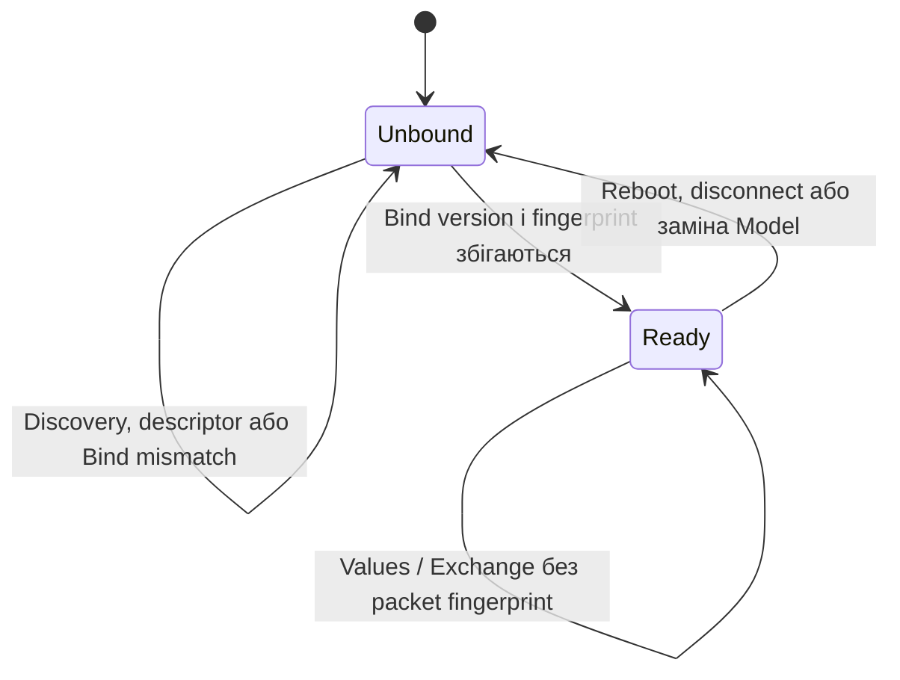

# Structured telemetry v3: план реалізації Field, Command і Service

Дата: 2026-09-26. Автори: Ruslan Kovtun (shpegun60), codexAi.

Статус: **узгоджена специфікація для поетапної реалізації; наведений новий API ще не реалізований**.
Перша версія structured-модуля позначається далі як **structured v1**, а її
мережевий формат — **v3.0**. Це різні номери: версія нового модуля і версія
формату обміну.

Базовий scalar-код: `5a289a8f12a85f68219275abcde7b58d925076ac`.
Документ об'єднує пропозицію окремого C++20 structured-модуля і три доповнення
про тип повернення callable, розділення Command/Service та місце limits.
Останнє уточнення користувача має пріоритет: **Service має лише назву і
прив'язку до callable; опис request/response виводиться зі структур.
Жодних limits, defaults, units або прикладних політик у Service.**

Уточнення після review: сумісність descriptor узгоджується **один раз
на підключення/сеанс зв'язку**, а не в кожному packet. Fingerprint
залишається в descriptor і запиті початкового узгодження; звичайні
Exchange requests/responses і values.bin його не містять. Правила
reconnect/reboot описані в розділі 12. Це не змінює scalar wire v2.1.

Підсумковий reflection-контракт після review: Registry, Codec, Model і
Descriptor використовують власний facade. C++20 backend на PFR,
`magic_enum` і callable traits — основний для structured v1; C++26
`std::meta` — необов'язковий експеримент на хості. Вибір backend лише
compile-time. Точні enum names можна задати разом із кодами, незалежно
від automatic reflection. Контракт описаний у §4.4 і §5.3.

Після завершення **всіх етапів 00–15 і перевірок цього плану** можливий
окремий [рефактор зберігання scalar metadata](ScalarMetadataStorageRefactorPlan.md):
обов'язкові name/unit, sparse optional limits/defaults і винесення
холодних даних без сповільнення read/write/command. Він не входить у
поточний implementation scope; під час structured v3 scalar baseline
залишається незмінним. Limits до Service цим майбутнім етапом не додаються.

## Навігація

- [1. Рішення, які вже зафіксовані](#decisions)
- [Архітектурні діаграми: модель і шляхи виклику](#architecture)
- [2. Що існує зараз і що залишається незмінним](#baseline)
- [3. Користувацький API](#public-api)
- [4. Reflection і типи callable](#reflection)
- [Контракт reflection backend](#reflection-backend)
- [5. Підтримувані типи даних](#data-types)
- [6. TypeRegistry і identity](#registry)
- [7. ServiceResult та статуси](#results)
- [8. Codec, пам'ять і lifetime](#codec)
- [9. Виклики, bindings і slots](#invocation)
- [10. Descriptor і fingerprint](#descriptor)
- [11. ValuesFile](#values)
- [12. Запис, команди та RPC через транспорт](#exchange)
- [13. Файли, залежності й qmake](#files)
- [14. Клієнт JavaScript/Qt](#clients)
- [15. Вимоги до ефективності](#performance)
- [16. Етапи реалізації](#stages)
- [17. Матриця перевірок](#verification)
- [18. Умови завершення та межі першої версії](#completion)
- [19. Джерела й уточнення до вихідних пропозицій](#sources)

<a id="decisions"></a>
## 1. Рішення, які вже зафіксовані

### 1.1. Три окремі поняття

| Поняття | Призначення | Вхід | Вихід |
| --- | --- | --- | --- |
| `Field<T>` | Значення або стан | `T` для запису | `T` для читання |
| `Command<Request>` | Виконати дію | Структура запиту або відсутній запит | Наявний `telemetry::CommandResult` |
| `Service<Request, Response>` | Виклик із прикладною відповіддю | Структура запиту або відсутній запит | `ServiceResult<Response>`; можливий `void` payload |

Користувач не пише ці типи вдруге у фабриках. `field`, `command` і `service`
виводять їх із getter/setter або сигнатури функції. Тип повернення callable
є повноправною частиною опису поряд із параметрами.

Command не змінює значення свого результату. `Accepted` залишається
«власник прийняв дію», а не «дію завершено». Service має власний набір
статусів і не використовує `CommandResult` як універсальний статус RPC.

### 1.2. Три різні види інформації

| Інформація | Де живе у structured v1 | Приклад |
| --- | --- | --- |
| Форма даних | `TypeRegistry` | `channel: U8`, вкладена структура, масив із 16 елементів |
| Назва endpoint | Опис Field/Command/Service | `ReadCalibration` |
| Одиниця цілого поля | Необов'язковий рядок тільки в описі Field | `V` |
| Прикладна перевірка | Метод користувача | Канал існує, стан дозволяє запис, температура прийнятна |
| Limits/default/constraints | **Не реалізовуються в structured v1** | Немає автоматичного `0..500` або initial value |

`TypeDescriptor` ніколи не містить `min`, `max`, `default`, `unit`,
`Persistent`, правил доступу або callback перевірки. Той самий C++ тип
має один структурний опис незалежно від того, хто ним користується.

У Service немає навіть необов'язкового semantic overlay. Не додаємо туди
`arg`, `limits`, `metadata`, `constraints`, units або FieldFlags. Наявність
імен членів, типів, довжини масиву чи словника enum — це опис форми даних,
а не прикладні обмеження сервісу.

### 1.3. Межа з поточною бібліотекою

- Поточний scalar core залишається C++17, з чинним ABI та поведінкою.
- Базова in-memory ABI revision — 8; це не номер wire v2.1/v3.0.
- Новий модуль потребує C++20 і підключається явно.
- Наявні `Scalar`, `Field`, `Command`, getter/setter і layout таблиць не розширюються.
- Наявні `limits`, `arg`, enum default та перевірки scalar-запису залишаються.
- Поточні binary-файли v2.1 і decoder зберігають свій контракт.
- Нові файли отримують окремі шляхи `/telemetry3/...`.
- Структури не додаються альтернативами в поточний `Scalar`.
- Реалізація нового модуля не є приводом ще раз рефакторити перевірений scalar core.

### 1.4. Принципи виконання

1. Локальний typed-виклик працює з C++ значеннями без `Scalar`, серіалізації
   та пошуку типу під час виконання.
2. Глобальний compile-time ID маршрутизується в той самий typed-виклик.
3. Runtime-виклик за ID використовує згенерований адаптер і canonical codec.
4. Reflection, побудова графа типів, розміри та offsets залежать від типів
   і мають обчислюватися на етапі компіляції.
5. Fingerprint звіряється при початковому узгодженні зв'язку. Наявність
   даних у пакеті, коректність `bool` і доступність late-bound target
   перевіряються при обробці відповідних даних.
6. Жодного прихованого heap allocation, базового virtual provider або нового `init()`.
7. Успішно перевірений запит викликає ціль рівно один раз. Невірний запит
   не викликає її зовсім. Це властивість одного виклику обробника, а не
   гарантія від повторення пакета транспортом.

<a id="architecture"></a>
### 1.5. Архітектурні діаграми

#### 1.5.1. Загальна схема після review

```text
                         C++ types
                             │
                             ▼
                     Reflection facade
                             │
               ┌─────────────┴─────────────┐
               ▼                           ▼
        C++20 production             C++26 experimental
        PFR + magic_enum                  std::meta
        callable traits                  host only
               │                           │
               └─────────────┬─────────────┘
                             ▼
              Normalized facade result (§4.4)
                             │
                             ▼
                        TypeRegistry
                             │
           ┌─────────────────┼─────────────────┐
           ▼                 ▼                 ▼
       Field<T>        Command<Request>   Service<Req,Resp>
           │                 │                 │
           └─────────────────┼─────────────────┘
                             ▼
                      Model / descriptor
                             │
                  fingerprint at Bind only
                             │
                            Ready
                             │
                    ┌────────┴────────┐
                    ▼                 ▼
               ValuesFile          Exchange
               no hash             no hash
```

Це схема зв'язків, **не послідовність runtime-викликів і не порядок
ініціалізації об'єктів**. Її точне значення для реалізації:

- Facade надає властивості aggregate, enum і сигнатур callable. У C++20
  його реалізують PFR, `magic_enum` та callable traits. Registry не
  викликає ці backend API напряму; обидві гілки повертають результат
  через один контракт facade. У збірці вибрана лише одна гілка.
- Explicit `EnumReflection<E>` перевизначає автоматичний словник;
  code/name entries не потребують вгадування alias жодним backend.
- Фабрики `field/command/service` створюють typed definitions і задають
  кореневі типи. Під час складання Model `TypeRegistry` збирає спільний
  граф цих типів. Користувач не створює registry перед кожним endpoint.
- Registry описує форму даних; definitions зберігають прив'язки до цілей.
  Model об'єднує їх, а `descriptor.bin` публікує опис для клієнта.
  Жодних Service limits/defaults/units тут немає.
- Верхня частина, включно з графом типів, wire sizes і descriptor
  metadata, будується на етапі компіляції. Bind і читання живих значень
  відбуваються під час роботи.
- `Ready` належить конкретному connection/peer транспортного адаптера,
  а не Model або Field. Fingerprint зберігається в descriptor і
  звіряється при Bind; ValuesFile та Exchange не містять packet hash.
- Для offline читання зберігають пару `descriptor.bin + values.bin`.
  Сам `values.bin` не дозволяє відновити назви, типи чи прив'язану модель.

#### 1.5.2. Прямий C++ виклик і закодований запит

```mermaid
flowchart TB
    subgraph native [Прямий C++ виклик]
        cpp["Native C++ arguments"] --> typed["Local або global compile-time API"]
        typed --> direct["Конкретний getter / setter / command / service"]
        direct --> result["Native C++ result"]
    end

    subgraph encoded [Запит через транспорт]
        packet["Повний request packet"] --> ready["Transport dispatcher: Ready цього peer"]
        ready --> exchange["Exchange: header, endpoint, sizes, workspace"]
        exchange --> decode["Decode Request у caller-owned workspace"]
        decode --> resolve["Resolve target один раз"]
        resolve --> invoke["Та сама C++ ціль: один виклик"]
        invoke --> response["Status і canonical Response bytes"]
    end
```



Typed-шлях не проходить через Bind, wire descriptor, codec або `Scalar`.
Його прив'язки й повернені типи відомі компілятору; перевірки доступності
late-bound target зберігаються там, де вони потрібні.

Друга частина показує успішний Exchange; повний порядок перевірок і
відмов визначений у §12.4. Неуспішний preflight не викликає ціль.
Локальний encoded API також можна викликати без транспорту й Bind:
викликач сам надає runtime view потрібного Model.

Вимоги до розміру й вирівнювання workspace обчислює бібліотека, але
пам'ять надає викликач. Reflection не створює прихованого heap або
спільного scratch для одночасних викликів.

#### 1.5.3. Що залишається користувачеві

```cpp
ts::service<&Device::readCalibration>("ReadCalibration", device);
```

Цієї декларації достатньо для назви та binding сервісу. Request/Response,
імена й типи членів, wire sizes, codec та runtime thunk виводить бібліотека.
Застосунок володіє Device, таблицями та workspace, підключає транспорт і
задає його місткість. Прикладні перевірки залишаються в методі Device.

Межі залежностей між бібліотеками наведені в §13.2; стани транспортного
binding — у §12.1.1. Вони не додають нового `init()` до Model.

<a id="baseline"></a>
## 2. Що існує зараз і що залишається незмінним

Ці відомості звірені з вихідним кодом базового коміту; це не звіт про
новий запуск усіх тестів під час написання документа.

| Наявна частина | Що використовуємо | Чого не робимо |
| --- | --- | --- |
| [CallableTraits](../lib/telemetry/detail/TelemetryCallable.h) | Уже є `Result`, `Arguments`, arity, відмінність method/free function | Не стверджуємо, що Result треба винаходити з нуля |
| [FieldTable](../lib/telemetry/field/TelemetryFieldTable.h) | Модель збереження типів definition і прямий typed-шлях | Не додаємо struct ops у старий `Field` |
| [CommandTable](../lib/telemetry/command/TelemetryCommandTable.h) | Модель local/global/runtime і metadata з відомим lifetime | Не розширюємо старий `Scalar[]` контракт структурами |
| [CommandResult](../lib/telemetry/command/TelemetryCommand.h) | Статуси дії для нового structured Command | Не трактуємо їх як статуси Service |
| [Slots](../lib/telemetry/slot/README.md) | Наявні види пізньої прив'язки і snapshot target | Не додаємо перевірку null для коректного прямого owner-reference |
| [resource](../lib/resource/README.md) | Плоский FileIndex, `u64` cursor, span, stat/read/write | Не вбудовуємо знання про telemetry у resource core |
| [resource protocol](../lib/resource/protocol/Protocol.hpp) | Наявні LIST/STAT/READ/WRITE для файлів | Не видаємо WRITE за готовий RPC request/response |
| [Binary v2.1](../lib/resource/telemetry/BinaryFormat.hpp) | Окремий незмінний формат scalar-модуля | Не підміняємо payload v2.1 структурним |

Перед першою зміною коду потрібно знову записати фактичний HEAD, compiler
версії, конфігурації, стан дерева та результати baseline. Якщо HEAD уже
інший, різницю з цим SHA треба описати. Чужі незакомічені файли й матеріали
незалежного review не включаються в implementation-коміт автоматично.

Посилання на базові перевірки:
[host runner](../tests/run_checks.py),
[ARM runner](../tests/run_arm_checks.py),
[FieldTable codegen](../tests/FieldTableCodegen.cpp),
[CommandTable codegen](../tests/CommandTableCodegen.cpp),
[runtime index codegen](../tests/IndexCodegen.cpp),
[поточний H7S receipt](../tests/regression/h7s/current-receipt.json),
[CI](../.github/workflows/ci.yml).

<a id="public-api"></a>
## 3. Користувацький API

Усі приклади нового API нижче — ціль реалізації, а не код, який уже можна
зібрати з поточного `Telemetry.h`.

### 3.1. Простий Service: одна декларація, без повторного опису полів

```cpp
#include <telemetry_structured/Structured.hpp>

namespace ts = telemetry::structured;

// Named namespace: reflected wire types must have external linkage.
namespace device_api {

struct ReadCalibrationRequest {
    std::uint8_t channel;
};

struct ReadCalibrationResponse {
    float gain;
    float offset;
};

class Device {
public:
    ts::ServiceResult<ReadCalibrationResponse>
    readCalibration(const ReadCalibrationRequest& request) noexcept;
};

inline Device device;

inline constexpr ts::ServiceTable deviceServices{
    ts::service<&Device::readCalibration>("ReadCalibration", device)
};

} // namespace device_api
```

Бібліотека виводить `Request`, `Response`, ім'я `channel`, його тип `U8`,
імена `gain/offset` і їхній тип `F32`. Користувач не задає TypeId, список
членів, serializer, deserializer, кількість аргументів або розмір пакета.

Назву `ReadCalibration` задаємо явно. PFR не визначає ім'я методу.
Назву C++ типу `ReadCalibrationResponse` теж не обіцяємо отримати з PFR:
для протоколу достатньо TypeId і відображених імен членів.

### 3.2. Прикладна перевірка живе у методі

```cpp
ts::ServiceResult<device_api::ReadCalibrationResponse>
device_api::Device::readCalibration(
    const ReadCalibrationRequest& request) noexcept
{
    if (!channelExists(request.channel)) {
        return ts::ServiceResult<ReadCalibrationResponse>::failure(
            ts::ServiceStatus::InvalidArgument);
    }

    return ts::ServiceResult<ReadCalibrationResponse>::success({
        readGain(request.channel),
        readOffset(request.channel)
    });
}
```

`channelExists/readGain/readOffset` тут позначають прикладні функції.
Бібліотека перевіряє, що отримано один коректно закодований `uint8_t`.
Чи є канал із таким номером у пристрої, вирішує Device.

### 3.3. Дозволені сигнатури Service

| Callable | Request type | Response type | Результат typed API |
| --- | --- | --- | --- |
| `Response f(const Request&) noexcept` | `Request` | `Response` | `ServiceResult<Response>`, успіх після виклику |
| `ServiceResult<Response> f(const Request&) noexcept` | `Request` | `Response` | `ServiceResult<Response>` |
| Ті самі форми з `Request` за значенням | `Request` | `Response` | Те саме; вартість копії визначає сигнатура |
| `Response f() noexcept` | `Void` | `Response` | `ServiceResult<Response>` |
| `ServiceResult<Response> f() noexcept` | `Void` | `Response` | `ServiceResult<Response>` |
| `void f(const Request&) noexcept` | `Request` | `Void` | `ServiceResult<void>` |
| `ServiceResult<void> f(const Request&) noexcept` | `Request` | `Void` | `ServiceResult<void>` |
| `void f() noexcept` / `ServiceResult<void> f() noexcept` | `Void` | `Void` | `ServiceResult<void>` |

У structured v1 корінь непорожнього Service request/response — aggregate
структура. Числа, enum і `std::array` живуть усередині неї. Так усі значущі
частини запиту мають імена, які reflection справді може отримати.
Порожня структура дозволена і відрізняється типом від `Void`.

Не підтримуються `Request&`, `Request&&`, pointer/span як request,
посилання/pointer як response, variadic-функції, кілька окремих аргументів,
неоднозначний `operator()` і callable без `noexcept`.
Для двох параметрів слід оголосити одну структуру, наприклад
`ConfigureRequest { float voltage; Mode mode; }`.

Канонічна форма прикладів — `const Request&`. By-value форма залишається
для випадків, де користувач свідомо обрав її, зокрема для маленьких DTO.
Бібліотека не перетворює таку сигнатуру на reference непомітно: можливе
ABI-копіювання аргументу є її реальною вартістю. Для великих Request
потрібно використовувати `const Request&` і перевіряти stack consumer-а.
Довільного порогу «до N bytes можна, вище заборонено» не вводимо.

### 3.4. Варіанти прив'язки

```cpp
// NTTP: target відомий compiler-у.
ts::service<&Device::readCalibration>("ReadCalibration", device);
ts::service<&readCalibration>("ReadCalibration");

// Аргумент функції: зберігаємо точний native function pointer.
ts::service("ReadCalibration", readCalibration);
ts::service("ReadCalibration", &readCalibration);

// Capture-free lambda: [] і +[] підтримуються.
ts::service("ReadCalibration",
    [](const ReadCalibrationRequest& request) noexcept {
        return device.readCalibration(request);
    });

// Іменований callable із захопленням: запозичений стабільний lvalue.
auto reader = [owner = &device](const ReadCalibrationRequest& request) noexcept {
    return owner->readCalibration(request);
};
auto endpoint = ts::service("ReadCalibration", reader);
```

Останні два приклади показують форми окремо: не оголошувати всі ці endpoint
під однаковою назвою в одному каталозі. Capturing lambda має жити довше за
таблицю, що її використовує. Тимчасовий capturing callable відхиляється.
Не додаємо змішаних форм, де частина targets задається NTTP, а інша —
звичайними аргументами.

### 3.5. Структурні поля й команди

```cpp
struct MotorState {
    float voltage;
    float current;
    bool running;
};

struct MotorConfig {
    float targetVoltage;
    std::uint16_t rpm;
};

struct ResetRequest {
    std::uint8_t channel;
};

// Приклад методів Device:
// MotorState state() const noexcept;
// MotorConfig config() const noexcept;
// telemetry::WriteResult setConfig(const MotorConfig&) noexcept;
// telemetry::CommandResult reset(const ResetRequest&) noexcept;

inline constexpr ts::FieldTable motorFields{
    ts::field<&Device::state>("State", "", device),
    ts::field<&Device::config, &Device::setConfig>("Config", "", device)
};

inline constexpr ts::CommandTable motorCommands{
    ts::command<&Device::reset>("Reset", device)
};
```

Для Field зберігається один порядок аргументів: `name, unit, binding`.
Відсутня одиниця — `""`; не додаємо паралельний набір `makeField`.
Для Command і Service: `name, binding`, без `unit`.

Getter повертає `T` за значенням. Setter приймає той самий нормалізований
`T` за значенням або `const T&` і повертає `telemetry::WriteResult`.
Для struct setter рекомендована форма — `const T&`; by-value лишається
явним вибором користувача з тією самою вимогою перевіряти вартість копії.
Structured v1 не вводить структурних перетворень між різними C++ типами.
Перетворення довільних чисел scalar core залишаються його власним API.

### 3.6. Одна форма декларації каталогів, три рівні виклику

```cpp
inline constexpr ts::FieldCatalogTable fields{
    ts::group("motor", motorFields)
};

inline constexpr ts::CommandCatalogTable commands{
    ts::group("motor", motorCommands)
};

inline constexpr ts::ServiceCatalogTable services{
    ts::group("device", deviceServices)
};

inline constexpr ts::Model model{fields, commands, services};

// 1. Локальні позиції, native C++ аргументи.
auto state = motorFields.read<0>();
auto writeStatus = motorFields.write<1>(config);
auto commandStatus = motorCommands.call<0>(ResetRequest{0});
auto reply = deviceServices.call<0>(ReadCalibrationRequest{0});

// 2. Глобальні compile-time IDs.
auto state2 = fields.read<telemetry::makeId(0, 0)>();
auto reply2 = services.call<telemetry::makeId(0, 0)>(
    ReadCalibrationRequest{0});

// 3. Runtime API після стирання типів — explicit encoded operations.
auto runtimeFields = model.fieldIndex();
auto runtimeCommands = model.commandIndex();
auto runtimeServices = model.serviceIndex();

// runtimeFields.readEncoded(id, output, workspace);
// runtimeFields.writeEncoded(id, input, workspace);
// runtimeCommands.executeEncoded(id, input, workspace);
// runtimeServices.callEncoded(id, input, output, workspace);
```

`read<I>()` нового FieldTable повертає `std::optional<T>`, щоб виразити
порожній slot. Це не `Scalar`. `write<I>()` повертає `WriteResult`,
`call<I>()` Command — `CommandResult`, Service — `ServiceResult<Response>`.

`I` — локальна позиція. Packed ID — позиція групи та позиція в групі
за чинним `makeId`. Field, Command і Service мають окремі простори ID;
на дроті їх розрізняє operation/category. Один ID не визначає категорію.

Іменований enum для локальних позицій підтримується з такими самими
перевірками ширини/знака, як чинний typed API. Порядок таблиці залишається
identity; enum-константа не створює незалежного стабільного номера.

Локальний runtime typed dispatch можна додати поверх тієї самої таблиці,
якщо він потрібний застосунку. Він не є умовою першого релізу: обов'язкові
саме три рівні вище. Це не причина стирати типи в `call<I>()`.

<a id="reflection"></a>
## 4. Reflection і типи callable

### 4.1. Один власний facade

**`telemetry::structured::reflection` — стабільний внутрішній контракт.**
Конкретний backend прихований за ним. Registry, Codec, Model і Descriptor
звертаються до цього інтерфейсу, а не до PFR, `magic_enum` або `std::meta`.

```cpp
namespace telemetry::structured::reflection {

template <class T>
inline constexpr std::size_t memberCount = /* backend */;

template <std::size_t I, class T>
using MemberType = /* exact declared member type */;

template <std::size_t I, class T>
constexpr std::string_view memberName() noexcept;

template <std::size_t I, class T>
constexpr decltype(auto) get(T&& object) noexcept;

template <class E>
struct Enum;  // normalized structural dictionary, including explicit overrides

template <class E>
struct EnumReflection;  // optional user specialization for an enum dictionary

template <class Signature>
struct Function;

} // namespace telemetry::structured::reflection
```

Агрегатний інтерфейс залишається набором наведених helpers: окремий
публічний `Aggregate<T>` wrapper для того самого контракту не потрібний.
Назви внутрішніх adapter classes можуть змінюватися без зміни користувацьких
`field/command/service` або wire records.

`get<I>(object)` приймає лише lvalue aggregate і повертає посилання з
правильним `const`. Boost.PFR для rvalue aggregate повертає член за значенням;
тому тимчасовий object відхиляємо, щоб не приховувати копіювання і не
змінювати семантику доступу до членів.

У C++20 PFR використовується лише за facade. Сигнатури facade не містять
типів Boost, `magic_enum` або `std::meta::info`; вони повертають C++ типи,
значення й `std::string_view` зі стабільним lifetime. Транзитивне включення
vendor headers у шаблонному коді допустиме й не є runtime reflection.

`reflection::Enum<E>` надає нормалізований словник із §5.3:

| Елемент | Контракт |
| --- | --- |
| `Underlying` | Точний `std::underlying_type_t<E>` |
| `entryCount` | Compile-time кількість експортованих кодів |
| `entryValue<I>()` | Значення типу E без втрати ширини або signedness |
| `entryName<I>()` | `std::string_view` на стабільні bytes експортованого імені |

Entries відсортовані за числовим кодом, кожен код присутній лише раз.
Для порожнього словника `entryCount == 0`; індекс I поза межами —
compile-time помилка. Codec використовує underlying representation,
а не шукає код у словнику під час кожного виклику.

Facade має розрізняти перевірку підтримуваного типу і фактичне розкладання.
`is_reflectable` від PFR не вважається універсальним доказом, що довільний
клас можна безпечно розкласти й отримати всі імена. Непідтримувані типи
перевіряються окремими negative compile tests.

### 4.2. Повний опис callable

`reflection::Function<Signature>` має надавати:

| Елемент | Значення |
| --- | --- |
| `Result` | Тип повернення зі збереженням reference/cv, наявних у function type |
| `Arguments` | `std::tuple` типів параметрів, збережених у function type |
| `Owner` | Тип класу для member function; `void` для free function |
| `arity` | Кількість параметрів |
| `isMember`, `isConst`, `isVolatile` | Властивості сигнатури |
| `refQualifier` | None, LValue або RValue |
| `isNoexcept` | Чи має callable контракт `noexcept` |

Traits описують сигнатуру; фабрики вирішують, чи дозволена вона.
Те, що мова не зберігає у function type, traits не відновлюють:
наприклад, top-level `const` параметра за значенням, його ім'я чи default
argument. `const Request&` зберігає constness об'єкта й reference.

Наприклад, можна розпізнати `volatile` або `&&` метод і відхилити його
зрозумілим повідомленням, замість неповної спеціалізації з довгою помилкою.
Для borrowed owner підтримуються звичайні, `const`, `&` і `const &` методи.

Нормалізація request/response виконується **після** перевірки сигнатури.
Не можна спочатку перетворити `T&` на `T`, а потім випадково дозволити
mutable request або reference response.

Окремий `EndpointTraits` визначає:

```text
Request = Void або remove_cvref_t<Argument0>
Response = лише для Service: unwrap ServiceResult<T> до T або оголошений Result
Kind = Field / Command / Service
```

`ServiceResult<T>` не стає wire-структурою з reflected `optional`.
Його status обробляє envelope, payload описується як `T`.
Для Field і Command `Response` є `void`: їхній сирий `Result` трактує
відповідна фабрика як значення getter або статус операції. `WriteResult` і
`CommandResult` не реєструються як структурні response types.

`Function<Signature>` описує **тип**, не оголошення конкретної функції.
Із `void(int)` неможливо відновити ім'я параметра `speed` з
`void configure(int speed)`. C++26 `parameters_of()` також відрізняє
reflection function entity від reflection function type.
[Контракт parameters_of](https://eel.is/c++draft/meta.reflection.queries#62).

Майбутній `CallableEntity<Target>` може окремо надавати function/parameter
identifiers, annotations та інші властивості доступного оголошення.
Це напрям розширення, не потрібний v1 API і не обіцянка отримати declaration
з будь-якого runtime pointer або slot. У v1 змістовні імена параметрів
містяться у Request struct; назву endpoint задає користувач.

### 4.3. Імена й обмеження backend

Імена endpoint задає користувач. Імена членів aggregate та enum надає
facade: C++20 automatic backend використовує PFR і `magic_enum`, а явний
enum dictionary бере задані користувачем code/name entries.
Для типів wire-контракту використовуємо named namespace та external
linkage; локальні типи й anonymous namespace не обіцяються для name reflection.

Усі отримані імена мають static storage duration. Не зберігаємо
`string_view` на тимчасовий сформований рядок. Ім'я C++ типу не є
обов'язковим елементом протоколу: не використовуємо RTTI або
compiler-specific pretty-function text як його стабільну назву.

PFR member names залежать від підтримки конкретним компілятором.
До реалізації решти модуля потрібний маленький `PfrProbe` на всіх
цільових toolchains. Підміна відсутнього імені на `member0` мовчки
не допускається.

У structured v1 автоматичні member names та enum names мають відповідати
ASCII identifier `[A-Za-z_][A-Za-z0-9_]*`. Перевіряємо отримані backend-ом
bytes, а не обіцяємо однакове подання Unicode identifier у різних
compiler signatures. Невідповідність — зрозуміла compile-time помилка.
Явні endpoint/group names, Field unit та імена в `enumEntry` залишаються
UTF-8: їх задає користувач, а не compiler parser. Це різні джерела імен
і різні правила. Валідність рядків і межі довжини визначені у §10.

<a id="reflection-backend"></a>
### 4.4. Контракт reflection backend

Основний backend structured v1 — C++20:

| Джерело | Відповідальність усередині facade |
| --- | --- |
| Pinned Boost.PFR | Aggregate member count, types, names та access |
| Pinned `magic_enum` | Автоматичний enum dictionary і name lookup для enumCodes |
| Callable signature traits | Result, Arguments, Owner, arity та qualifiers |
| Явний `EnumReflection<E>` | Пріоритетний структурний опис enum із §5.3 |

Майбутній/експериментальний C++26 backend використовує `std::meta` за
тим самим контрактом. Його додавання **не змінює** допустимі wire types,
Service semantics, TypeId ordering, codec або формат v3.0. Виявлення
bases, private members чи bit-fields не дозволяє їх автоматично.
Annotations не входять у structured v1 API й не додають semantic metadata.

Правила реалізації:

1. Backend обирається під час компіляції. Немає runtime backend object,
   vtable, реєстрації provider або нового `init()`.
2. Прямі звернення до PFR/`magic_enum`/`std::meta` дозволені в adapter
   headers і probes конкретного backend. Registry, Codec, Model і Descriptor
   не включають ці headers напряму й не використовують vendor symbols.
   CI перевіряє цю межу для власних файлів, не для транзитивних includes.
3. `get<I>()` зберігає reference і cv доступного об'єкта. Решта результатів
   нормалізується до власних/STL типів: backend-specific reflection handles
   не потрапляють у tables, public factories або runtime ops.
4. Explicit enum specialization замінює автоматичний словник повністю,
   без прихованого доповнення кодами іншого backend. Для точного імені
   використовуються code/name entries; `enumCodes` лишає name lookup backend-у.
5. Automatic enum names, порядок members і правила нормалізації
   детерміновані для зафіксованої конфігурації. Однаковий fixture у різних
   backend повинен дати однаковий результат у спільному підтримуваному subset.
6. Вибраний backend, його конфігурація й explicit specializations однакові
   в усіх translation units одного executable. Порівняння backend виконує
   дві окремі збірки; їхні різні визначення шаблонів не змішуються в одному binary.

Parity перевіряється послідовно: member count/order/names/types та
Function facts після етапу 02; enum dictionary після 03; TypeRegistry
після 05; exact descriptor bytes після 09. Для automatic enum із aliases
або кодами, які один backend не знаходить, потрібний явний code/name
dictionary або позначення fixture поза спільним automatic subset.
Різницю всередині заявленого subset вважаємо помилкою контракту; просте
порівняння fingerprint не замінює byte comparison.

Host prototype і його parity job необов'язкові для випуску C++20/MCU.
Їхня відсутність позначається як «не запускалося», а не успішна перевірка.
Наявний experimental job не приховує знайдені відмінності під загальним skip;
результати враховуються до будь-якого просування C++26 backend у production.

<a id="data-types"></a>
## 5. Підтримувані типи даних

### 5.1. Рекурсивний набір structured v1

| Тип | Wire representation | Примітка |
| --- | --- | --- |
| `bool` | 1 byte: 0 або 1 | Інші коди — помилка формату |
| Unsigned 8/16/32/64 | 1/2/4/8 bytes, little-endian | Повний діапазон відповідного типу |
| Signed 8/16/32/64 | 1/2/4/8 bytes, two's-complement, little-endian | Без небезпечного signed shift/overflow |
| `float` | IEEE binary32, 4 bytes | Платформні властивості перевіряються static_assert |
| `double` | IEEE binary64, 8 bytes | Платформні властивості перевіряються static_assert |
| Scoped enum | Underlying integer representation | Словник окремо в TypeDescriptor |
| Aggregate struct | Члени в порядку declaration, рекурсивно | Без C++ padding |
| `std::array<T, N>` | Рівно N послідовних T | N відоме compiler-у |
| `Void` | 0 bytes | Тільки відсутній request/response |

Типи класифікуються в порядку scalar → enum → `std::array` → aggregate.
`std::array` не можна випадково розкласти через внутрішні члени реалізації STL.

`wireSize<Struct>` — сума розмірів членів; `wireSize<Array>` — перевірений
добуток N на розмір елемента. Усі додавання, множення, offsets, counts
перевіряються до звуження до `u32`. Переповнення — compile-time помилка
для static model, а не wrapped FileSize.

### 5.2. Межа підтримуваних aggregate

Початковий контракт: public aggregate-члени, без bases, unions, bit-fields,
raw C arrays, reference/const/volatile members та custom object layout.
Кожен член рекурсивно належить до підтримуваного набору. Struct має бути
standard-layout, trivially copyable і trivially destructible.

Забороняються pointer, string/vector/map, `std::span`, `optional`, довільний
`variant`, smart pointer, динамічна довжина, user serializer як неявний fallback.
Великі фіксовані масиви дозволяються за умови перевірених size і workspace.
`std::array<T, 0>` і порожня структура мають wireSize 0; zero-count масив
не створює нескінченного циклу чи ділення на нуль у cursor codec.

`packed` aggregate не належить до підтримуваного subset, навіть якщо
розмір його C++ object виглядає як потрібний wire size. Звичайний aggregate
так само кодується без padding, а невирівняний член `packed` може пройти
через PFR як звичайне посилання. GCC і Clang поводяться тут по-різному:
перевірки вирівнювання відхиляють перевірені форми, але C++20/PFR не дає
універсального trait для всіх compiler-specific packing attributes.
Отже це також явна умова для автора типу; адаптер до зовнішнього packed
формату копіює його поля в звичайний вирівняний aggregate. До появи
повнішої рефлексії не заявляємо, що кожен packed type діагностується.

Це різниця між доступом за значенням і посиланням: CubeIDE GCC приймає
`uint32_t copy = packet.value` для packed поля, але відхиляє прив'язку
`uint32_t& ref = packet.value` із `cannot bind packed field`. PFR facade
надає саме доступ до членів за посиланням, тож пряме читання packed поля
поза facade не доводить безпечності такого типу для telemetry.

Default member initializers на кшталт `float gain = 1.0f` не є metadata:
їх не експортуємо, не використовуємо для пропущених байтів і не називаємо
wire default. Decoder має явно заповнити кожен член. Бажана реалізація —
рекурсивне aggregate construction з усіма ініціалізаторами, щоб не
виконувати приховане початкове заповнення перед overwrite.
Підтримку таких типів і відсутність зайвих великих копій треба окремо
довести на етапі codec; якщо це не досягнуто, обмеження оголошується явно
до freeze, а не маскується під автоматичну підтримку.

### 5.3. Enum: словник, а не перевірка членства

```cpp
enum class Mode : std::uint8_t { Off, Auto, Manual };
```

Descriptor повідомляє underlying U8 і словник 0/1/2. Значення 7
декодується як представимий код `Mode`; належність до словника не є
умовою прийняття. Якщо застосунку потрібні лише Off/Auto/Manual,
це перевіряє його callback. Клієнт показує невідомий код числом.

Для такого контракту structured v1 приймає **scoped enum**. У них fixed
underlying type; для unscoped enum без fixed underlying type довільне
приведення коду небезпечне. У C++20 немає універсального стандартного
trait, що відрізняє всі fixed/unfixed unscoped enum, тому початковий API
відхиляє unscoped enum. Це нове обмеження structured-модуля і не зміна
існуючого scalar enum API.

Underlying тип має належати до підтримуваних signed/unsigned integer
widths; enum з underlying `bool` або непідтримуваним character type
відхиляється. `enum class Mode { ... }` без явного `: type` теж scoped:
його `int` underlying відображається за фактичною шириною платформи.

Facade підтримує три способи отримання **одного** словника:

| Спосіб | Що задає користувач | Звідки імена |
| --- | --- | --- |
| Automatic reflection | Нічого | Вибраний backend знаходить коди й імена |
| `enumCodes<E::A, E::B>()` | Коди, які треба експортувати | Name lookup вибраного backend |
| `enumEntries(enumEntry(E::A, "A"), ...)` | Коди й точні експортовані імена | Явні рядки, незалежні від backend |

Explicit helpers задаються через структурну спеціалізацію
`telemetry::structured::reflection::EnumReflection<E>` до першого
використання E через facade або в Model. Спеціалізація містить
`inline static constexpr auto entries`; один опис спільний для всіх
Field/Command/Service цього типу.
Наведений API — ціль реалізації:

```cpp
namespace device_api {

enum class Error : std::uint16_t {
    None = 0,
    Overvoltage = 1000,
    Overcurrent = 2000
};

enum class State : std::uint8_t { Ready = 1, Ok = 1 };

} // namespace device_api

namespace telemetry::structured::reflection {

// Select values; the backend still supplies their names.
template <>
struct EnumReflection<device_api::Error> {
    inline static constexpr auto entries = enumCodes<
        device_api::Error::None,
        device_api::Error::Overvoltage,
        device_api::Error::Overcurrent>();
};

// Choose the exact name for code 1, including across backend changes.
template <>
struct EnumReflection<device_api::State> {
    inline static constexpr auto entries = enumEntries(
        enumEntry(device_api::State::Ready, "Ready"));
};

} // namespace telemetry::structured::reflection
```

Для C++20 backend `enumCodes` запитує ім'я конкретного значення, а не
розширює scan усіх integers між sparse кодами. Якщо ім'я отримати неможливо,
це compile-time діагностика з порадою використати `enumEntry`; непомітно
викидати код або вигадувати ім'я не можна.

`enumCodes<E::A>()` та `enumCodes<E::AliasA>()` не розрізняють написання,
якщо значення однакові: enumeration template arguments порівнюються за
типом і значенням. Для стабільного alias/name потрібна пара **код + ім'я**.
[Правило C++ про template-argument equivalence](https://eel.is/c++draft/temp.type#2.5).

Нормалізація й validation виконуються під час компіляції:

1. Усі entries належать точно одному підтримуваному enum E; integer або
   інший enum замість E не приводиться неявно. Відсортований результат
   зберігає numeric code ascending із правильною signedness і шириною.
2. У v3.0 на один числовий код експортується одне ім'я. Automatic aliases
   зводяться до одного імені за правилом pinned backend. Повтор кодів у
   **явному** списку — compile-time помилка, навіть якщо написані різні aliases.
3. `enumEntry` приймає непорожнє валідне UTF-8 ім'я; його bytes мають
   жити протягом lifetime Model. У static dictionary це static storage,
   зазвичай string literal; тимчасові сформовані рядки не запозичуються.
4. `enumEntries<E>()` без аргументів задає явно порожній словник.
   Непорожній `enumEntries(...)` виводить E з entries. Відсутність explicit
   specialization і explicit empty dictionary мають різний зміст.
5. Explicit `EnumReflection<E>` має пріоритет над automatic backend і
   замінює його словник повністю. `enumCodes` задає values, `enumEntries`
   задає values та names; це не два словники, що зливаються між собою.

Жоден спосіб не має initial/default, min/max або runtime subset validation.
Старий `enumType/enumSpec`, який несе таку metadata, не використовується.
Порожній словник дозволений; unknown codes усе одно представимі.
Зміна експортованого імені змінює descriptor fingerprint. Тому заміна
backend не гарантує однакові bytes для всіх automatic enums; parity
вимагається на спільному subset або з однаковими explicit code/name entries.

### 5.4. Float і точність

Codec передає біти F32/F64, не форматований текст і не проміжний double.
Немає перевірки прикладного діапазону або автоматичної заборони NaN/Inf.
На native typed-шляху також не додається прихована перевірка finite.

`-0`, subnormal, infinity та NaN patterns перевіряються побітовими тестами
codec. Не можна обіцяти збереження signaling NaN після арифметики всередині
методу або редагування через JS Number: це вже інша операція. Прозорий
codec не має виконувати FP-арифметику над payload.

Рекомендуються `std::uint*_t/std::int*_t`. Alias не створює нового C++ типу:
якщо `int32_t` є `int`, reflection не може визначити, яке написання було
в джерелі. Підтримку визначають ширина/representation, а не spelling.
`long double`, plain `char` і wchar/char16/char32 не отримують неявного wire-коду.

<a id="registry"></a>
## 6. TypeRegistry і identity

### 6.1. Нормалізація і повторне використання

Одиниця реєстрації — нормалізований C++ тип `remove_cvref_t<T>` після
перевірки законності місця використання. Одна `MotorConfig`, використана
у Field, кількох Command і Service, описується один раз.

```cpp
struct A { float x; };
struct B { float x; };
```

A і B мають різні TypeId. Порівнювати їхній layout і зливати їх не треба.
Натомість `using C = A` використовує TypeId A.
Структурні цикли через pointers відсутні, бо pointers не підтримуються.

Registry отримує members, enum entries та signature facts тільки через
`reflection::…`. PFR/`magic_enum`/`std::meta` не впливають на алгоритм
реєстрації поза нормалізованим результатом facade; ідентифікатор backend
не стає TypeId або wire record.

### 6.2. Детермінований порядок

Пропонований контракт v3.0:

1. TypeId 0 — Void.
2. Builtins 1..11: Bool, U8, S8, U16, S16, U32, S32, U64, S64, F32, F64.
3. Далі типи першого використання: Field catalogs/entries, Command
   catalogs/entries, Service catalogs/entries; у Service request перед response.
4. Nested dependencies реєструються перед типом, що їх використовує.
5. Struct members — у declaration order; array реєструє element type.
6. Повторний тип не додає запису.

Таким чином TypeId є позицією у registry цього descriptor. Він не
зберігається як номер усередині кожного C++ об'єкта і не є довічним ID.
При reorder або зміні набору endpoint потрібний новий fingerprint.

### 6.3. Розділення локальних таблиць і Model

Локальний `ServiceTable<Definitions...>` зберігає точні C++ типи і bindings.
Він не може наперед знати глобальний TypeId, поки не відомі інші таблиці.
`Model<Fields, Commands, Services>` збирає типи й створює холодні описи
endpoint із глобальними TypeId, посилаючись на наявні bindings.

Не можна намагатися відновити Request/Response з готового старого
`CommandIndex`: scalar type erasure уже втратила цю інформацію.
Вхід для Model — typed structured catalog tables.

Гарячий typed call не читає TypeRegistry. Runtime invoke ops не обходять
дерево descriptor, щоб дізнатися, як викликати C++ метод: codec/thunk для
конкретного T вже згенерований compiler-ом.

### 6.4. Flash і ініціалізація

`constexpr` definitions/catalogs дозволяють отримати TypeRegistry, counts,
wire sizes, offsets і fingerprint під час компіляції. Descriptor-дані
мають бути придатні для `.rodata`; новий `init()` не потрібний.

OwnerSlot/FunctionSlot живуть у RAM; незмінний опис і таблиця можуть
посилатися на них із Flash. Для прямого runtime owner використовується
runtime binding з тим самим статичним описом типів.

Імена, що справді задаються runtime, можуть потребувати одноразового
обчислення descriptor size/hash при конструюванні Model. Це окремий
шлях, а не обов'язковий startup traversal для constexpr model.
Після побудови імена/metadata не змінюються й живуть довше за Model.
Нова версія моделі — новий об'єкт із новим fingerprint.

`constinit` сам собою не означає Flash або immutable. Розміщення
перевіряється ELF/map, а не припущенням із ключового слова.

<a id="results"></a>
## 7. ServiceResult та статуси

### 7.1. Прикладний результат

```cpp
enum class ServiceStatus : std::uint8_t {
    Ok = 0,
    InvalidArgument = 1,
    Unavailable = 2,
    Busy = 3,
    Failed = 4
};
```

`ServiceResult<T>` має приватний status і storage для T. Інваріант:
`Ok` означає наявний payload; будь-яка помилка означає відсутній payload.
`ServiceResult<void>` не має storage T; `Ok` для нього не несе байтів.
Це звичайний value type без heap. Public operations та інваріант
фіксуються раніше, ніж фізичне storage: треба порівняти `optional<T>`
із власним status+union за sizeof/alignment/triviality/return ABI/stack
на цільових compilers. Наперед не вважаємо жоден варіант швидшим.
Для union обов'язкові тести active member, construction, copy/move та
destruction на всіх статусах; заощадження byte не виправдовує lifetime UB.

Публічні операції:

```cpp
ServiceResult<Response>::success(Response{...});
ServiceResult<Response>::failure(ServiceStatus::Busy);
ServiceResult<void>::success();
ServiceResult<void>::failure(ServiceStatus::InvalidArgument);

result.status();
result.hasValue();
result.value();       // documented precondition: successful non-void result
result.valueOrNull(); // pointer or nullptr, no exception path
```

Не залишати aggregate з публічними полями, де можна створити
`{Ok, empty}`. `failure(Ok)` і невідомий status — порушення API-контракту:
потрібна перевірка при construction і окремі тести; не серіалізуємо
невизначений enum byte. Для constexpr неправильне використання має
відхилятися; для runtime — визначена contract-failure поведінка без UB.

### 7.2. Три незалежні категорії статусів

| Категорія | Приклад | Чи був викликаний application target |
| --- | --- | --- |
| Dispatch/codec | Невірна довжина, невідомий ID, малий workspace | Ні |
| Availability | Slot порожній або unresolved weak target | Ні; encoded API повертає `DispatchStatus::Unavailable` |
| Application result | `Busy`, `InvalidArgument`, `Failed`, успішна відповідь | Так, один раз |

У encoded response `dispatch=Unavailable` відрізняється від
`dispatch=Ok, endpointStatus=ServiceStatus::Unavailable`: у другому
випадку callable був викликаний і сам повідомив недоступність.
SchemaMismatch є результатом початкового узгодження, не звичайного виклику.

Local typed API лишається простим `ServiceResult<T>`: тут порожній slot і
повернений власником Unavailable мають свідомо однаковий зовнішній status.
По ньому не можна визначити, чи викликався callback. Якщо потрібне саме
це розрізнення, його дає dispatch result encoded API; додатковий origin
flag у кожному native результаті не вводиться.

Не приводимо `resource::Status`, `WriteResult`, `CommandResult` і
`ServiceStatus` один до одного через `static_cast`. Вони мають різний
зміст. Envelope явно кодує dispatch status і endpoint status окремо.
Числові wire-коди визначає формат, не поточний порядок enum у довільному header.

<a id="codec"></a>
## 8. Codec, пам'ять і lifetime

### 8.1. Canonical encoding

```cpp
struct State {
    float voltage;
    std::uint16_t rpm;
    bool enabled;
};
```

Payload State має рівно `4 + 2 + 1 = 7` bytes незалежно від `sizeof(State)`.
Порядок: voltage, rpm, enabled. Немає member tags, TypeId, alignment bytes
або length на кожному значенні: це відомо з descriptor.

Scalar codec працює через unsigned byte operations та bit representation
окремого scalar. Забороняється читати невирівняний `float*` із пакета,
накладати C++ struct на вхідний span або передавати `sizeof(T)` байтів
цілого об'єкта. `memcpy`/`bit_cast` окремого scalar допустимі; object
padding і pointer representations у протокол не потрапляють.

Для signed integer implementation не покладається на signed overflow
або right shift від'ємного значення. Передавання FP не виконує casts
F32 → F64 → F32. Загальний codec не підключає `to_chars`, printf,
decimal formatting або JSON.

### 8.2. Контракт decode

1. До читання перевірити точну очікувану довжину payload.
2. Створити об'єкт у коректно вирівняному storage з початим C++ lifetime.
3. Рекурсивно декодувати всі члени; ніколи не створювати invalid bool
   копіюванням довільного byte у bool storage.
4. При помилці не передавати об'єкт власнику і не повертати його як успішний.
5. На успіху cursor decoder має точно дорівнювати кінцю payload.
6. Зруйнувати тимчасовий об'єкт після синхронного виклику/кодування.

Робоча пам'ять на помилковому шляху може містити неповний результат.
Гарантія atomic decode стосується **відсутності виклику target з цим
результатом**, а не rollback байтів workspace.
Декодер не змінює живий Field по одному члену: лише повністю сформований
T передається setter-у одним викликом.

Оскільки кожен payload має фіксований розмір, truncated input відсіюється
до побудови T. Помилки представлення, наприклад bool=2 у середині struct,
мають зберегти callback count 0. Trailing bytes також відхиляються.

### 8.3. Workspace належить викликачеві

Encoded runtime API приймає об'єкт Workspace над `std::span<std::byte>`.
Бібліотека не резервує приховано найбільший struct на task stack і не
виділяє heap. Model повідомляє окремі вимоги:

```text
maxReadScratch
maxWriteScratch
maxCommandScratch
maxServiceScratch
maxServiceResponseWireSize
```

Scratch requirement містить bytes та alignment. Треба розрізняти:

- `sizeof(T)`/`alignof(T)` для живого C++ об'єкта;
- `wireSize<T>` для байтів протоколу;
- payload storage самого `ServiceResult<T>`;
- запас padding для вирівнювання всередині невирівняного span.

`Workspace::reserve<T>()` перевіряє залишок, вирівнює адресу, повертає
storage або помилку. Перевірки додавання адрес/розмірів виконуються до
операцій, що можуть переповнитися. Reinterpret cast на T сам собою не
починає lifetime: потрібні placement construction або коректний для
обраного C++20 алгоритму lifetime primitive. Для отримання адреси після
placement construction використовуємо повернений T*, а не старий pointer.

Якщо Request і Response мають жити одночасно, requirement — їхній сумарний
storage з потрібним alignment. `max(sizeof(Request), sizeof(Response))`
недостатньо. Враховується також wrapper, якщо callback повертає
`ServiceResult<Response>`, а не голий Response.

Успішний повернений об'єкт бажано конструювати прямо у призначеному
scratch через prvalue/copy elision. Для вкладених aggregate і великих
масивів це перевіряється disassembly та `.su`, а не лише читанням C++.
Код користувача може створювати власні великі локальні змінні; це не
приховується в заяві про bounded stack бібліотеки.

`std::construct_at(storage, target())` сам собою **не гарантує**, що
аргумент `target()` не матеріалізується окремо. Треба відрізняти пряме
placement construction з exact-type prvalue від передавання результату
через forwarding parameters, а також від необов'язкового NRVO всередині
самого target. `std::start_lifetime_as` не є C++20 і тут не використовується.

Етап 04 має обов'язкове рішення до freeze: якщо великий return-by-value
не вкладається у виміряний stack budget, invocation form змінюється до
публікації API. Можливий output form:

```cpp
ServiceStatus read(const Request& request, Response& output) noexcept;
```

Це **резервний варіант, а не вже дозволена друга сигнатура v1**. Його
прийняття вимагає оновлення signature table, reflection rules і тестів
у цьому документі. Request/Response і тоді мають виводитися із сигнатури,
без limits чи ручного serializer. Якщо stack створює саме тіло callable,
один внутрішній thunk не може усунути його — потрібна відповідна форма
самого callback або зміна його реалізації.

### 8.4. Пропонований внутрішній алгоритм побудови

Перший правильний варіант:

```text
decodeValue<T>(reader)
    scalar: read exact bytes and form a valid native value
    enum: decode underlying, then form the scoped enum
    array: construct every element
    struct: construct T with every reflected member explicitly initialized
```

Reader зберігає першу помилку. Якщо читання leaf неуспішне, для завершення
безпечного construction він може повернути визначене службове значення,
наприклад false, але весь decoded T залишається неуспішним і target не
викликається. Жоден відсутній byte не отримує значення з DMI як «default».

Це також уникає виконання DMI для пропущених ініціалізаторів, оскільки
ініціалізатори надані для всіх членів. Реалізацію не зобов'язано буквально
писати як величезний template expansion для масиву: homogeneous array
codec має допускати компактний цикл. Безпечний початок lifetime та
відсутність великої прихованої копії залишаються обов'язковими.

Не застосовувати швидший in-place overwrite до класу з нетривіальним
construction лише тому, що його wire members прості. Якщо optimization
потребує вужчих traits, вона вмикається `if constexpr` тільки для них,
а загальний правильний шлях лишається доступним.

### 8.5. Concurrency і запозичення

Один workspace належить одному активному encoded-виклику. Реентерабельний
або паралельний виклик потребує іншого workspace. Глобальний прихований
scratch не допускається.

Provider/таблиця запозичує owner, callable, slots, names і каталоги.
Reference/snapshot не продовжує час життя об'єкта. Запити, передані як
`const Request&`, чинні тільки на час callback. Для черги власник копіює
дані у своє сховище; Service v1 не зберігає response «на потім».

Mutex/critical section для live state, bind/reset та invoke забезпечує
застосунок. Бібліотека не робить `OwnerSlot` thread-safe простим читанням
pointer один раз. Один snapshot дає узгоджену ціль у межах правильного
зовнішнього контракту синхронізації.

<a id="invocation"></a>
## 9. Виклики, bindings і slots

### 9.1. Typed path

```text
services.call<makeId(group, entry)>(request)
    compile-time group/entry
    local ServiceTable::call<entry>
    exact target binding
    native request
    native ServiceResult<Response>
```

Немає descriptor lookup, TypeId switch, encode/decode, `Scalar` чи
тимчасового byte buffer. Лише перевірки, властиві цій прив'язці:
порожній slot, unresolved target або application validation.

Typed call приймає саме виведений Request, як lvalue/const lvalue або
тимчасове значення на час виклику. Implicit conversion з іншого struct
чи довільного holder не є частиною цього API. За потреби застосунок
явно створює `Request{...}`; числові ініціалізатори підкоряються звичайним
правилам C++, а не новій прихованій системі scalar casts.

Для прямого owner-reference немає null check. Для відомого звичайного
NTTP target компілятор має усунути перевірку адреси там, де це дозволяє
його модель; для weak/runtime target перевірка потрібна. Не повертати
старі constexpr pointer comparisons, які ламали GCC null-check modes.

Результат нормалізується до ServiceResult, навіть якщо функція повертає
Response: інакше порожній slot не мав би способу повідомити відсутність.
Оптимізатор може усунути статично відомий status у прямому сценарії;
обіцяти це для всіх компіляторів до вимірювання не слід.

### 9.2. Runtime encoded path

```text
operation + ID + input bytes
    positional lookup with checked bounds
    ops generated for exact Request/Response
    check sizes/workspace
    decode Request
    resolve target once
    invoke once
    encode successful Response
```

Порядок перевірок має бути єдиним для прямого encoded API і транспортного
адаптера. У новому модулі malformed payload має пріоритет над unavailable
target: спочатку валідність запиту, потім snapshot/check прив'язки, потім
виклик. Це не змінює вже встановлений порядок перевірок scalar-модуля.

Вихідний буфер перевіряється за **максимальною успішною відповіддю** до
виклику. Не можна викликати потенційно змінюючий стан метод і тільки потім
виявити BufferTooSmall. Для одного exact Response розмір відомий статично.

### 9.3. Матриця bindings

| Binding | Де target | Що перевіряємо під час виконання |
| --- | --- | --- |
| NTTP free/static function | У типі definition | Лише потрібну перевірку unresolved/weak address |
| NTTP method + прямий owner | Owner pointer у binding, target у типі | Не перевіряємо коректний прямий owner на null |
| Звичайний function pointer | У binding | Наявність адреси |
| Capture-free lambda | Exact function pointer або NTTP | Як для відповідної форми функції |
| Стабільний callable lvalue | Borrowed closure address | Не перевіряємо lvalue на null |
| Method + `OwnerSlot<T>` | Поточний object у slot | Один get/check |
| `FunctionSlot<Signature>` | Поточна function address | Один get/check |
| `ContextFunctionSlot<Signature>` | Function + context snapshot | Перевірка callable, контракт context зберігається |
| `DelegateRefSlot<Signature>` | Borrowed target snapshot | Один availability check, target lifetime зовнішній |
| `DelegateSlot<Signature, Capacity>` | Inline owned callable | Snapshot/view за поточним контрактом slot |

Exact signature slot має містити Request/Response, а не `Scalar`-adapter:

```cpp
telemetry::FunctionSlot<
    ts::ServiceResult<ReadCalibrationResponse>(
        const ReadCalibrationRequest&) noexcept
> reader;

constexpr ts::ServiceTable table{
    ts::service("ReadCalibration", reader)
};
```

Усі форми треба перевірити з aggregate return і `const Request&`, а не
припустити підтримку лише через старі scalar-тести. Не змінювати tiny
delegate одночасно з новим модулем без окремого відтвореного дефекту.

### 9.4. Lifetime і overload hygiene

- Тимчасові owner/capturing closure/catalog group не можна запозичувати.
- Перевірити явні template arguments, `{}`, `{temporary}`, conversion
  holders і `std::reference_wrapper`, де останній дозволяється контрактом.
- `const T&` helper може приховати час життя; це не лікується null check.
- Не ставити unconstrained deleted catch-all у загальний namespace,
  який перехоплює сторонній ADL або валідний overload.
- Групи не приймають тимчасових таблиць. Таблиці з внутрішніми
  self-references не копіюються/переміщуються після побудови.
- Runtime ID не має звужуватися через явний template parameter до перевірки.
- Diagnostics мають називати порушення контракту: signature, lifetime,
  unsupported member, workspace, а не лише помилку глибоко всередині PFR.

<a id="descriptor"></a>
## 10. Descriptor і fingerprint

Це **цільова специфікація формату v3.0**, яку треба закріпити golden bytes
до інтеграції transport/UI. Якщо прототип покаже необхідність змінити
layout, зміну вносимо сюди й у goldens одним окремим етапом до freeze.
Не підтримуємо одночасно кілька недокументованих варіантів «v3».

### 10.1. Загальні правила

- Усі багатобайтові integers — little-endian.
- TypeId, counts, offsets, lengths — u32, якщо явно не вказано інакше.
- Fingerprint — u64.
- Текст — `u32 byteLength` і рівно стільки UTF-8 bytes, без завершального NUL.
- Немає padding між wire records.
- Pointer, `size_t`, C++ enum object layout і struct padding не експортуються.
- Counts/offsets відносяться до конкретного descriptor й перевіряються decoder-ом.
- Nonzero reserved bits, невідомі record flags/version у v3.0 відхиляються.
- Імена endpoint/group мають бути непорожніми; unit може бути порожнім.
  Embedded NUL, некоректний UTF-8 та перевищення format size відхиляються.
- Імена endpoint у межах одного catalog і назви catalog у межах категорії
  унікальні. Імена з різних категорій можуть збігатися.

### 10.2. Header descriptor.bin: 64 bytes

| Offset | Тип | Значення |
| --- | --- | --- |
| 0 | 4 bytes | ASCII `TDS3` |
| 4 | u16 | major = 3 |
| 6 | u16 | minor = 0 |
| 8 | u16 | headerBytes = 64 |
| 10 | u16 | flags = 0 |
| 12 | u32 | totalBytes |
| 16 | u64 | descriptorFingerprint |
| 24 | u32 | typeCount, включно з Void і builtins |
| 28 | u32 | fieldCatalogCount |
| 32 | u32 | fieldCount |
| 36 | u32 | commandCatalogCount |
| 40 | u32 | commandCount |
| 44 | u32 | serviceCatalogCount |
| 48 | u32 | serviceCount |
| 52 | u32 | typesOffset |
| 56 | u32 | catalogsOffset |
| 60 | u32 | endpointsOffset |

Canonical section order: Header → Types → Catalogs → Endpoints.
Catalogs та Endpoints усередині секції впорядковані Field → Command →
Service, далі group/entry position. Порожні секції можуть починатися на
однаковому offset; sections не перекриваються й закінчуються на totalBytes.

### 10.3. Record header: 8 bytes

| Offset | Тип | Значення |
| --- | --- | --- |
| 0 | u8 | kind: Type=1, Catalog=2, Field=3, Command=4, Service=5 |
| 1 | u8 | recordVersion = 1 |
| 2 | u16 | flags = 0 |
| 4 | u32 | payloadBytes, без цих 8 bytes |

Length дає змогу безпечно знайти межу record, але не означає, що v3.0
decoder може мовчки прийняти невідому семантику. Відомий kind з
непідтримуваними flags/version є помилкою. Правила сумісності нового
kind/minor треба визначати разом із відповідним майбутнім розширенням.

### 10.4. Type records

Спільний payload prefix, 12 bytes:

```text
u32 typeId
u8  typeKind       // Void=0, Scalar=1, Enum=2, Struct=3, Array=4
u8  reserved[3]    // zero
u32 wireBytes
```

Далі залежно від kind:

| Kind | Payload після prefix |
| --- | --- |
| Void | Немає; typeId=0, wireBytes=0 |
| Scalar | `u8 scalarCode`, 3 reserved zero bytes; codes 1..11 як builtins |
| Enum | `u32 underlyingTypeId`, `u32 entryCount`, далі `{code bytes, name string}` |
| Struct | `u32 memberCount`, далі `{u32 memberTypeId, memberName string}` |
| Array | `u32 elementTypeId`, `u32 elementCount` |

Enum code займає wireBytes underlying scalar, включно з signed
representation. Code не є текстом або універсальним u64 зі втраченим знаком.
Усі references ведуть на коректні типи; enum underlying тільки integer,
Array не містить Void, Struct member не є Void.

WireBytes повторно обчислюється клієнтом із графа і звіряється з записаним.
Через postorder реєстрацію складний тип посилається на вже описані типи.
Немає циклів, дубльованих typeId, пропущених позицій або implicit alias records.

Для цього першого формату **немає typeName**. Клієнт використовує
endpoint/member names. Людиночитаний debug type label можна додати
окремо в майбутньому, не обіцяючи reflection назви класу сьогодні.

### 10.5. Catalog і endpoint records

Catalog payload:

```text
u8  category      // Field=1, Command=2, Service=3
u8  reserved[3]   // zero
u32 groupIndex
u32 firstEntry    // ordinal у відповідній категорії endpoint records
u32 entryCount
string name
```

Field payload:

```text
u32 packedId
u32 valueTypeId
u8  capabilities // Readable=1, Writable=2
u8  reserved[3]  // zero
string name
string unit      // empty permitted
```

Command payload:

```text
u32 packedId
u32 requestTypeId // 0 for a zero-argument command
string name
```

Service payload:

```text
u32 packedId
u32 requestTypeId
u32 responseTypeId
string name
```

**Service record на цьому закінчується.** Немає хвоста units/limits/
default/constraints/flags-policy. Request/Response members розкладаються
лише через TypeRegistry. Доступність late-bound slot не входить у
descriptor: rebind/reset не змінює fingerprint і не видаляє Service.

Structured v1 не вводить reserved placeholder endpoints. Порожня
таблиця дозволена; дірки між entry ні. Якщо згодом потрібні placeholders,
їх треба явно кодувати окремою семантикою, а не прирівнювати до zero-arg
Command/Service.

### 10.6. Один fingerprint

Алгоритм: FNV-1a 64 над canonical descriptor bytes; початкове значення
`0xcbf29ce484222325`, множник `0x100000001b3`, unsigned arithmetic modulo
2^64. Під час обчислення bytes 16..23 самого fingerprint трактуються як
нулі. Усі інші header/record/string bytes входять у hash.

Це fingerprint опису, не перевірка цілісності транспортного payload,
не авторизація й не доказ відсутності колізій. Framing/checksum та
контроль доступу залишаються відповідальністю застосунку/транспорту.

Тут свідомо один wire fingerprint. TypeRegistry залишається незалежним
від unit, але зміна unit Field змінює **повний** descriptor і його hash.
Фраза «зміна unit не змінює структуру типу» не означає «весь descriptor
повинен мати старий fingerprint».

Імена, enum dictionary, порядок endpoint, request/response shape,
field capabilities, units та version входять у fingerprint. Поточні
значення, адреса owner, адреса callback і стан slot не входять.

Fingerprint обчислюється один раз для незмінного Model. У wire v3.0
він присутній **лише в descriptor header і Bind request при узгодженні**.
Його немає у ValuesFile, звичайному Exchange request або response.
Після успішного Bind обидві сторони користуються узгодженим Model до
закриття підключення. Немає перерахунку descriptor hash або порівняння
u64 fingerprint на кожний read/write/call.

### 10.7. Як віддавати descriptor порціями

Descriptor — незмінний упродовж життя Model. Cursor цього provider можна
визначити як byte offset; це локальний контракт, resource core його не
інтерпретує. Різати immutable descriptor посеред record/string дозволено.

Зберігаємо constexpr offsets records/segments. Resume знаходить потрібний
segment через прямий індекс або binary search у таблиці offsets і далі
читає послідовно. Не повторюємо повний traversal від першого типу на
кожний packet. Цільова складність пошуку segment — O(log M), видачі —
O(виданих bytes + пройдених segments); O(1) заявляється лише після
впровадження відповідного прямого індексу.

Повний duplicate serialized descriptor у RAM не створюється. Варіант
constexpr packed bytes у Flash порівнюється зі streaming segments за
Flash/stack/cycles; це внутрішня заміна зі строго однаковими golden bytes.

### 10.8. Межі ресурсів Model і parser

Це обмеження пам'яті та роботи parser/компілятора, **не limits значень
Service**. Вони не додаються до Service record і не перевіряють, наприклад,
прикладний діапазон напруги.

Початковий профіль, який implementation може явно перевизначити:

| Величина | Default ceiling | Що обмежує |
| --- | --- | --- |
| `maxTypeDepth` | 32 | Вкладені Struct/Array; scalar/enum мають depth 0 |
| `maxTypeCount` | 4096 | Усі records, включно з Void і builtins |
| `maxStructMembers` | 256 | Члени одного struct |
| `maxArrayElements` | 65536 | N одного fixed array |
| `maxDescriptorBytes` | 4194304 | Повний descriptor до allocation/parsing |
| `maxStringBytes` | 4096 | Один explicit/reflected рядок у descriptor |
| `maxEnumEntriesTotal` | 65536 | Сума dictionary entries всіх enum |
| `maxCatalogCountTotal` | 65536 | Усі категорії каталогів разом |
| `maxEndpointCountTotal` | 65536 | Fields, Commands і Services разом |
| `maxValueWireBytes` | 1048576 | Один тип payload; transport capacity окрема |
| `maxExpandedValueNodes` | 262144 | Розгорнута складність одного значення для decode/UI |

Wire widths залишаються u32 і packed ID, а ці ceilings — профіль
реалізації. Клієнт може мати нижчі межі й відхилити завеликий descriptor
з явною помилкою до Bind. За це не змінюється сам descriptor fingerprint.
Розширення ceiling не скасовує перевірки integer overflow і capacity.

Expanded nodes: scalar/enum=1, Void=0, Struct=1+сума member nodes,
Array=1+N*element nodes. Так вкладені arrays із zero-wire-size members
не можуть обійти budget через маленьку довжину bytes. Усі обчислення
перевіряються до додавання/множення; перевищення одразу відхиляється.

На MCU Model перевіряє відомі compile-time counts/depth/sizes до створення
metadata. На ПК спочатку перевіряються header ceilings, потім записи;
allocation за неперевіреним count/length заборонена. Type references мають
вести на менший TypeId, тому depth/wireSize/nodeCount обчислюються
послідовно без необмеженої рекурсії. Cycle/forward reference відхиляється.
UI будує великі arrays частинами; не створює N widgets автоматично лише
тому, що parser прийняв тип.

<a id="values"></a>
## 11. ValuesFile

### 11.1. Header і фіксований розмір

Header `values.bin`, 16 bytes:

| Offset | Тип | Значення |
| --- | --- | --- |
| 0 | 4 bytes | ASCII `TVL3` |
| 4 | u16 | major = 3 |
| 6 | u16 | minor = 0 |
| 8 | u32 | fieldCount |
| 12 | u32 | totalBytes |

Далі поля в тому самому category/group/entry order, що в descriptor:

```text
u8 readStatus
wireSize<FieldType> payload bytes
```

ReadStatus v3.0: Ok=0, Unavailable=1. У першій версії getter повертає
саме T; failure wrapper для getter не вводиться. Відсутній slot/target
дає Unavailable. Інші byte-коди decoder відхиляє.

При Unavailable payload усе одно займає той самий розмір і заповнюється
нулем; decoder його не трактує як значення. Загальний розмір незмінний:

```text
16 + sum(1 + wireSize<T_i>)
```

Повністю порожня FieldCatalogTable дає коректний файл лише з header.
Struct із wireSize 0 усе одно має status byte.

ValuesFile не містить fingerprint. Клієнт декодує його через descriptor,
закріплений за поточним узгодженим підключенням. Окремий values.bin без
цього контексту не є самоописним архівом. Якщо потрібний offline export,
клієнт зберігає descriptor і values як один явно пов'язаний комплект;
не намагається вгадати схему за збігом довжини або fieldCount.

### 11.2. Getter викликається після перевірки місця

Перед кожним token:

1. Перевірити, що цілий `1 + wireSize<T>` поміщається у вихідний span.
2. Перевірити, що provider має достатній workspace для snapshot T.
3. Resolve binding і прочитати T один раз.
4. Закодувати отриманий snapshot або status Unavailable.
5. Лише тоді просунути cursor за token.

Якщо token не вміщається, getter не викликається, workspace object не
конструюється і cursor цього token не рухається. Уже видані попередні
token зберігаються; якщо жодного byte не видано — BufferTooSmall.

Це гарантує цілісність **одного отриманого T**. Це не одночасний snapshot
усього файла і не автоматична синхронізація getter із writer іншої задачі.
Власник має коректно сформувати повернений T.

### 11.3. Cursor

Cursor ValuesFile також представляє byte position, але допустимі лише:

- позиції всередині 16-byte immutable header;
- початок кожного повного token;
- кінець файла.

Cursor усередині payload token відхиляється як InvalidCursor; не можна
повторно викликати getter, щоб дописати другу половину іншого snapshot.
Після часткового header читання продовжується з його nextCursor.
Header та наступні повні tokens можуть бути видані одним READ.

Token offsets відомі з типів. Lookup робиться таблицею offsets, а не
повторним викликом/обходом усіх попередніх getters. `size()` не читає дані.
READ з EOF повертає 0 bytes і eof=true, не викликаючи callbacks.

### 11.4. Поєднання з resource

```cpp
// Проєктований integration API; імена/model/workspace мають сталий lifetime.
telemetry_structured_resource::DescriptorFile descriptor{model.view()};

alignas(ModelType::scratchAlignment)
std::array<std::byte, ModelType::maxReadScratch> valueStorage;

telemetry_structured_resource::ValuesFile values{
    model.view(), ts::Workspace{valueStorage}
};

constinit auto files = resource::filesystem(
    resource::file("/telemetry3/descriptor.bin", descriptor),
    resource::file("/telemetry3/values.bin", values)
);
```

`ModelType` тут — тип створеного `model` без cv. Provider API resource
не має параметра scratch у `read`, тому ValuesFile явно запозичує
workspace при конструюванні. Паралельні READ потребують зовнішньої
серіалізації або окремих provider/workspace на кожний одночасний виклик.
Це документується біля конструктора.

Оскільки один token неподільний, максимальний resource READ payload
транспорту має вміщати найбільший token. Перевірку сумісності виконують
при інтеграції. Якщо `Spectrum` більший за доступний packet payload,
v1 повертає BufferTooSmall; не можна обіцяти передачу будь-якої struct
через довільний малий packet. Майбутній snapshot/streaming API для
таких об'єктів є окремою функціональністю.

<a id="exchange"></a>
## 12. Запис, команди та RPC через транспорт

### 12.1. Межа з resource protocol

Resource READ доставляє descriptor і values. Для запиту з відповіддю
потрібен окремий bounded `Exchange::process` у structured-адаптері.
Він працює з одним повним request span та response span і не залежить
від UART/TCP/COBS. Transport dispatcher вибирає resource protocol або
structured exchange за власним channel/message kind.

Не додаємо mailbox-файл, чергу відповідей або lifecycle `init` до Model.
Узгодженість підключення явно належить transport dispatcher, як описано
нижче; це не прихований стан усередині кожного Field/Service або provider.
Resource core і чинні Op List/Stat/Read/Write не змінюються.
Використання `resource::Input/Output` не означає, що resource WRITE
автоматично є RPC.

### 12.1.1. Узгодити descriptor один раз

Кожне прийняте підключення/peer має власний стан:



Після disconnect стан видаляється; новий peer знову починає з Unbound.
Читання descriptor або наявність cached descriptor самі по собі не
переводять connection у Ready: потрібна успішна відповідь Bind.

Фактично «один раз на старті» означає один раз на старті **взаємодії цієї
пари клієнт/пристрій**. Сам пристрій до появи клієнта не знає його схему.
Якщо клієнт один і зв'язок живе весь час роботи пристрою, це і є один
Bind на запуск. Нове підключення іншого клієнта узгоджується окремо.

До Ready дозволені discovery, LIST/STAT, читання descriptor і Bind.
Потік values та керуючі виклики відкриває transport dispatcher після
успішного Bind. Model/таблиці не стають «неініціалізованими»: прямий
локальний typed API та локальний encoded API працюють за своїм звичайним
контрактом і не знають про підключення.

`Exchange::process` отримує прив'язаний до незмінного Model runtime view.
Transport зберігає цей binding для конкретного peer/connection. Звичайна
маршрутизація Unbound/Ready може використовувати вже наявний стан або
handler підключення; окремий fingerprint compare в hot path відсутній.
Не вводимо sessionId у кожний telemetry packet замість вилученого hash.

Мінімальний Bind request, 16 bytes:

| Offset | Тип | Значення |
| --- | --- | --- |
| 0 | 4 bytes | ASCII `TSBN` |
| 4 | u16 | major=3 |
| 6 | u16 | minor=0 |
| 8 | u64 | Fingerprint descriptor, яким користується клієнт |

Bind response, 8 bytes:

| Offset | Тип | Значення |
| --- | --- | --- |
| 0 | 4 bytes | ASCII `TSBA` |
| 4 | u8 | Ready=0, SchemaMismatch=1, UnsupportedVersion=2, InvalidRequest=3 |
| 5 | 3 bytes | reserved=0 |

Після Ready жодний звичайний packet не повторює fingerprint. При
SchemaMismatch клієнт показує помилку й не надсилає керуючих запитів.
Можна перечитати descriptor та виконати новий Bind, але стару команду
не повторюють автоматично вже з новими positional IDs. Повторний Bind
є новим узгодженням і не виконується паралельно з активними запитами.

### 12.1.2. Reboot, reconnect і черги

- Device reboot скидає binding; дані до нового Bind не викликають target.
- Disconnect клієнта скидає його binding; інший peer не успадковує Ready.
- Model незмінний протягом підключення. Його заміна закриває всі bindings
  і потребує нового узгодження до роботи з іншою таблицею.
- Клієнт скидає pending requests і прив'язаний decoder на втраті зв'язку.
- Транспорт має не переносити накопичені старі data frames у нове Ready.
  На UART це явна межа restart/framing/reset RX queues; TCP забезпечує
  межі різних connections. Саме мовчання каналу не доводить reboot.
- Для безсеансового/reordering транспорту, де старі datagrams можуть
  з'явитися після нового Bind, потрібний його власний механізм розділення
  поколінь. Без цього одноразове узгодження не дає гарантії проти старих
  packets. Цей транспортний механізм не дублюється в кожному telemetry
  endpoint і не називається fingerprint-перевіркою.

Жоден одноразовий handshake не може розпізнати довільний старий packet,
якщо нижчий транспорт не розрізняє сеанси. Для v1 це явна передумова
інтеграції, а не причина повернути hash у кожний request.

### 12.1.3. Обмежена кількість підключень

Transport adapter задає явну місткість контекстів, наприклад
`maxConnections`, а за потреби окрему межу Ready bindings
`maxBoundPeers`. Назви тут позначають integration contract, а не нові
поля wire descriptor або параметри `service()`.

- Місткість охоплює також Unbound peers: незавершений Bind не повинен
  створювати необмежену таблицю станів. Зберігання — заздалегідь
  виділений масив/pool або вже обмежені контексти самого транспорту.
- Для одного UART peer достатньо одного контексту. TCP чи інший
  багатоклієнтський адаптер явно задає свою кількість; універсальної
  прихованої capacity в Model немає.
- Ключ контексту визначає транспорт: connection або peer/session key.
  У безсеансовому транспорті він також має забезпечувати розділення
  поколінь, описане в §12.1.2.
- Коли місця немає, транспорт відхиляє або відкладає приймання нового
  peer своїм штатним механізмом. Не позичає йому Ready іншого клієнта
  й не витісняє активний binding мовчки. Новий wire status не потрібний.
- Контекст повторно використовується після завершення його активного
  обробника та очищення старих черг. Межі concurrent handlers/workspaces
  залишаються явними; capacity peers не замінює контракт scratch memory.

Ці межі задаються при інтеграції та перевіряються fake transport тестами.
Вони не додають fingerprint compare у звичайний request.

### 12.2. Проєктована request envelope: 24 bytes

| Offset | Тип | Значення |
| --- | --- | --- |
| 0 | 4 bytes | ASCII `TSRQ` |
| 4 | u16 | major=3 |
| 6 | u16 | minor=0 |
| 8 | u32 | requestId для зіставлення запиту/відповіді |
| 12 | u32 | packed endpointId |
| 16 | u32 | payloadBytes |
| 20 | u8 | operation: FieldWrite=1, Command=2, Service=3 |
| 21 | u8 | flags=0 |
| 22 | u16 | reserved=0 |
| 24 | bytes | Рівно payloadBytes canonical bytes |

Запит не містить TypeId кожного аргументу або fingerprint. У вже
узгодженій моделі operation+endpointId задають тип і wireSize request.
Запити з іншим розміром або trailing bytes відхиляються.
Field read у цьому milestone забезпечує ValuesFile; окрема read-one
операція може бути додана пізніше без зміни local typed API.

### 12.3. Проєктована response envelope: 24 bytes

| Offset | Тип | Значення |
| --- | --- | --- |
| 0 | 4 bytes | ASCII `TSRP` |
| 4 | u16 | major=3 |
| 6 | u16 | minor=0 |
| 8 | u32 | requestId |
| 12 | u32 | endpointId |
| 16 | u32 | response payloadBytes |
| 20 | u8 | operation |
| 21 | u8 | dispatchStatus |
| 22 | u8 | endpointStatus; 0 при dispatch failure |
| 23 | u8 | flags=0 |
| 24 | bytes | Payload лише успішного Service з non-void Response |

DispatchStatus v3.0:

| Код | Назва | Значення |
| --- | --- | --- |
| 0 | Ok | Запит structurally valid, endpoint result має зміст |
| 1 | InvalidRequest | Некоректний envelope/operation/reserved field |
| 2 | UnsupportedVersion | Непідтримувана версія |
| 3 | NotReady | Transport dispatcher ще не має узгодженого binding |
| 4 | NotFound | Немає endpoint відповідної категорії/ID |
| 5 | InvalidPayload | Length/bool/struct representation некоректні |
| 6 | BufferTooSmall | Не вистачає response capacity |
| 7 | WorkspaceTooSmall | Немає достатнього вирівняного scratch |
| 8 | InternalError | Порушена внутрішня передумова адаптера |
| 9 | Unavailable | Target/slot відсутній; application callback не викликався |

При dispatch=Ok endpointStatus означає:

- FieldWrite: явне wire-відображення `WriteResult`;
- Command: явне wire-відображення `CommandResult`;
- Service: `ServiceStatus` із розділу 7.

Для FieldWrite початкові wire-коди: Applied=0, NotFound=1, ReadOnly=2,
InvalidValue=3, Busy=4, Unavailable=5. Для Command: Executed=0,
Accepted=1, NotFound=2, Unavailable=3, ArgumentCountMismatch=4,
InvalidValue=5, Busy=6, Failed=7. Ці таблиці треба закріпити тестами,
не використовувати raw enum bytes без явного mapping.

Якщо callback повернув enum status, для якого mapping не визначений,
адаптер повертає InternalError без payload. Це стосується також
WriteResult/CommandResult; невідомий byte не випускається на дріт.

NotFound від lookup — dispatch failure; однойменний status, повернений
самим application callback, залишається endpoint result. Command з
одним request struct не породжує ArgumentCountMismatch у codec, але
чинний `CommandResult` не обрізається й може бути повернений власником.

Якщо не вміщається навіть response header або request коротший за
header/не має впізнаваного magic, process повертає локальний status і
written=0. Він не читає відсутній requestId й не вигадує кореляцію.
Якщо header впізнаний і його поля доступні, protocol errors можуть
бути повернені у звичайному header з payloadBytes=0.

### 12.4. Порядок обробки одного запиту

1. Перевірити minimum input/output header sizes та magic.
2. Без невирівняних loads прочитати header; перевірити version, flags,
   reserved bytes і operation.
3. Перевірити exact envelope length з overflow-safe arithmetic.
4. Використати Model, уже закріплений за Ready-підключенням. Transport
   не направляє Unbound traffic у цей dispatcher; hash тут не звіряється.
5. Знайти endpoint; перевірити capabilities FieldWrite.
6. Звірити payloadBytes із request wireSize цього endpoint.
7. Перевірити output на header + максимальну успішну відповідь.
8. Перевірити workspace, alignment і неперекриття input/output/workspace.
9. Повністю декодувати request; помилка означає callback count 0.
10. Resolve target один раз; його відсутність повертає dispatch Unavailable.
11. Викликати callback один раз із native Request.
12. Перевірити інваріант ServiceResult; записати status.
13. У разі Service Ok закодувати Response повністю; інакше payloadBytes=0.
14. Завершити lifetime scratch objects і повернути written bytes.

Для read-only Field результат ReadOnly визначається до decode, як явна
відсутність можливості запису; при цьому ціль не викликається. Інші
endpoint дотримуються структурної валідації перед availability check.

Input/output/workspace v1 не перекриваються. Це перевіряється на межі
encoded API, а не використовується як недокументований `restrict`.
Перевірка overlap не повинна робити невизначене relational comparison
pointer-ів різних C++ об'єктів; реалізація використовує документований
для цільових платформ адресний helper з перевіркою переповнення.

### 12.5. Повторення, атомарність і великі запити

RequestId — correlation, а не deduplication key. Повторений пакет
виконується повторно. Немає автоматичного retry side-effect operation,
exactly-once delivery або rollback змін Device, якщо зник транспорт.
Після успішної локальної обробки втрата response не скасовує callback.

`requestId` — `u32`; перехід `0xFFFFFFFF → 0` дозволений, нуль не
зарезервований. Клієнт зобов'язаний забезпечити унікальність ID серед
усіх outstanding requests **одного binding**. Scope кореляції —
`(binding, requestId)`; operation та endpointId відповіді додатково
мають збігатися з очікуваним запитом. Інший peer може використовувати
той самий ID незалежно.

Генератор ID після wrap пропускає зайняті значення. Клієнт має обмежену
таблицю pending requests; заповнення таблиці відкладає або відхиляє
новий запит локально, а не перезаписує незавершений. Це клієнтський
resource limit, а не дедуплікація на пристрої.

Timeout не доводить, що відповідь уже не прийде. Не можна відразу
віддати цей ID іншому запиту, доки транспорт допускає пізню відповідь
попереднього запиту. Якщо адаптер не може встановити таку межу, перед
повторним використанням потрібне закриття binding з очищенням старих
frames за §12.1.2. Немає вимоги зберігати необмежену історію ID.

Encoded API приймає повний packet. Транспорт або надає достатній frame,
або збирає його у власному буфері до process. Callback не отримує частину
запиту через серію resource WRITE. Максимальні request/response sizes
відомі Model і звіряються з реальною capacity транспорту при інтеграції.

Команда, яка повертає Accepted, сама керує чергою. Сервіс v1 синхронний;
немає promise/future, implicit continuation або background response.

<a id="files"></a>
## 13. Файли, залежності й qmake

### 13.1. Структура директорій

Наведені нові шляхи — план. Файл створюється тоді, коли з'являється його
відповідальність, а не як порожня заготовка наперед.

```text
lib/
  telemetry/                         existing C++17 core
  telemetry_structured/
    Structured.hpp                   one public umbrella
    structured.pri                   one qmake entry point
    README.md
    LICENSE
    abi/
      StructuredAbi.hpp/.cpp          exact cross-TU layout guard
    reflection/
      Aggregate.hpp                  memberCount/MemberType/name/get
      Callable.hpp                   signature traits
      Enum.hpp                       Enum + explicit structural dictionaries
      detail/
        PfrAdapter.hpp               direct PFR calls, C++20 backend
        MagicEnumAdapter.hpp         direct magic_enum calls, C++20 backend
        CallableTraitsAdapter.hpp    C++20 signature traits
        StdMetaAdapter.hpp           optional host prototype, not C++20 dependency
    type/
      Traits.hpp                     supported subset, wireSize
      Descriptor.hpp                 immutable type records/views
      Registry.hpp                   deduplication, deterministic TypeId
    codec/
      Scalar.hpp                     canonical leaf encoding
      Codec.hpp                      recursive aggregate/array codec
      Workspace.hpp                  alignment and object lifetime
    model/
      ServiceResult.hpp
      Field.hpp
      Command.hpp
      Service.hpp
      Tables.hpp                     local typed tables
      Catalogs.hpp                   group/entry routing
      Model.hpp                      registry + runtime views
  resource/
    resource.pri                     existing single resource entry point
    protocol/                        existing generic protocol
    telemetry/                       existing scalar binary v2.1
    structured/
      BinaryFormat.hpp
      DescriptorFile.hpp/.cpp
      ValuesFile.hpp/.cpp
      Bind.hpp/.cpp                  one-time descriptor agreement
      Exchange.hpp/.cpp
      README.md
  boost_pfr/
    LICENSE_1_0.txt
    VERSION.md                       pinned tag/commit and origin
    include/boost/pfr/...             vendor structure retained
tests/
  structured/
    reflection/
    experimental/std_meta/           optional probes and backend parity
    codec/
    model/
    resources/
    codegen/
    h7s/
    run.py
    README.md
web/
  telemetryStructured.js
```

Не створюємо root forwarding headers із тими самими назвами, що у
піддиректоріях. `Structured.hpp` — справжній umbrella, не комплект
compatibility aliases. Не дублюємо LICENSE чи `.pri` всередині кожної
піддиректорії resource.

Зазначена гранулярність файлів може уточнюватися за розміром коду.
Не потрібно створювати окремий class/header для кожного допоміжного
виразу; відповідальність і читабельність важливіші за кількість шарів.

### 13.2. Напрям залежностей

```text
Registry / Codec / Model / Descriptor
    -> telemetry::structured::reflection facade
         -> selected C++20 backend
              -> pinned PFR
              -> pinned magic_enum
              -> callable signature traits
         OR selected experimental C++26 backend
              -> std::meta

model bindings / runtime views
    -> stable telemetry IDs/results/slot contracts where needed

resource/structured
    -> telemetry_structured runtime views
    -> resource types and file interface

resource core/protocol
    -> no telemetry or PFR dependency

old telemetry core
    -> no telemetry_structured or PFR dependency
```

Це напрям compile-time залежностей. Гілки backend альтернативні;
споживачі facade не обходять його прямими vendor calls. Explicit enum
specializations обробляються facade за §5.3. Scalar core зберігає свої
наявні залежності; правило нового facade не запускає його рефактор.

На першому етапі facade не вимагає винесення всіх старих internal traits
у спільну бібліотеку. Можна адаптувати наявні правила й додати власні
спеціалізації в новому модулі. Спільний рефактор допустимий лише окремо,
з виміром незмінного scalar codegen.

Не включаємо internal headers старого binary adapter лише заради
кількох byte helpers. Малий новий constexpr primitive або згодом
окремий перевірений спільний helper кращий за приховану залежність
нового формату від приватного layout v2.1.

### 13.3. Підключення `.pri`

Проєкт явно підключає залежності в одному місці:

```qmake
CONFIG += telemetry_no_json
include($$PWD/lib/telemetry/telemetry.pri)
include($$PWD/lib/telemetry_structured/structured.pri)

CONFIG += resource_structured
include($$PWD/lib/resource/resource.pri)
```

`structured.pri` ставить C++20 і прибирає суперечні старі language CONFIG.
Він має include guard, додає свої headers/include paths та залежності
основного C++20 backend. Сам факт новішого compiler або `-std=c++26`
не перемикає backend мовчки; experimental host runner обирає його явно.
C++20 збірка не включає `<meta>` і не розбирає C++26 syntax; prototype
не змінює production `.pri` або вимоги до CubeIDE toolchain.
`resource.pri` умовно додає `resource/structured` при `resource_structured`.
Не підключає telemetry/structured `.pri` назад і не створює цикл.

`resource_telemetry` лишається окремою незалежною опцією для v2.1.
Обидва адаптери можуть працювати в одному executable. Мінімальна
resource-only програма не повинна почати вимагати PFR/telemetry.
Scalar-only consumer і надалі збирається у C++17.

`telemetry_no_json` стоїть **до** telemetry.pri: structured-only consumer
не компілює старі JSON serializers. Якщо застосунок окремо використовує
v2 JSON, він не ставить цей CONFIG. Це не вимикає scalar types, ABI anchor
або binary v2.1 adapter.

### 13.4. Оформлення

Нові власні файли мають header з призначенням, авторами
`Ruslan Kovtun (shpegun60), codexAi` і правильним посиланням на MIT.
Vendor PFR лишається під Boost Software License; його авторство й
повідомлення зберігаються. VERSION.md фіксує точний commit/hash залежності.

Коментарі пояснюють lifetime, перевірки, wire invariants і причину
нетривіальної template-конструкції. Не стискати кілька перевірок, casts
і returns в один рядок. Порядок validation має читатися згори донизу.

### 13.5. Окремий in-memory ABI guard

Нові `.cpp` адаптери отримуватимуть ModelView/TypeDescriptor/EndpointOps,
побудовані шаблонами в іншому TU. Це окремий ABI. Старий scalar ABI 8
і wire fingerprint не перевіряють його сумісність.

Запроваджуємо `structuredAbiVersion = 1` та exact template tag із:

- revision семантики descriptor/ops;
- sizeof/alignof/істотними offsets **усіх** layout-sensitive views/ops,
  які реально перетинають header/`.cpp` boundary;
- pointer width і compile-time configuration, що змінює ці layouts.

Як у [поточному ABI guard](../lib/telemetry/abi/TelemetryAbi.h), символ
лінкування ідентифікується повним tuple параметрів, не коротким hash.
У views віддаємо перевагу standard-layout типам із явними callback
signatures. ServiceResult storage лишається всередині typed thunk,
де можливо; не робимо layout STL optional частиною окремого `.cpp` API.

Усі реальні входи в compiled adapters мають породжувати залежність від
правильного tag. Можна включити tag у link-visible signatures і додати
retained anchor для boundary TUs. Не досить функції, яку ніхто не викликає
або яку прибирає section GC. Тестами перевіряємо mismatched views/ops при
звичайному linking, LTO/GC та підтримуваному PIC/PIE.

Guard працює на compile/link boundary. Він не додає порівняння версій,
layout hashes чи виклик перевірки на кожне read/write/service. Вартість
anchor і його retention перевіряється codegen/sections окремо.
Не обіцяємо автоматичної перевірки довільних сторонніх header-only TU,
які не користуються цими boundaries; для них діє звичайний ODR-контракт.

Різні executables, наприклад MCU і Qt, можуть мати різні in-memory layouts:
між ними передаються canonical bytes. Зміна тільки локального layout
потребує ABI revision/guard, але не нової wire schema без зміни її bytes.

<a id="clients"></a>
## 14. Клієнт JavaScript/Qt

Decoder v3 — окремий модуль; не змінює поведінку поточного
[telemetryBinary.js](../web/telemetryBinary.js).

Його модель:

```text
types[typeId]
fieldCatalogs / fields[id]
commandCatalogs / commands[id]
serviceCatalogs / services[id]
```

Клієнт завантажує descriptor, перевіряє resource ceilings, header, records,
references, count/offset/size arithmetic та один раз його fingerprint.
Після успішного Bind закріплює цей decoder за підключенням. Потім:

1. Генерує request editor рекурсивно за typeId.
2. Encoder пише поля в descriptor order у fixed-size payload.
3. Exchange response зіставляється в межах binding за requestId,
   endpointId і operation; wrap і pending capacity підкоряються §12.5.
4. Response декодується через вже узгоджену модель; перевіряються status
   і точна довжина, але fingerprint у packet відсутній.
5. Struct/array response відображається через той самий TypeRegistry.

Правила відображення:

| Type | Мінімальний UI |
| --- | --- |
| Integer/float | Числове значення відповідного представлення |
| Bool | Boolean control |
| Enum | Відомі назви плюс можливість показати/передати невідомий representable code |
| Struct | Члени за reflected names у declaration order |
| Array | Рівно N елементів |
| Void | Немає форми request/response |

Service UI **не вигадує** unit/min/max/default і не бере їх із Field,
який використовує той самий TypeId. Межі native integer у редакторі
означають місткість представлення, а не application limit Service.
Якщо UI заповнює нову форму нулями, це локальна дія UI, не default зі схеми;
запит усе одно має містити кожен член.

Для JS u64/s64 і fingerprint потрібен `BigInt`; не переводити їх у Number.
F32 використовує `DataView`/Float32 conversion на межі редагування,
F64 — відповідне binary64 представлення. Raw payload tools зберігають
bytes, якщо треба побітовий NaN roundtrip. Назви не є виразами JavaScript.
Мапи members/enum безпечніше зберігати як масиви/Map, не присвоювати
неперевірені імена у прототипні властивості звичайного object.

UI має явний результат InvalidArgument/Busy/Unavailable/Failed.
Немає automatic retry запису або сервісу після timeout. SchemaMismatch
при Bind означає помилку узгодження й відсутність Ready. Старий
positional ID не повторюється мовчки після завантаження нового descriptor
без повторного вибору endpoint. Reconnect/reboot скидає pending requests
і decoder binding; наступна взаємодія починається з нового Bind.

Qt smoke перевіряє підключення C++20/PFR, моделі й обмін із fake Device.
Повний редактор і спеціалізовані графіки не є умовою завершення ядра.

<a id="performance"></a>
## 15. Вимоги до ефективності

### 15.1. Що переноситься в compile time

| Відоме з C++ типів/constexpr declarations | Де використовуємо |
| --- | --- |
| Request/Response, members, names, enum underlying | Type descriptors |
| Type deduplication, TypeId, canonical order | Model |
| wireSize, object alignment/storage, token offsets | Codec, Workspace, ValuesFile |
| Максимальні request/response/scratch sizes | Інтеграція транспорту |
| Getter/setter/command/service target для NTTP | Прямий typed invoke |
| Descriptor size/hash для constexpr model | Flash metadata, header |

Runtime лишаються input bytes, дані owner, перевірка доступності slot,
перевірка packet boundary/status, dynamic ID bounds та
прикладна логіка. «Без limits» не означає «без перевірки пам'яті».
Fingerprint compare належить початковому Bind, а structured ABI guard —
лінкуванню; обидва відсутні в гарячому read/write/service dispatch.

### 15.2. Що вимірюємо

- `.text/.rodata/.data/.bss` окремо для scalar-only, structured-only і mixed consumer.
- Disassembly direct call, local table, global table для однакових callable.
- Runtime lookup із direct owner та всіма slot-видами.
- Stack frames **і** оцінку сумарного call chain, включно з aggregate return.
- Кількість getter/callback/metadata traversal на один запит/chunk.
- Copy construction великих Request/Response і workspace peak.
- Compile time/RAM compiler-а для малих і великих type graphs.
- Вплив N=1/16/256/1024 у std::array: runtime цикл проти надмірного unroll.
- Кількість bytes на descriptor і dense values без дублювання типів.

Немає початкової вимоги `alignas(32)` до кожного нового Service.
Вирівнювання старого Field не означає, що холодний Service descriptor
має бути 96/128 bytes. Layout нового модуля вибирається після розділення
bindings/metadata і виміру на ARM.

### 15.3. Критерії, які не можна послабити заради цифри

- Немає UB, неправильного lifetime або function-pointer reinterpret cast.
- Немає callback до перевірки повного request і capacity response.
- Typed path не йде через Scalar або binary codec.
- Scalar-only layout/ABI і normalized codegen probes незмінні.
- `-Og` збирається; `always_inline` не додається масово.
- Є реальна bounded workspace вимога, а не велика автоматична змінна.
- No-heap перевіряється для згенерованого linked consumer, не тільки grep-ом.
- Виграш host benchmark не називається виміром MCU.

<a id="stages"></a>
## 16. Етапи реалізації

Кожний етап завершується робочим невеликим комітом із тестами та
оновленням свого README. Не накопичувати всі зміни до одного великого
merge. До completion усіх відповідних етапів новий модуль називається
experimental; поточна scalar-бібліотека придатна для окремого використання.

Залежності:

```text
00 baseline
  -> 01 C++20 reflection backend probe
  -> 02 stable reflection facade
  -> 03 wire type subset
  -> 04 codec/workspace
  -> 05 registry
  -> 06 ServiceResult/bindings
  -> 07 service tables/model/vertical slice
  -> 08 fields/commands
  -> 09 descriptor/fingerprint
  -> 10 values/resource
  -> 11 one-time Bind + exchange
  -> 12 client
  -> 13 complete CI/codegen/stack
  -> 14 H7S
  -> 15 freeze
```

Тести додаються на кожному кроці. Етап 13 збирає повну матрицю й
підсилює докази, а не відкладає тестування до кінця.

### Етап 00. Зафіксувати scalar baseline

Робота:

1. Зафіксувати HEAD, upstream SHA, стан робочого дерева та версії tools.
2. Записати перелік незмінних scalar headers/ABI layout/codegen probes.
3. Прогнати чинні host, sanitizer, ARM O2/Os/Og і resource checks.
4. Зберегти normalized instructions, linked sizes, stack reports та
   посилання на exact-SHA CI.
5. Перевірити, чи існуючий H7S receipt справді відповідає source hashes.
   Архівний вимір не називати новим прогоном.

Артефакт: `tests/structured/README.md` із baseline SHA, командами й
розмежуванням «виконано», «архівний доказ», «ще не перевірено».
Generated binaries/logs зберігаються у переданому runner-у build directory.

Завершено, коли baseline відтворюваний і немає нез'ясованого початкового
падіння. Нові метрики не порівнюються з випадковим старим compiler build.

### Етап 01. Перевірити основний C++20 reflection backend

Робота:

1. Вибрати конкретний tag/commit Boost.PFR, зберегти LICENSE та provenance;
   зафіксувати версію/config наявного `magic_enum` для structured backend.
2. Написати `PfrProbe.cpp`: два scalar members, repeated member types,
   nested struct, std::array, const object access і member names.
3. Перевірити `BOOST_PFR_CORE_NAME_ENABLED` і потрібний C++20 backend.
4. Зібрати host GCC, Clang, ARM GCC baseline toolchain і фактичний
   CubeIDE toolchain. CubeCLT не підміняє CubeIDE.
5. Перевірити namespace-scope reflected types у кількох translation units.
6. Перевірити ASCII automatic names та відхилення Unicode identifiers;
   explicit UTF-8 endpoint/group names мають лишатися допустимими.
7. Написати короткий compile-time/resource-size звіт. Не тягнути решту Boost.
8. Перевірити automatic enum entries і name lookup окремого sparse value,
   signed codes та aliases. Результат визначає спільний automatic subset;
   неможливість назвати explicit code закривається code/name dictionary.

Обов'язкові assertions:

```cpp
static_assert(reflection::memberCount<Probe> == 2);
static_assert(reflection::memberName<0, Probe>() == "voltage");
static_assert(reflection::memberName<1, Probe>() == "rpm");
```

На цьому першому probe facade може ще бути локальним тестовим adapter.
Якщо compiler не дає правильні імена, етап не пройдено: виправляємо
backend/config або звужуємо заявлену матрицю з явним поясненням.
Не починаємо protocol implementation на припущенні, що імена «якось будуть».

### Етап 02. Стабільний reflection facade

Робота:

1. Додати Aggregate facade з exact member reference semantics.
2. Додати Function traits, які не гублять Result/cv/ref/noexcept.
3. Додати signature normalization та `ServiceResult<T>` unwrapping trait
   незалежно від його майбутнього storage implementation.
4. Визначити concrete callable/slot signature resolution без неоднозначного
   `operator()` і без небезпечного function-pointer cast.
5. Зробити narrow diagnostics для непідтримуваних signatures.
6. Зафіксувати контракт `Enum<E>` та customization point `EnumReflection<E>`;
   реалізація словників і нормалізація завершуються в етапі 03.
7. Ізолювати прямі backend calls в adapters; додати CI-перевірку, що
   Registry/Codec/Model/Descriptor не використовують vendor API напряму.

Тести:

- Free/static, const/nonconst member, `&`/`const &` qualifiers.
- Lvalue `get<I>()` зберігає посилання; rvalue aggregate відхиляється.
- Rejection `&&`, volatile, throwing, variadic, mutable request reference.
- Response reference/pointer не проходить після remove_cvref normalization.
- Bare lambda, `+lambda`, function pointer, NTTP і borrowed lvalue.
- Traits не викликають callable і не конструюють owner.
- Function traits не обіцяють declaration names або top-level const
  value-параметра; const/reference властивості об'єкта за посиланням збережені.
- C++20 consumer не потребує `<meta>` чи підтримки C++26 syntax.
- Старі scalar probes не змінилися.

Завершено, коли в одному місці доступні точні Request/Response типи,
а backend types/symbols не просочуються в споживачів facade.

#### Необов'язковий host experiment після етапу 02

`StdMetaProbe` може реалізувати альтернативний backend за тим самим
facade. Офіційні [нотатки GCC 16](https://gcc.gnu.org/gcc-16/changes.html)
вказують підтримку reflection, annotations і function parameter reflection
під `-std=c++26 -freflection`. Перед probe перевіряється фактичний host
compiler; наявність цієї можливості в CubeIDE не припускається.

- Experimental build окремий від production C++20/MCU і не є dependency
  етапу 03 чи наступних етапів. Відсутність compiler не блокує їх.
- Після 02 порівнюються member count/order/names/types, cv/ref access та
  Function facts. Після 03 додаються enum dictionaries; після 05 — registry;
  після 09 — exact descriptor bytes, як визначено у §4.4.
- Основний набір — спільний automatic subset. Окремий набір з explicit
  code/name entries перевіряє sparse codes, alias choice та пріоритет
  specialization без залежності від automatic enum discovery.
- Дані двох збірок порівнює host runner; не лінкує два різні backend
  визначення одного template в один executable. Відмінності не ховаються
  оновленням golden лише для experimental build.
- `CallableEntity`, annotations і розширення supported wire types сюди
  не додаються. Результат probe не змінює Service API.

### Етап 03. Fixed wire types і enum reflection

Робота:

1. Реалізувати classification і `wireSize<T>` з checked arithmetic.
2. Розпізнавати std::array до aggregate backend.
3. Реалізувати `reflection::Enum<E>` без FieldType/limits/default.
4. Додати `enumCodes`, `enumEntry`, `enumEntries` і пріоритет
   `EnumReflection<E>`: explicit values з backend names та точний
   code/name dictionary, включно з sparse/large codes та empty override.
5. Заборонити unsupported member categories до створення descriptor там,
   де C++20 backend надає надійну діагностику; packing залишається також
   явною умовою для автора типу згідно з §5.2.
6. Зафіксувати обмеження щодо linkage, packed/bit-field та DMI.
7. Реалізувати per-type ceilings depth/wire bytes/expanded nodes із §10.8;
   сумарні type/catalog/endpoint counts перевіряє Model/Registry після
   появи цих структур. Це ресурсні межі, а не Service value constraints.

Тести:

- Усі scalar widths, signed min/max representation, array/empty cases.
- Складний nested struct із повторним типом.
- Scoped enum unknown code, sparse codes, aliases, zero-entry dictionary.
- Explicit code/name dictionary має ті самі entries без automatic lookup;
  alias spelling не приписується value-only `enumCodes`.
- Missing name для enumCodes, duplicate explicit code, mixed enum types,
  empty/invalid UTF-8 name і borrowed temporary name відхиляються.
- Explicit empty specialization не доповнюється automatic entries;
  explicit dictionary не обмежує decode unknown representable code.
- Unscoped enum compile rejection.
- C array, pointer, string/vector/span/optional/union/base/ref/const member rejection.
- Checked multiplication/addition: large N не створює wrapped wireSize.

Завершено, коли supported type отримує однозначний wire layout,
а unsupported type не переходить у випадковий backend/byte fallback.

### Етап 04. Codec, Workspace і lifetime

Робота:

1. Реалізувати scalar LE codec, потім array, потім aggregate.
2. Реалізувати exact payload length і structural validation.
3. Додати вирівняний Workspace та RAII cleanup тимчасових objects.
4. Реалізувати construction, що явно задає кожен member, включно з DMI cases.
5. Прибрати великі автоматичні Request/Response з erased runtime helper.
6. Порівняти array loop і template expansion за `.text`/stack.
7. Виміряти large raw Response і ServiceResult<Response> return-by-value
   на CubeIDE O2/Os/Og, включно з forwarding helper/construct_at cases.
8. Зафіксувати рішення: прийнятний return ABI або output-form зміна API
   до freeze. Не позначати цей крок завершеним лише host roundtrip тестом.

Тести:

- Golden bytes з незалежно заданими очікуваними константами.
- Roundtrip не є єдиним доказом: encoder і decoder можуть мати ту саму помилку.
- Truncate на кожному byte, extra trailing byte, bool=2/255.
- Перекошена адреса workspace, рівно достатній buffer, на byte менший.
- Input/output/workspace overlap відхиляється без callback.
- FP bit patterns, integer extremes і unknown scoped enum codes.
- DMI side-effect counter залишається 0 при explicit full-member decode.
- ASan/UBSan, no heap, ARM `.su` для 4 KiB array.

Завершено, коли codec correctness і object lifetime доведені тестами,
а великий об'єкт не приховано копіюється на стек бібліотеки.
Якщо DMI або return ABI заважають цьому, спочатку вирішуємо це тут;
не переносимо непомітне обмеження на етап інтеграції клієнта.

### Етап 05. Compile-time TypeRegistry

Робота:

1. Реалізувати compile-time typelist traversal і normalization.
2. Побудувати dependency-first order та lookup `typeId<T>`.
3. Згенерувати immutable descriptors з member names/types.
4. Створити constexpr counts/wire sizes і checked record sizes.
5. Перевірити memory placement на ARM ELF.
6. Виділити набір cross-TU views/ops і додати structured ABI revision/tag.
   Перші compile/link controls мають охоплювати зміну size, offsets
   та revision навіть тоді, коли shape wire records лишилася однаковою.

Тести:

- Один тип у 20 endpoint описано один раз.
- `T/const T&` дають той самий TypeId після перевірки сигнатури.
- A/B однакової форми залишаються різними.
- Повторна компіляція однакових декларацій дає однаковий порядок bytes.
- Shape registry не містить Field units/default/limits або owner addresses.
- Порядок deterministic між підтримуваними compiler-ами для fixture.
- У пустій model є лише зафіксований набір Void/builtins.

Завершено, коли registry можна використати без створення живого Device
і без читання жодного getter.

### Етап 06. ServiceResult і всі прив'язки Service

Робота:

1. Реалізувати інваріанти ServiceResult<T>/void і normalized return.
2. Реалізувати `service<target>(name[, owner])`.
3. Реалізувати `service(name, callable)` для дозволених прямих форм.
4. Підключити всі існуючі slot families із exact structured signature.
5. Зберегти lifetime/null/weak behavior на основі чинних правил.
6. Додати compile-time rejection будь-яких Service metadata arguments.
7. Порівняти optional/union storage ServiceResult на ARM; зафіксувати
   рішення за вимірами без зміни public result semantics.

Тести:

- Success, усі ServiceStatus, invalid wrapper construction.
- Request/Response inference без явних template types у фабриці.
- Direct owner не отримав runtime null check.
- Порожній slot → Unavailable, callback count 0; rebind → нова ціль.
- Native Unavailable має задокументовану спільну семантику; encoded
  dispatch Unavailable відрізняється від результату викликаної application.
- Target snapshot береться один раз, не окремо для check та invoke.
- Method constness, capturing-lvalue lifetime, braced temporary rejections.
- GNU weak declaration/definition/override на ELF.
- GCC null-check mode і debug Og на всіх supported forms.

Завершено, коли Service можна викликати native без таблиці/протоколу,
а його signature і результат вже мають повністю визначений контракт.

### Етап 07. ServiceTable, catalogs, Model і перший наскрізний приклад

Робота:

1. Реалізувати local typed table без Scalar erasure.
2. Реалізувати group/catalog compile-time routing.
3. Реалізувати Model із registry та runtime views.
4. Додати serviceIndex.callEncoded з Workspace і preflight response size.
5. Зібрати ReadCalibrationRequest/Response приклад з owner і slot.
6. Підключити exact ABI guard до реальних compiled adapter boundaries;
   продемонструвати link failure для mismatch, а не лише standalone trait.

Перша наскрізна вертикаль:

```text
C++ Request/Response
    -> reflection
    -> service definition
    -> registry
    -> local typed call
    -> global typed call
    -> encoded call to the same Device method
```

Тести:

- Три шляхи дають однаковий application result для однакових даних.
- Відсутні explicit Request/Response metadata declarations.
- Callback count=0 для short output/workspace/invalid bool.
- Table copy/move/lvalue lifetime rules.
- Boundary IDs і локальні enum positions, без звуження wide runtime IDs.
- Код local/global typed call зіставлений із direct call на ARM O2/Os.

Завершено, коли можна продемонструвати робочий Service без descriptor
файла або UI. Це перший контроль придатності архітектури до використання.

### Етап 08. Structured Field і Command

Робота:

1. Реалізувати native Field read/write exact T, optional read status.
2. Реалізувати Command з нульовим або одним request struct і CommandResult.
3. Додати local/global typed routing і encoded runtime adapters.
4. Включити їх у спільний Model registry без дублювання shared types.
5. Залишити необов'язкову unit тільки на рівні цілого Field.

Тести:

- Getter T і setter T/const T&; несумісний setter не компілюється.
- Writable і read-only field, missing getter/setter slot.
- Усі CommandResult, включно з Accepted без прихованої черги.
- Одна MotorConfig у Field, Command, Service має один TypeId.
- Старий `limits` не додає правила новому Service або TypeRegistry.
- Typed native та encoded paths узгоджені; no Scalar symbols у новому typed probe.

Завершено, коли три сімейства мають однаковий стиль декларації й окрему
семантику результатів без перероблення старого scalar API.

### Етап 09. Descriptor v3.0 і fingerprint

Робота:

1. Реалізувати header/records за розділом 10.
2. Реалізувати constexpr sizes/offsets/hash для constexpr Model.
3. Додати потокове читання descriptor із прямим переходом до segment.
4. Додати frozen golden fixtures для Field+Command+Service model.
5. Додати незалежний host parser fixture, який перевіряє кожен record.
6. Застосувати parser budgets до allocation, references, depth та
   expanded nodes; не покладатися лише на коректність firmware producer.

Тести:

- Exact bytes, counts, section offsets, header/record reserved bytes.
- Перехресні references, wireSize sums, заборона циклів/невідомих type codes.
- Зміна owner address/slot state не змінює fingerprint.
- Зміна member name/enum name/unit змінює повний fingerprint.
- Зміна Field unit не змінює Type record або Service record цього типу.
- Service payload закінчується name: metadata хвіст не допускається.
- Fingerprint незалежно перерахований за bytes із нульовим hash field.
- ASCII reflected names дають однакові bytes у toolchain matrix;
  explicit UTF-8 names проходять окремі encoding tests.
- Descriptor вище resource ceilings відхиляється до великих allocations.
- Якщо experimental C++26 backend реалізований, порівняти exact bytes
  двох backend на common-subset fixtures та explicit enum dictionaries.
  Відсутність цього prototype не блокує завершення етапу 09.

Завершено, коли формат не залежить від host C++ ABI і відтворюється
однаково підтримуваними toolchains на спільному fixture.

### Етап 10. Resource providers і dense values

Робота:

1. Додати DescriptorFile/ValuesFile в `lib/resource/structured`.
2. Явно під'єднати workspace до ValuesFile.
3. Реалізувати cursor contracts і bounded token emission.
4. Додати conditional `resource_structured` у єдиний resource.pri.
5. Підключити два файли у fake DeviceResources.cpp без нового init.

Тести:

- Кожний можливий chunk size навколо header і token boundaries.
- Getter counts для insufficient buffer, unavailable slot, EOF і resume.
- Всі legal cursors та representative invalid/middle-token cursors.
- Full-file bytes дорівнюють chunked reconstruction.
- `size()` не викликає getter і лишається сталим при зміні live values.
- Values header має 16 bytes і не містить hash; decoder використовує
  Model поточного binding, а offline export зберігає descriptor поруч.
- Resource-only/old-adapter-only/new-adapter-only/both qmake consumers.
- Max token перевищує транспортну capacity: явна відмова без нескінченного loop.

Завершено, коли реальний existing resource READ може отримати v3 файли,
а current v2.1 golden bytes і protocol tests лишаються незмінними.

### Етап 11. Одноразовий Bind і Exchange для write/command/service

Робота:

1. Реалізувати Bind request/response та явний transport-owned binding.
2. Реалізувати 24-byte data envelopes без fingerprint і без memcpy wire struct.
3. Реалізувати statuses mapping і порядок preflight перевірок.
4. З'єднати encoded indexes із операціями 1/2/3 для bound Model.
5. Додати приклад transport dispatcher для resource/structured channel
   із переходами Unbound/Ready та скиданням на reboot/disconnect.
6. Задокументувати повторення пакета, correlation, межі сеансів і
   відсутність dedupe. Телеметричний packet не отримує новий sessionId.
7. Задати обмежену місткість peer contexts разом із Unbound станами;
   перевірити відмову при заповненні та безпечне повторне використання.

Тести:

- Запит → відповідь із matching requestId/operation/endpointId.
- Stale fingerprint відхиляється під час Bind; data traffic до Ready
  не доходить до callbacks. Reorder Model закриває старі bindings.
- Після Ready серія звичайних запитів не виконує hash/compare повторно;
  це перевіряється лічильником і disassembly.
- Reboot/reconnect, два клієнти та очищення старої RX черги перевірені
  окремо; один peer не успадковує Ready іншого.
- Заповнення всіх peer contexts не створює додаткового storage й не
  витісняє активний binding; звільнений контекст починає з Unbound.
- Unknown ID/operation/version/flags, truncated header/payload, extra bytes.
- Output/workspace на byte менший: callback count 0.
- Response error не містить uninitialized payload bytes.
- Target absent дає dispatch Unavailable, application Unavailable
  дає dispatch Ok + endpoint status; у першому випадку callback count 0.
- Repeated valid request виконує callback повторно за явним контрактом.
- Змінюючий стан Service із великим Response не викликається без capacity.

Завершено, коли fake transport читає descriptor/values, записує Field,
виконує Command і отримує Service response без ручних serializers.

### Етап 12. Клієнт і демонстрація

Робота:

1. Реалізувати strict descriptor/types/values decoder у JavaScript.
2. Реалізувати request encoder і response decoder за registry.
3. Додати Bind/cache-model lifecycle та мінімальний generic Service UI.
4. Додати Qt C++20 smoke і один простий приклад інтеграції.
5. Оновити README з одним канонічним прикладом, без кількох паралельних API.

Тести:

- C++ golden packets читаються JS, JS requests читаються C++.
- U64/S64 extremes через BigInt, negative enum, F32 roundtrip.
- Descriptor mutations/count overflows/depth bounds у decoder.
- Немає unit/default/limits у Service editor або запозичення їх із Field.
- Enum unknown code можна показати й передати без вигаданого default.
- Timeout не запускає automatic repeat side-effect request.
- Wrap `requestId` через `0xFFFFFFFF → 0` пропускає outstanding ID;
  однакові ID різних bindings не змішуються. Pending capacity не
  дозволяє перезаписати запит, а пізня відповідь після timeout не
  зіставляється з новим запитом, якому передчасно видали старий ID.
- Bind mismatch показує помилку; звичайний response/value decode
  користується прив'язаною схемою без packet fingerprint.

Завершено, коли новий користувач може задекларувати дві структури й
метод, а клієнт сам будує форму та розбирає результат.

### Етап 13. Повна CI, codegen і memory перевірка

Робота:

1. Інтегрувати новий runner у CI з реальними counted assertions.
2. Прогнати C++20 GCC/Clang, sanitizer, null-check modes і Og.
3. Зібрати ARM O2/Os/Og compiler-ом CubeIDE та pinned CI toolchain.
4. Порівняти scalar baseline instruction streams/layout/linked size.
5. Перевірити structured native call, type-erased encoded call,
   big object scratch і no-heap linked symbols.
6. Зібрати mixed multi-TU/LTO/section-GC consumers.
7. Виміряти compile time для зростання кількості endpoint і type depth.
8. Прогнати structured ABI link mismatch controls, LTO/GC/PIC/PIE,
   перевіривши відсутність guard calls у hot dispatch.
9. Окремо перевірити structured-only qmake з `telemetry_no_json`:
   старі JSON translation units не компілюються й не лінкуються.

Завершено, коли всі заявлені конфігурації перевірені, unresolved
відмінності описані конкретно й жоден gate не послаблено лише заради green.
Результат `-fstack-usage` не видається за сумарний maximum call-chain stack.
Expected compile failure звіряє потрібну причину, а не довільне слово `error`.

### Етап 14. Реальний MCU

Порядок спирається на наявні
[resource H7S інструкції](../tests/resources/h7s/README.md).

Робота:

1. Ідентифікувати підключений target і його поточний стан.
2. Зберегти потрібний образ Flash та перевірити придатність backup.
3. Зібрати окремий fixture без зміни option bytes/захистів/clock setup
   робочої прошивки поза документованим тестовим образом.
4. Прогнати correctness і DWT вимірювання local/global/encoded service,
   descriptor chunks, values tokens і великих Request/Response.
5. Зберегти compiler flags, target clocks, caches, buffer memory bank,
   кількість повторів і raw дані.
6. Відновити образ і перевірити readback та стан плати.
7. Створити новий receipt із hashes саме випробуваного коду.

Профілі: direct owner/slot, same endpoint/sequential/random IDs,
малий/великий request, Flash metadata/RAM workspace, O2/Os.
Bind вимірюється окремо від серії звичайних викликів; його одноразову
вартість не додаємо до кожного packet у performance звіті.
Показувати розкид/median, не лише найкращий одиничний результат.

Завершено, коли correctness пройдено на MCU, пам'ять/цикли виміряні й
відновлення підтверджене. Якщо плата недоступна, етап залишається відкритим;
host або objdump не перейменовуються на «перевірено на MCU».

### Етап 15. Freeze structured v1 / wire v3.0

Робота:

1. Зіставити реалізований public API із цим документом.
2. Зафіксувати остаточні wire tables/goldens/version і dependency pins.
3. Перевірити документацію, всі приклади й `.pri` consumers з чистого дерева.
4. Записати measured sizes/stack/cycles з compiler SHA/flags.
5. Перевірити exact-SHA remote CI після публікації implementation-коміту.
6. Окремо назвати залишкові user lifetime/concurrency передумови.

Завершено, коли виконано checklist розділу 18. Freeze означає
підтверджений контракт і тести, а не обіцянку відсутності будь-яких
можливих дефектів у довільному зовнішньому застосуванні.

<a id="verification"></a>
## 17. Матриця перевірок

### 17.1. Correctness і negative contracts

| Зона | Позитивна перевірка | Негативна/гранична перевірка |
| --- | --- | --- |
| Reflection | Exact member names/types/order | Base, union, bit-field, C array, ref/const member |
| Reflection boundary | Споживачі використовують тільки facade | Прямі vendor calls/includes поза adapters і backend probes |
| Callable | Result/Request deduction | Throwing/variadic/ambiguous overload, mutable reference |
| Service metadata | Лише name+binding | Додаткові unit/arg/limits/default/flags не компілюються |
| Enum | Named і unknown representable codes | Unscoped enum, duplicate explicit code, missing name |
| Explicit enum | Code/name override, sparse codes, empty dictionary | Mixed enum types, temporary/invalid names, automatic доповнення explicit списку |
| Scalars | Всі крайні values, FP bit patterns | Bool=2/255; unsupported widths |
| Array/struct | Nested, empty, zero-count array | Size/count overflow, unsupported leaf |
| Registry | Dedupe C++ type | A/B одного layout не зливаються |
| Codec | Незалежні golden bytes | Кожне truncation, extra byte, invalid bool |
| Workspace | Exact size/alignment | Unaligned start, short span, overlap |
| Lifetime | Стабільні owner/closure/table | Braced temporary, explicit-template bypass |
| Slots | Bind/reset/rebind snapshot | Empty target, invalid borrowed lifetime за негативним repro |
| Native call | Local/global/direct parity | Немає codec/Scalar на цьому шляху |
| Encoded call | Callback рівно один раз | Callback 0 на всіх preflight errors |
| Results | Кожний application status | Ok без payload, unknown status, error із payload |
| Descriptor | Counts/offsets/fingerprint | Bad references, flags/version, cycles, duplicate IDs |
| Parser budgets | Bounds до allocation/recursion | Count/depth/string/node ceilings, zero-size nested arrays |
| Values | Full bytes = chunked bytes | Middle-token cursor, short output, unavailable target |
| Bind | Одноразове узгодження схеми | Stale fingerprint, reconnect/reboot, traffic до Ready |
| Peer capacity | Окремий стан кожного peer | Повний pool, Unbound peers, reuse після очищення черг |
| Request correlation | ID унікальний серед outstanding одного binding | Wrap, pending capacity, late response після timeout |
| Exchange | Correlation без packet hash | Malformed envelope, output shortage, unavailable target |
| Structured ABI | Однакові layouts лінкуються | Revision/offset mismatch при LTO/GC/PIC |
| Client | C++ ↔ JS golden exchange | BigInt narrowing, malformed descriptor |
| Integration | Scalar-only і mixed | Нова залежність у resource-only/C++17 consumer |

Тести на відмову мають позитивні controls. Інакше помилка include path
або unsupported compiler могла б виглядати як успішна перевірка контракту.
Тести дефектів відокремлюються від загальної regression coverage.

### 17.2. Toolchain matrix

| Конфігурація | Мінімальна перевірка |
| --- | --- |
| Host GCC C++20 | Усі structured correctness і compile-fail cases |
| Host Clang C++20 | Те саме, особливо PFR names/constexpr differences |
| Clang ASan+UBSan | Codec/workspace/bindings/resource/exchange |
| GCC null-check mode | Повна supported factory/slot matrix, без вибіркового одного probe |
| GCC UBSan на ELF | Weak targets, function presence, pointer/lifetime checks |
| ARM CubeIDE O2/Os | Codegen, linked size, stack, constexpr metadata |
| ARM CubeIDE Og | Debug compile всіх public paths |
| Multi-TU + LTO/GC | Lifetime of static descriptors, linking, ODR consistency |
| Node | Descriptor/values/exchange goldens і mutations |
| Qt C++20 | qmake integration та fake Device smoke |
| Current scalar C++17/20 matrix | Незмінний старий API, ABI, codegen, wire bytes |
| Optional host C++26 std::meta | Parity facade/registry/descriptor на common subset; окремий experimental результат |

Конкретні compiler версії фіксуються runner-ом. MSVC/libc++ підтримка
не заявляється лише тому, що GCC/Clang+libstdc++ пройшли.
Якщо їх додають до supported matrix, потрібні відповідні probes і CI.

Рядок C++26 необов'язковий для production C++20/MCU release. Він не
замінює жоден обов'язковий C++20 probe; відсутній compiler або prototype
позначається окремо. Тести explicit enum dictionaries, межа facade та
весь supported subset входять у звичайну обов'язкову матрицю.

### 17.3. Відтворювані performance артефакти

Потрібні fixtures щонайменше:

1. Service з U8 request і двома F32 response.
2. Void request, void response і ServiceResult<void>.
3. Nested Request із enum і масивом.
4. Request та Response по 4 KiB, одночасно живі у scratch.
5. 1/16/256 endpoint із shared типами.
6. Та сама кількість endpoint із різними типами для виміру registry growth.
7. Direct owner, OwnerSlot, FunctionSlot, ContextFunctionSlot,
   DelegateRefSlot та DelegateSlot.
8. Змішаний v2.1/v3 consumer для виявлення випадкових залежностей.

Звіт містить baseline/current SHAs, compiler/flags, linked та object
sizes окремо, пояснення section GC, stack frames і виклики, DWT raw
samples та формулу підсумкового порівняння. Log без source identity
не є доказом для майбутнього коміту.

<a id="completion"></a>
## 18. Умови завершення та межі першої версії

### 18.1. Definition of done

- [ ] Поточний scalar core/ABI/layout/v2.1 byte contract не змінено.
- [ ] Новий consumer явно обирає C++20 structured module.
- [ ] Endpoint оголошується через один із `field`, `command`, `service`.
- [ ] Service задає тільки name+binding; metadata overloads відсутні.
- [ ] Request/Response types виводяться із callable, members — через reflection.
- [ ] Callable Return/Arguments/qualifiers не губляться до validation.
- [ ] Registry/Codec/Model/Descriptor використовують тільки reflection facade.
- [ ] Backend обирається compile-time; C++20 не потребує std::meta або C++26.
- [ ] Function traits не обіцяють імен параметрів або інших declaration facts.
- [ ] Enum codes і exact code/name entries мають явний пріоритет та negative tests.
- [ ] Explicit empty dictionary, aliases і unknown enum codes мають описану поведінку.
- [ ] TypeRegistry спільний, shape-only, deterministic, deduplicates exact C++ types.
- [ ] Сервіс не отримує limits/units/default від Field із таким самим типом.
- [ ] Codec є member-wise canonical LE, без C++ padding/heap/Scalar.
- [ ] Новий cross-TU ABI має exact link guard без hot-path перевірки.
- [ ] Невірний запит не викликає target; preflight output виконується до callback.
- [ ] Workspace size/alignment/lifetime і concurrent use контракт явні.
- [ ] Великі struct-и не створюють прихованого великого stack frame бібліотеки.
- [ ] Local/global typed path проходить codegen перевірку.
- [ ] Descriptor v3.0, dense values і Exchange мають незалежні golden fixtures.
- [ ] Fingerprint звіряється у Bind; ordinary requests/responses/values його не містять.
- [ ] Reboot/reconnect закриває binding; старі frames не переходять у нове Ready.
- [ ] Peer contexts і pending requests мають явну bounded capacity.
- [ ] RequestId wrap не створює колізії з outstanding або пізньою відповіддю.
- [ ] Parser/model ceilings і ASCII automatic names перевірені явно.
- [ ] Large return ABI decision gate закритий вимірами до freeze API.
- [ ] JS/Qt приклад працює без ручних serializers для кожної структури.
- [ ] Public examples, negative tests, sanitizer і ARM gates включені в CI.
- [ ] Реальний MCU етап має receipt, backup/restore підтверджені.
- [ ] README називає виміряні обмеження, не обіцяє універсальної zero-cost поведінки.

### 18.2. Що свідомо не входить

- Рефактор/видалення поточних scalar limits або зміна scalar conversions.
- Dynamic-length collections, strings у payload, pointers, arbitrary classes.
- Optional request members, omitted arguments, wire defaults.
- Nested field units overlays, constraints або validation annotations.
- Будь-які semantic metadata для Service.
- Async RPC, дедуплікація, automatic retries або persistence транзакцій.
- Розбиття одного live value token на різночасові chunks.
- Автоматичне відновлення C++ type/method names через PFR.
- Production C++26 backend, CallableEntity та annotation API; host prototype необов'язковий.
- Відображення C++ об'єкта на wire через raw memory.
- Довготривала стабільність positional IDs без початкового узгодження моделі.
- Автоматична синхронізація owners/slots/workspaces.
- Примусове 32-byte alignment для кожного нового descriptor без вимірювання.

### 18.3. Рішення, що потребують виміру до freeze

Це не відкриті питання про семантику Service; його контракт уже заданий.
Це внутрішні варіанти реалізації з однаковою зовнішньою поведінкою:

| Питання | Як закриваємо |
| --- | --- |
| Версії/config PFR, magic_enum і compiler | Етап 01: member/enum name probes на всіх production toolchains |
| Як будувати aggregate з DMI і великими arrays без зайвого stack | Етап 04: lifetime tests + ARM codegen/stack |
| Return-by-value або output form для великих Response | Етап 04: обов'язкове рішення до freeze; wrapper не приховує target stack |
| Storage ServiceResult | Етап 06: optional проти union, invariant tests і ARM ABI |
| Packed descriptor bytes чи segment writer | Етап 09: однакові goldens, вимір Flash/stack/cycles |
| Фізичний layout нових bindings/ops | Етапи 07/13/14: codegen і MCU, без зміни старого Field |
| Конкретна capacity транспорту/workspace застосунку | Етапи 10/11: Model requirements проти фактичних buffers |

Якщо будь-який із цих пунктів не закритий, не видаємо гіпотезу за
виміряний результат. API не обростає параметрами «про всяк випадок»
для компенсації невирішеної внутрішньої реалізації.

<a id="sources"></a>
## 19. Джерела й уточнення до вихідних пропозицій

### 19.1. Прийняті уточнення

| Пропозиція | Рішення цього документа |
| --- | --- |
| Додати тип повернення в загальний опис callable | `Result` уже є в core; новий facade зберігає його та додає повні qualifier facts |
| Розділити Command і Service | Окремі public factories, results та descriptor records |
| Request/Response визначати із сигнатури | Так; не просимо користувача повторювати типи або members |
| У Service тільки назва і структура | Так; навіть optional semantic overlays для Service не вводяться |
| Винести limits із TypeDescriptor | Так; structured v1 узагалі не має constraints/defaults |
| Залишити optional units | Тільки root Field unit; nested overlays відкладаються |
| Одна registry для Field/Command/Service | Так; не змішує type shape з endpoint metadata |
| Дозволити unknown enum values | Для scoped enum з представимим underlying code |
| Не ламати scalar реалізацію | Окремий C++20 модуль і wire v3.0 поруч із v2.1 |
| Не ховати великі objects на stack | Явний Workspace і перевірки aggregate return на цільовому compiler |

### 19.2. Де вихідні формулювання були надто широкими

1. PFR не дає готового універсального IDL для довільного класу. Потрібні
   підтримуваний aggregate subset, власний facade і compiler probes.
2. PFR не дає стабільної C++ назви типу. У v3.0 вона не є обов'язковою.
3. «Type hash не змінюється від unit» стосується shape. Повний descriptor
   fingerprint змінюється, якщо змінюється будь-який його byte.
4. «Будь-який enum code» потребує fixed underlying semantics. Не можна
   без перевірки поширити це на всі unscoped enum.
5. `constexpr`/`constinit` не замінюють перевірку реального розміщення в ELF.
6. «Перевіряємо до callback» не забороняє application callback самому
   змінити стан і повернути Failed. Транзакційність його логіки — окремий контракт.
7. Поточні матриці GCC null-check modes треба описувати за чинними tests.
   Не переносимо старе загальне твердження про непідтримку на всі форми;
   окремі DelegateRefSlot constexpr обмеження звіряємо з його README.

### 19.3. Зовнішні технічні джерела

- [Boost.PFR: limitations and configuration](https://www.boost.org/doc/libs/latest/doc/html/boost_pfr/limitations_and_configuration.html)
  — межі aggregate reflection, configuration і отримання імен.
- [Boost.PFR: tutorial, field-name reflection](https://www.boost.org/doc/libs/latest/doc/html/boost_pfr/tutorial.html)
  — індексний доступ і C++20 `get_name`.
- [Boost.PFR repository](https://github.com/boostorg/pfr)
  — джерело dependency; конкретний commit має бути pinned на етапі 01.
- [Boost Software License 1.0](https://www.boost.org/LICENSE_1_0.txt)
  — ліцензія vendored PFR, окрема від MIT власного коду.
- [C++ draft: enumeration declarations](https://eel.is/c++draft/dcl.enum)
  — fixed underlying type scoped enum і множина представимих значень.
- [C++ draft: copy/move elision](https://eel.is/c++draft/class.copy.elision)
  — умови elision, які не можна підміняти загальною обіцянкою «ніякого stack».
- [C++ draft: construct_at](https://eel.is/c++draft/specialized.construct)
  — construction через forwarded arguments; API не гарантує усунення
  матеріалізації аргументу `target()`.
- [C++ draft: parameters_of](https://eel.is/c++draft/meta.reflection.queries#62)
  — відмінність function entity та function type при reflection параметрів.
- [C++ draft: template-argument equivalence](https://eel.is/c++draft/temp.type#2.5)
  — enum aliases з однаковим значенням не зберігають окреме spelling у NTTP.
- [GCC 16: C++ reflection](https://gcc.gnu.org/gcc-16/changes.html)
  — можливості host compiler для необов'язкового std::meta probe;
  це не підтвердження підтримки на поточному MCU toolchain.

Посилання `latest` пояснюють можливості backend, але не фіксують версію
dependency. Відтворюваність забезпечує майбутній VERSION.md із точним
tag/commit та перевірені probes, а не поточний вміст сторінки документації.

### 19.4. Рішення після review цього плану

| Пункт review / уточнення користувача | Рішення |
| --- | --- |
| Не передавати й не перевіряти fingerprint у кожному packet | Прийнято: descriptor + одноразовий Bind, data headers без hash |
| Потрібний structured ABI guard | Прийнято: окрема revision і exact link tag для cross-TU views/ops |
| Return-by-value може створити великий stack | Прийнято: обов'язковий ARM decision gate, output form за необхідності до freeze |
| Reflected Unicode names не гарантують однакові bytes | Прийнято: automatic ASCII identifiers; explicit labels залишаються UTF-8 |
| ServiceResult storage не слід наперед фіксувати як optional | Прийнято: виміряти optional/union, зберегти один public invariant |
| Заборонити будь-який by-value Request | Не прийнято як blanket заборона: const reference рекомендована; explicit by-value і його вартість залишаються |
| Struct setter краще приймає const reference | Прийнято як канонічний приклад, без видалення by-value форми |
| Відрізняти відсутню ціль від application Unavailable | Прийнято для encoded dispatch; native ServiceResult свідомо простіший |
| Потрібні depth/count/size budgets | Прийнято як ресурсні ceilings parser/model, не Service constraints |
| Structured-only consumer не потребує старого JSON | Прийнято: telemetry_no_json перед telemetry.pri |
| PFR subset, enum unknown codes, цілі values tokens, RequestId без dedupe | Залишено за початковим контрактом |
| Архітектурна схема з review | Додана в §1.5 разом із розділенням typed/encoded шляхів; binding lifecycle у §12.1.1 |
| RequestId wrap і повторне використання | Прийнято: унікальність серед outstanding одного binding, обробка late response і bounded pending table |
| Обмежити кількість bindings/peers | Прийнято: capacity транспортного адаптера, включно з Unbound; не metadata Service і не wire field |
| PFR/magic_enum є backend, а не архітектурою | Прийнято: stable facade, compile-time вибір і перевірка прямих залежностей |
| Function signature не містить імен параметрів | Прийнято: Function лише для type facts; CallableEntity поза v1 |
| EnumCodes не зберігає spelling alias | Прийнято: value selection; enumEntries/enumEntry задають точні код і назву |
| Explicit enum dictionary має пріоритет | Прийнято: заміна automatic словника, один exported name на код, duplicate explicit code відхиляється |
| Додати C++26 parity | Прийнято як optional host experiment, без нового обов'язкового етапу або MCU dependency |
| std::meta може бачити більше типів і metadata | Supported wire subset не розширюється автоматично; annotations і Service limits не додаються |

Ці зміни уточнюють план; жоден новий Service/codec/protocol ще не
вважається реалізованим лише через наявність його опису в цьому документі.

Документ готовий для початку етапу 00, потім 01. Рішення з §18.3
закриваються передбаченими compiler/ARM/MCU вимірами під час реалізації;
їх не потрібно видавати за доведені на етапі документації. Після 00–15
окремо виконується відкладений scalar metadata план.
