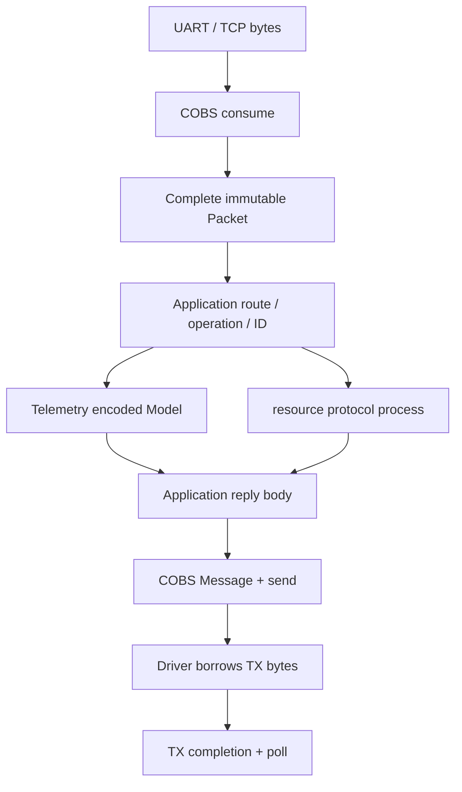

# COBS поверх Telemetry та resource

Автори: Ruslan Kovtun (shpegun60), codexAi. [MIT](../../LICENSE).

Цей розділ показує, як використати
[`shpegun60/cobs`](https://github.com/shpegun60/cobs) для framing власних
telemetry/resource повідомлень. Повна програма та команди збірки — у
[COBS integration example](../../examples/cobs_integration/README.md).
Операції вашого протоколу — у [TransportWalkthrough](TransportWalkthrough.md).

## Два різні завдання

| Шар | Що робить | Хто визначає формат |
| --- | --- | --- |
| Telemetry codec | C++ value ↔ canonical bytes, без padding | Поточний wire v3: фіксовані scalar widths, LE, bool 0/1, структурний порядок members |
| Application protocol | Вибирає Read/Write/Command/Service або files, задає IDs і statuses | Ваш застосунок; тут використано готовий Direct/Resource приклад |
| Resource protocol | LIST/STAT/READ/WRITE для u32 file index | [Resource packet contract](../../lib/resource/protocol/README.md) |
| COBS endpoint | Збирає bytes у packets, додає length/CRC/encoding/delimiter та керує blocks | Погоджений `cobs::Format` обох peers |
| Byte transport | Передає/приймає chunks, повідомляє фізичну втрату bytes та TX completion | UART/TCP/інший driver вашого застосунку |

LE не означає «лише little-endian процесор». Наприклад, число
`0x12345678` завжди має wire bytes `78 56 34 12`. Little-endian target може
зробити fixed-size `memcpy`; на big-endian target codec явно складає або
розкладає байти. Це compile-time вибір, без runtime endian branch.
Floating-point payload має IEEE binary32/binary64 representation, bool —
окремий byte 0/1. C++ padding не передається. Непідтримувані representations
відхиляє Type model; «будь-який C++ об'єкт» не є wire value.

Наш serializer залишається тим самим оптимізованим codec. COBS не
замінює reflection, TypeRegistry або canonical value encoding. Його
`append_le/read_le` зручно використовувати для **вашого packet header**,
а DTO кодувати через `telemetry::encode/decode`.

## Архітектура



Файли тут опціональні: route Direct звертається прямо до Model. Route
Resource потрібен лише для файлів. `DescriptorFile` та `ValuesFile` можна
додати до filesystem так само, як власні version/settings/log providers;
це пояснює [DescriptorAndValues](DescriptorAndValues.md).

## 1. Обрати bounded storage і wire format

```cpp
#include <cobs/Cobs.h>

using Link = cobs::Endpoint<wire::Pool<8, 2>,
                            cobs::Format<crc::Crc16Bitwise, 128>>;

Link link;
```

Це фрагмент декларації; повна working програма є у прикладі. Pool числа
8 та 2 означають кількість RX/TX blocks, а 128 — корисні payload bytes.
Length, CRC та encoder headroom не треба вручну віднімати від 128.
У прикладі length займає 1 byte, CRC — 2 bytes. Інший Format може мати
іншу length width; клієнт і Device повинні використовувати погоджені
налаштування. CRC не визначається автоматично.

Pool дає bounded storage без heap. Вибір `wire::Heap` — явне рішення
застосунку. Telemetry tables і filesystem від цього не змінюються.
Endpoint не переміщується й живе довше за свої Message/Packet handles.
У firmware розмістіть endpoints/pools у стабільному storage, розмір якого
включено до RAM budget; host приклад не обіцяє малий сумарний task stack.

## 2. Прив'язати ваш byte transport

Endpoint потребує двох callbacks:

| Callback | Значення |
| --- | --- |
| `bool send(span<const uint8_t>)` | true: transport позичив **саме ці bytes**; false: нічого не позичив |
| `bool busy()` | true: transport ще може читати позичені bytes; false: більше їх не торкається |

Приклад `Transport` у [main.cpp](../../examples/cobs_integration/main.cpp)
зберігає borrowed span до `finish()`. У справжньому UART це відповідає
часу до підтвердженого завершення/зупинки TX DMA. Callback не повертає
false, якщо DMA вже почала читати buffer. Обидва callbacks синхронні,
`noexcept`, без повторного входу в той самий endpoint.

```cpp
// Фрагмент: transport і link вже створені та залишаються живими.
const bool bound = link.bind(
    Link::Sender{tiny::bind<&Transport::send>(transport)},
    Link::BusyQuery{tiny::bind<&Transport::busy>(transport)});
```

`bind()` відхиляє неповну pair; перевіряйте результат. Driver/transport
живе довше за останній TX borrow, а переобв'язування не дозволяється
під час active transfer. STM32 UART glue має власний
[COBS integration guide](https://github.com/shpegun60/cobs/blob/2e0abf260848fcb74e4a57b37532188047759643/doc/INTEGRATION.md).
Бібліотека telemetry не включає HAL чи UART driver.

## 3. Побудувати application packet

Поточний приклад відділяє route від operation:

| Route | Body після route |
| --- | --- |
| 1 Direct | `u8 operation, u32 LE packedId, canonical payload` |
| 2 Resource | Complete generic LIST/STAT/READ/WRITE packet |

Для Field read у нашому Device Period має ID 0:

```cpp
auto message = link.make_message();
// Повна програма перевіряє message і результат КОЖНОГО append.
const bool ok = message
    && message.append_le(std::uint8_t{1}) // Direct route.
    && message.append_le(std::uint8_t{1}) // Read operation.
    && message.append_le(std::uint32_t{0});
```

Для Write body після header містить `telemetry::encode(value, bytes)`.
Передайте отримані bytes через `append_bytes()`, як `appendValue()` у
прикладі. Не використовуйте `append_native(struct)` та не надсилайте
`sizeof(Request)` bytes із пам'яті: це поверне platform padding/native
representation у ваш wire. `wire::read_le` читає scalar header з перевіркою
bounds; struct/array payload читає telemetry codec за його Type.

Відсутність length prefix у цьому body навмисна. COBS уже framing layer;
не пропускайте його decoded Packet повторно через length-prefix
`StreamReceiver` із device_integration.

## 4. Відправити й зберегти ownership

| SendResult | Значення | Дія застосунку |
| --- | --- | --- |
| Sent | Endpoint забрав TX block; Message порожній | Чекати завершення borrow та викликати poll |
| Busy | Message ще володіє block; transport недоступний | Зберегти pending Message та повторити після звільнення TX |
| Unbound | Sender/busy pair не прив'язана | Налаштувати transport |
| Failed | Старт transfer відхилено; prepared Message збережено | Розібрати причину; не вважати bytes доставленими |
| Invalid | Message порожній, чужий або має неприйнятний layout | Виправити побудову/ownership |

`Sent` не є підтвердженням виконання setter/Command у Device. Таке
підтвердження містить **application reply**. За Busy не знищуйте Message
і не створюйте нескінченну pending queue. Один retained Message або bounded
черга є рішенням application layer.

Викликайте `link.poll(now)` після того, як transport припинив читати
TX bytes. Poll повертає block у storage. Не обнуляйте або звільняйте його
вручну. Message, що вже пішов у Sent, не можна повторно append/send.

## 5. Прийняти chunks та виконати одну операцію

```cpp
// Фрагмент application/task loop; response building показано у roundTrip().
link.consume(rxChunk);
while (auto packet = link.pop_packet()) {
    const auto completeBody = std::as_bytes(packet.data());
    const auto reply = app::api::onCompletePacket(completeBody, replyBuffer);
    // Закодувати лише replyBuffer[0..reply.written) у новий COBS Message.
    // За Busy зберегти Message до наступного кроку TX.
}
```

Packet — immutable RAII handle. Його bytes живі, поки handle і underlying
endpoint живі. У прикладі handler синхронно декодує request та викликає
Device, тож після його повернення request Packet можна відпустити.
Він не передає borrowed request span у відкладену Command queue: owner
повинен зберегти власний Request, якщо повертає Accepted.

COBS builder копіює `append_bytes()` до свого block. Після успішного append
локальний replyBuffer можна використати повторно; transport далі позичає
TX block endpoint. Неповний RX chunk не викликає telemetry callback.
Один `consume()` може завершити кілька packets — тому потрібен while.

Серіалізуйте consume/pop/send/poll/bind і telemetry/resource handler
на відповідному execution context. Host приклад не виконує callbacks
у ISR. У UART ISR driver збирає/позначає bytes, а application task
обробляє готові chunks та бізнес-логіку за driver contract.

## 6. Фізична втрата та відновлення межі

На підтверджену втрату bytes викликайте `notify_gap()`. Endpoint відкидає
незавершений frame та чекає delimiter, щоб відновити boundary. Готові
queued packets зберігаються. **Короткий chunk, UART IDLE або тимчасова
відсутність bytes самі по собі не є gap.**

У host прикладі спочатку подаються лише перші bytes frame, потім gap,
потім його delimiter `00`, і лише тоді новий цілий frame. Якщо після gap
втрачений також delimiter, перший наступний frame може слугувати межею
resynchronization; його не можна обіцяти як доставлений packet.

## 7. Файли й Descriptor/Values

Resource route передає `packet.data()` після route у
`resource::protocol::process(files.view(), ...)`. Для власного файла
додається лише provider і `resource::file(path, provider)` — COBS endpoint
не знає шляху та не шукає файл. Приклад перевіряє LIST, STAT, version READ
і partial Note WRITE через ті самі COBS endpoints.

Для generic READ залиште місце на route та 12-byte response header.
У 128-byte application body це максимум 115 bytes data. Descriptor
допускає byte chunks; Values потребує місця на цілий token, тому
перевірте `maxTokenSize()` проти цієї capacity. Деталі:
[Resources](Resources.md), [Descriptor/Values](DescriptorAndValues.md),
[wire v3](../WireV3.md).

COBS не виконує Bind і не порівнює descriptor fingerprint. За потреби
application body може бути окремим Bind/Exchange packet замість нашого
Direct/Resource route. Тоді явно використайте
[structured_protocol example](../../examples/structured_protocol/README.md)
і його packet sizes; не змішуйте headers та operation codes двох прикладів.

## Перевірки та межі

[COBS runner](../../tests/cobs/run.py) перевіряє реальні endpoints, CRC,
ownership і 295 application conditions. Sanitizers виконуються на Linux;
ARM mode перевіряє компіляцію/лінкування. Реальне UART DMA виконання цього
telemetry прикладу тут не заявлене.

[Cross-endian runner](../../tests/structured/codec/endian.py) запускає
одні й ті самі codec/resource/Descriptor/Values програми на little-endian
host та справжньому s390x target під QEMU. Це окрема перевірка endian
незалежності, не вимір ARM продуктивності й не hardware qualification.
