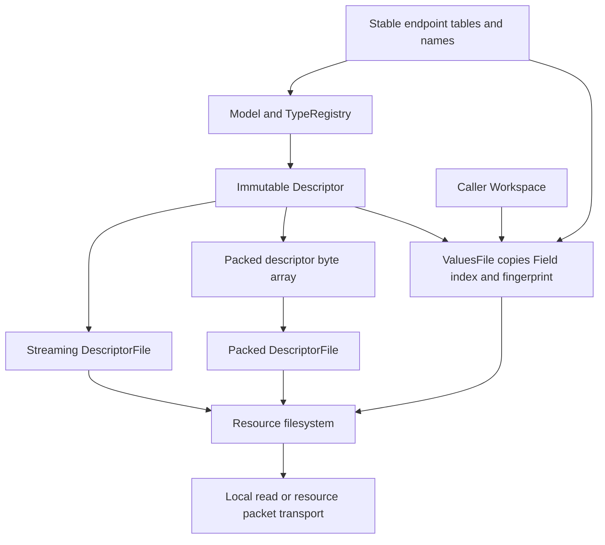

# Descriptor і живі Values

Автори: Ruslan Kovtun (shpegun60), codexAi. SPDX-License-Identifier: MIT.

[Посібник](README.md) · [Resource files](Resources.md) ·
[V3 provider API](../../lib/resource/telemetry/v3/README.md) · [Wire v3.0](../WireV3.md)

Перед providers прочитайте [Model](Model.md); для payload/scratch capacities
та lifetime leases є окремий [Codec and Workspace](CodecAndWorkspace.md).

Descriptor повідомляє consumer, які types, catalogs і endpoints має Model.
Values передає live Field values у тому самому порядку. Це два read-only
providers для незалежного `resource` filesystem; вони не є transport чи
сховищем application state. Повні Model/provider declarations є у
[client Device.hpp](../../examples/structured_client/Device.hpp).

## Навігація

- [Об'єкти та залежності](#обєкти-та-залежності)
- [Streaming або packed Descriptor](#streaming-або-packed-descriptor)
- [Descriptor API](#descriptor-api)
- [Зареєструвати Descriptor та Values як файли](#зареєструвати-descriptor-та-values-як-файли)
- [Values API та розміри buffers](#values-api-та-розміри-buffers)
- [Порційне читання і snapshot](#порційне-читання-і-snapshot)
- [Fingerprint та зміни моделі](#fingerprint-та-зміни-моделі)
- [Lifetime, concurrency та помилки](#lifetime-concurrency-та-помилки)
- [Клієнти й приклади](#клієнти-й-приклади)

## Об'єкти та залежності



Descriptor construction, reading і hashing не викликають getters.
Values constructor/size/STAT також не читають live state. Getter викликає
тільки explicit Values READ, коли достатньо output/scratch для token.
Services і Commands описані в descriptor, але Values містить лише Fields.

## Streaming або packed Descriptor

Фрагмент після current `model` declaration із
[Device.hpp](../../examples/structured_client/Device.hpp):

```cpp
#include <resource/telemetry/v3/Descriptor.hpp>
#include <resource/telemetry/v3/DescriptorFile.hpp>

namespace rs = resource::telemetry::v3;
inline constexpr rs::Descriptor descriptor{model};
static_assert(descriptor.valid());

// Option 1: stream directly from immutable metadata.
inline constexpr rs::DescriptorFile streamedDescriptor{descriptor};

// Option 2: serialize during compilation and serve immutable packed bytes.
inline constexpr auto descriptorBytes = rs::packDescriptor<descriptor>();
inline constexpr rs::DescriptorFile packedDescriptor{descriptorBytes};
```

Обидві форми віддають ті самі canonical bytes і fingerprint. Streaming
Descriptor має segment index; `Descriptor::indexBytes` показує його розмір.
Packed variant створює `std::array<byte, descriptor.size()>` під час
compilation; якщо streaming object більше не потрібний, остаточно
linked program може залишити лише byte array. Actual sections/Flash size
перевіряються у вашому build; automatic універсальної економії немає.

`packDescriptor` потребує valid constexpr Descriptor. Runtime Descriptor
перевіряйте через `valid()`/`error()` перед опублікуванням provider.
DescriptorFile позичає конкретний lvalue source: packed
`std::array<std::byte, N>` або об'єкт з exact const/noexcept operations
`resource::FileSize size() const noexcept` і
`resource::ReadResult read(resource::Cursor, resource::Output) const noexcept`.
Тому source може бути streaming Descriptor, named DescriptorView чи власний
сумісний immutable provider. Source і вся borrowed metadata живуть довше
за DescriptorFile та reads. Temporary source, включно з результатом
`descriptor.view()`, відхиляється; спочатку збережіть view у named lvalue.

Packed array та canonical Descriptor/DescriptorView використовують byte-offset
READ. Для custom streaming source wrapper делегує `read()` разом із cursor/error
semantics source; DescriptorFile не перевіряє довільні bytes як valid schema.

## Descriptor API

| Object / API | Тип і значення |
| --- | --- |
| `rs::Descriptor{model}` | Metadata/offset index і cached fingerprint для Model |
| `descriptor.valid()` | `bool`: model metadata прийнята |
| `descriptor.error()` | `DescriptorError`, причина відмови construction |
| `descriptor.size()` | `uint32_t`, повний canonical descriptor byte count |
| `descriptor.fingerprint()` | `uint64_t`, cached FNV-1a identity |
| `descriptor.fieldIndex()` | Borrowed FieldIndex, без getter call |
| `descriptor.view()` | Borrowed DescriptorView, лише із lvalue descriptor |
| `descriptor.read(cursor, output)` | `ReadResult`, byte-offset READ |
| `Descriptor::segmentCount` / `indexBytes` | Compile-time число emission segments без sentinel; byte size index включає один sentinel: `(segmentCount + 1) * sizeof(Segment)` |
| `rs::packDescriptor<descriptor>()` | Consteval packed byte array |
| `rs::DescriptorFile{source}` | Read-only generic resource provider |
| `descriptorFile.size()` / `read(cursor, output)` | FileSize / ReadResult; ті самі byte-offset правила |
| `DescriptorView::size/fingerprint/error/read` | Runtime borrowed facade; owner Descriptor живе довше |

Explicit profile для `Descriptor<Fields, Commands, Services, Profile>`
змінює technical parser/model ceilings у підтриманому profile interface.
Він не додає business limits чи unsupported wire types.
Default 11 constants і descriptor layout описані у
[Wire v3.0](../WireV3.md#default-technical-ceilings).

`DescriptorError` має окремий domain від resource/dispatch status:

| Enumerator | Значення |
| --- | --- |
| `None` | Metadata прийнята |
| `InvalidName` | Неприйнятне ім'я, UTF-8 чи name length |
| `DuplicateName` | Catalog name повторюється у своїй category або endpoint name у своєму catalog |
| `TooLarge` | Загальний descriptor byte size перевищує `Profile::maxDescriptorBytes` |
| `MetadataMismatch` | Неконсистентні type/endpoint metadata чи emission index |

Invalid constexpr Descriptor дає construction diagnostic. Runtime Descriptor
повертає error, `size()==0`, `fingerprint()==0` і READ `InvalidData`;
не публікуйте його як valid schema. Factory name contract перевіряється також
у declaration factories, до Descriptor construction.

Type/count/profile ceilings, які відомі зі static Model shape, перевіряються
через `static_assert`; вони не перетворюються на runtime `TooLarge`.

## Зареєструвати Descriptor та Values як файли

Integration fragment після stable Model declarations; повний executable
consumer має також include/link sources з
[GettingStarted](GettingStarted.md#крок-2-підключіть-source-та-include-paths):

```cpp
#include <resource/FileSystem.hpp>
#include <resource/telemetry/v3/Descriptor.hpp>
#include <resource/telemetry/v3/DescriptorFile.hpp>
#include <resource/telemetry/v3/ValuesFile.hpp>
#include <array>

namespace rs = resource::telemetry::v3;
inline constexpr rs::Descriptor descriptor{model};
inline constexpr auto descriptorBytes = rs::packDescriptor<descriptor>();
inline constexpr rs::DescriptorFile descriptorFile{descriptorBytes};

inline std::array<std::byte, model.maxFieldScratch()> scratch{};
inline telemetry::Workspace workspace{scratch};
inline constexpr rs::ValuesFile values{descriptor, workspace};
inline constexpr auto files = resource::filesystem(
    resource::file("/telemetry/descriptor.bin", descriptorFile),
    resource::file("/telemetry/values.bin", values));
```

Paths — application choice. Filesystem не створює data files на носії;
providers формують bytes під час READ. DescriptorFile і ValuesFile
не мають WRITE. Для зміни endpoint використайте native або encoded
Field write, Command чи Service. Для custom writable file потрібний
окремий [provider](Resources.md).

## Values API та розміри buffers

| API | Контракт |
| --- | --- |
| `rs::ValuesFile{descriptor, workspace}` | Копіює Field index, offsets і fingerprint; Workspace — borrowed lvalue |
| `values.size()` | FileSize: `24 + sum(1 + wireSize<T>)`; без getters |
| `values.fingerprint()` | Той самий cached descriptor hash |
| `values.fieldCount()` | Число Field tokens, без Commands/Services |
| `values.maxTokenSize()` | Найбільше `1 + wireSize<T>`; потрібна READ payload capacity |
| `values.requiredWorkspace()` | Найбільший read scratch requirement з alignment margin |
| `values.read(cursor, output)` | ReadResult; whole-token progression |
| `model.maxFieldScratch()` | Scratch bound Fields для integration storage |
| `model.maxScratch()` | Scratch bound однієї Field/Command/Service operation |

Scratch, wire payload і transport envelope — три різні розміри. Local
payload-object budget 32 B не обмежує packet до 32 B. Borrowed getter
може читатися без owning DTO scratch, але setter того самого Field
ще може потребувати decoded native object.

Output payload READ має вміщати `maxTokenSize()`; protocol reply header
і зовнішнє framing додаються окремо. Для максимального token 4097 B
transport із READ payload 512 B дасть BufferTooSmall на цьому Field.
Збільшення числа READ calls не розділить token. Descriptor bytes можна
читати малими chunks довільного розміру.

## Порційне читання і snapshot

Descriptor cursor — byte offset; READ може закінчитися всередині record
чи string. Values cursor дозволяє positions усередині immutable 24-byte
header, початок token або EOF. Середина token — InvalidCursor.
Header може бути partial, value token — цілий.

До token provider перевіряє output та required scratch, викликає getter
один раз, кодує повний payload і лише тоді просуває cursor. При
Unavailable status payload лишається fixed-size zero bytes, які consumer
не трактує як value. EOF повертає written=0/eof=true без getters.

Owning `T` дає snapshot одного Field. Borrowed `const T&` кодується з
existing object, який application тримає живим і стабільним протягом
операції. Різні Field tokens можуть бути отримані в різні моменти.
Для coherent multi-field результату поверніть одну coherent aggregate
або забезпечте зовнішню serialization/snapshot policy.

Client reading algorithm:

1. Знайти descriptor/Values indexes за paths через LIST, якщо filesystem
   ordering не є вашим application contract.
2. Прочитати весь descriptor, перевірити version, offsets, counts,
   references, canonical sizes, technical ceilings і fingerprint.
3. Почати Values cursor=0, зі span capacity ≥ maxTokenSize і envelope budget.
4. Прийняти рівно written bytes та продовжити з returned next.
5. Звірити Values fingerprint із descriptor перед інтерпретацією tokens;
   завершити на eof. Обробити status та відсутність progress явно.

## Fingerprint та зміни моделі

Fingerprint — FNV-1a-64 canonical immutable descriptor. Він включає
names, shape, endpoint order/capabilities і enum dictionary. Live values,
owner/callback pointers і slot Ready/empty state не входять.
Slot rebind, Field mutation чи owning→borrowed output з тією самою
canonical shape не змінює descriptor bytes.

Fingerprint пов'язує descriptor та Values. Це не checksum live values
і не connection state. Application вирішує, коли refresh descriptor:
при connection, новому firmware/model або явній mismatch відмові.
Offline export має зберігати обидва files. Новий descriptor змінився
після reordering/name/type/capability зміни — consumer оновлює schema.

## Lifetime, concurrency та помилки

Descriptor borrow underlying tables/names; DescriptorView additionally
borrow owning Descriptor. DescriptorFile borrow source. ValuesFile не
borrow сам Descriptor: він копіює FieldIndex/fingerprint, але underlying
tables/names і Workspace лишаються external storage.

Parallel operations через shared Workspace, включно з копіями одного
ValuesFile, потребують зовнішнього lock або окремих provider/workspace
instances. Names/metadata незмінні, owner state синхронізується application.
Output не перекриває Workspace, коли Values має scratch-backed Field.

**Увесь** Values READ output span має бути disjoint від live application
objects: provider записує header, status і payload. Payload overlap guard
окремого Field не перевіряє surrounding bytes. Це caller contract також
для header-only read; він потрібний, щоб не змінити owner до getter/encoding.

Descriptor/DescriptorFile source і metadata лишаються immutable. Destination
не може перезаписувати packed source bytes або borrowed metadata; packed
DescriptorFile read використовує `memcpy`. Дозволений protocol request/reply
overlap не дозволяє overlap response з provider source storage.

| Result | Meaning |
| --- | --- |
| Descriptor invalid/error | Відхилені metadata/profile; provider не публікується як valid schema |
| `BufferTooSmall` | Немає місця для потрібного progress / whole Values token |
| `InvalidCursor` | Cursor не є valid offset або token boundary |
| `InvalidData` | Заборонений output/scratch overlap для Values |
| `InternalError` | Values Workspace configuration не дозволяє operation |
| Values token `Unavailable` | Binding/target unavailable; token fixed-size, без value |

Якщо до problem token уже завершено prefix, Values повертає prefix Ok
і next саме цього token; наступний READ дістається до problem без повторів
уже викликаних getters. Dispatch/resource/token statuses мають різні domains.

## Клієнти й приклади

| Задача | Повний source / перевірка |
| --- | --- |
| Mixed reflected DTOs, immutable descriptor та Values | [Device.hpp](../../examples/structured_client/Device.hpp), [client README](../../examples/structured_client/README.md) |
| Незалежний JS parser/codec, U64/S64 BigInt і shape-driven payload | [Client API](../../tests/structured/client/README.md), [telemetry.js](../../web/telemetry.js) |
| Provider internals, exact default/profile contracts і qmake | [V3 README](../../lib/resource/telemetry/v3/README.md) |
| Exact bytes/header/record/fingerprint reference | [Wire v3.0](../WireV3.md) |
| Host, sanitizer, ARM та H7S доказові межі | [Descriptor checks](../../tests/structured/descriptor/README.md), [Values checks](../../tests/structured/resources/README.md) |
| Receive framing, LIST і file transfer | [Transport walkthrough](TransportWalkthrough.md) |
