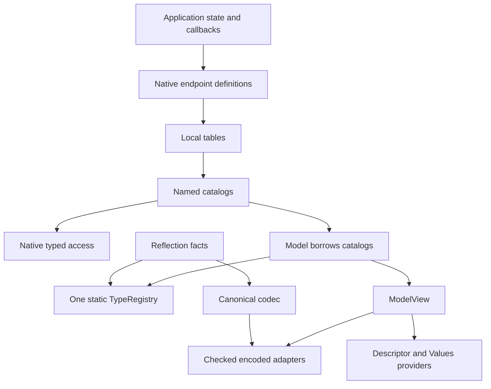

# Model: endpoint catalogs і structural types

Автори: Ruslan Kovtun (shpegun60), codexAi. SPDX-License-Identifier: MIT.

[Посібник](README.md) · [Таблиці й каталоги](TablesAndCatalogs.md) ·
[Codec і Workspace](CodecAndWorkspace.md) · [Descriptor і Values](DescriptorAndValues.md)

`Model` збирає Field, Command і Service catalogs та виводить із їхніх C++ типів
один `TypeRegistry`. Він дає runtime indexes, спільні TypeIds і межі buffer/scratch
для encoded operations. Значення пристрою залишаються у application owners;
модель позичає каталоги, а registry описує лише структуру типів.

Поточна реалізація міститься у [Model.hpp](../../lib/telemetry/model/Model.hpp),
[Registry.hpp](../../lib/telemetry/type/Registry.hpp) та
[Descriptor.hpp](../../lib/telemetry/type/Descriptor.hpp). Ця сторінка описує
наявний C++20 API.

## Навігація

- [Ролі об'єктів](#ролі-обєктів)
- [Повний приклад](#повний-приклад)
- [Model API](#model-api)
- [Typed access і runtime access](#typed-access-і-runtime-access)
- [ModelView](#modelview)
- [TypeRegistry і TypeDescriptor](#typeregistry-і-typedescriptor)
- [Positional roots і registry roots](#positional-roots-і-registry-roots)
- [Reflection та форма payload](#reflection-та-форма-payload)
- [Порядок IDs і зміни declaration](#порядок-ids-і-зміни-declaration)
- [Межі та порожні категорії](#межі-та-порожні-категорії)
- [Lifetime, synchronization і ABI](#lifetime-synchronization-і-abi)

## Ролі об'єктів

| Об'єкт | Що він містить | Для чого потрібний |
| --- | --- | --- |
| Application owner / callable / slot | Прикладний стан або callback target | Виконати getter, setter, Command чи Service |
| `FieldDefinition`, `CommandDefinition`, `ServiceDefinition` | Ім'я та native binding | Зберегти точну C++ сигнатуру і target |
| Local table | Власні definitions і похідні runtime entries | Typed position access та перевірений runtime selection |
| `TableGroup` / catalog table | Назву групи, позичені local tables і власні catalog rows | Об'єднати local positions у packed-ID простір |
| `Model` | Вказівники на три catalogs; тип `Registry` виведений із roots | Зіставити всі endpoint types та runtime families |
| `ModelView` | Позичені runtime indexes і паралельні TypeId catalogs | Передати повну модель до compiled adapter чи provider |
| `TypeRegistry` | Статичні descriptors точних C++ типів | Призначити TypeIds і описати залежності типів |
| `reflection` | Member, enum і callable facts | Перевірити payload shape та побудувати structural metadata |
| Codec | Canonical bytes конкретного native payload | Перетворити native object у bytes або bytes у leased object |



Native виклик можна виконати прямо через local table або catalog до створення
`Model`. Модель потрібна, коли всі families мають узгодити type metadata,
runtime view або розміри encoded storage. Сам `Model` не має native
`read<...>()`, `write<...>()` чи `call<...>()`: ці операції належать tables і catalogs.

## Positional roots і registry roots

Таблиці й каталоги мають два різні compile-time списки:

| Alias | Порядок і кількість | Споживач |
| --- | --- | --- |
| `RootTypes` | Усі declared roots; повтори зберігаються | Positional metadata, кількість Field tokens у `ValuesFile` |
| `RegistryRootTypes` | Унікальні normalized C++ типи; перше входження зберігається | Побудова `Model::Registry` |

Field має один value root, Command — один request root, Service — пару
request/response roots у порядку `Request0, Response0, Request1, Response1, ...`.
`Void` також залишається у positional списку. У каталозі списки йдуть у порядку
груп, а всередині груп — у порядку оголошення endpoints.

Наприклад, 100 Fields одного типу мають `RootTypes::size == 100` і
`RegistryRootTypes::size == 1`. Values зберігає всі 100 значень і 100 tokens
плюс EOF; Registry описує спільний тип один раз. Кількість endpoints,
packed IDs і positional TypeId arrays від дедуплікації не зменшуються.

Дедуплікація виконується в local table, потім між tables у каталозі.
`Model` передає Registry ці скорочені списки в порядку Fields → Commands →
Services. Registry, як і раніше, додає залежності перед типом-контейнером;
однаковий wire shape не об'єднує різні C++ типи. TypeIds, canonical descriptor
bytes і fingerprint тому не змінюються від самого скорочення повторених roots.

Catalog-like adapter із колишнім `RootTypes` без `RegistryRootTypes` також
приймається: Model виводить унікальні registry roots із його positional списку.
Для адаптера з власним `RegistryRootTypes` цей alias має дотримуватися того
самого порядку першого входження; він не може приховувати типи endpoints.

Це оптимізація template computation. Вона не змінює runtime entry layouts,
storage budget чи indexed dispatch і не гарантує побайтово однаковий ELF:
конкретна спеціалізація `Model::Registry` та її symbol names можуть змінитися.
Для великих проектів дивіться вимірювання й окремі compiler ceilings у
[Scalability](../Scalability.md). Прямий `TypeRegistry<Roots...>` і далі приймає
переданий користувачем список; hierarchical reduction стосується tables,
catalogs і Model.

## Повний приклад

Приклад показує одну Field-структуру, Command без request і Service з aggregate
request/response. Він використовує owning Service result та borrowed Field
getter. Усі declarations мають стабільні адреси, а application state живе довше
за таблиці.

```cpp
#include <telemetry/Telemetry.hpp>

#include <array>
#include <cassert>
#include <cmath>
#include <cstdint>

namespace ts = telemetry;

struct Config {
    float limit;
    bool enabled;
};

struct Query {
    std::uint16_t channel;
};

struct Response {
    float limit;
    std::uint16_t channel;
};

struct Device {
    Config config{230.0f, true};

    const Config& readConfig() const noexcept
    {
        return config;
    }

    ts::WriteResult writeConfig(const Config& next) noexcept
    {
        if (!std::isfinite(next.limit) || next.limit < 1.0f || next.limit > 1000.0f) {
            return ts::WriteResult::InvalidValue;
        }
        config = next;
        return ts::WriteResult::Applied;
    }

    ts::CommandResult restoreDefaults() noexcept
    {
        config = {230.0f, true};
        return ts::CommandResult::Executed;
    }

    ts::ServiceResult<Response> query(const Query& request) const noexcept
    {
        if (request.channel >= 3) {
            return ts::ServiceResult<Response>::failure(ts::ServiceStatus::InvalidArgument);
        }
        return ts::ServiceResult<Response>::success({config.limit, request.channel});
    }
};

inline Device device;
inline constexpr ts::FieldTable localFields{
    ts::field<&Device::readConfig, &Device::writeConfig>("Config", device),
};
inline constexpr ts::CommandTable localCommands{
    ts::command<&Device::restoreDefaults>("RestoreDefaults", device),
};
inline constexpr ts::ServiceTable localServices{
    ts::service<&Device::query>("Query", device),
};

inline constexpr ts::FieldCatalogTable fields{ts::group("settings", localFields)};
inline constexpr ts::CommandCatalogTable commands{ts::group("control", localCommands)};
inline constexpr ts::ServiceCatalogTable services{ts::group("queries", localServices)};
inline constexpr ts::Model model{fields, commands, services};

inline constexpr auto configId = ts::makeId<0, 0>();
inline constexpr auto queryId = ts::makeId<0, 0>();

int main()
{
    const auto native = fields.read<configId>();
    assert(native && native.valueOrNull() == &device.config);

    const auto nativeReply = services.call<queryId>(Query{2});
    assert(nativeReply.hasValue() && nativeReply.value().channel == 2);

    const auto view = model.view();
    assert(view.fieldTypeId(configId) == model.typeId<Config>());
    const auto serviceTypes = view.serviceTypeIds(queryId);
    assert(serviceTypes && serviceTypes->requestTypeId == model.typeId<Query>());
    assert(serviceTypes->responseTypeId == model.typeId<Response>());
    assert(model.types().find(model.typeId<Config>())->kind == ts::TypeKind::Struct);

    std::array<std::byte, model.maxScratch()> scratch{};
    ts::Workspace workspace{scratch};
    std::array<std::byte, ts::wireSize<Config>> configBytes{};
    const Config next{240.0f, true};
    assert(ts::encode(next, configBytes) == ts::CodecStatus::Ok);

    const auto written = ts::writeFieldEncoded(view, configId, configBytes, workspace);
    assert(written.dispatch == ts::DispatchStatus::Ok);
    assert(written.endpointStatus == ts::WriteResult::Applied);
    assert(device.config.limit == 240.0f);

    std::array<std::byte, ts::wireSize<Query>> requestBytes{};
    std::array<std::byte, ts::wireSize<Response>> responseBytes{};
    const Query request{1};
    assert(ts::encode(request, requestBytes) == ts::CodecStatus::Ok);
    const auto reply = ts::callServiceEncoded(view, queryId, requestBytes,
                                            responseBytes, workspace);
    assert(reply.dispatch == ts::DispatchStatus::Ok);
    assert(reply.endpointStatus == ts::ServiceStatus::Ok);
    assert(reply.written == responseBytes.size());
    assert(workspace.used() == 0);
}
```

Для compiled calls у прикладі потрібно лінкувати
[Adapter.cpp](../../lib/telemetry/model/Adapter.cpp) і
[StructuredAbi.cpp](../../lib/telemetry/abi/StructuredAbi.cpp).
[telemetry.pri](../../lib/telemetry/telemetry.pri) додає їх один раз у qmake build.
Manual C++20 build має include roots `lib`, `lib/boost_pfr/include` і `lib/magic_enum`.

Числові значення `configId` і `queryId` однакові: families мають окремі логічні
простори. Transport передає також вид операції, який вибирає потрібний index.

## Model API

| Виклик | Результат / дія |
| --- | --- |
| `Model{fields, commands, services}` | Позичає саме ці lvalue catalogs; temporary catalogs відхиляються |
| `Model::Registry` | Тип повного registry, виведений із roots трьох families |
| `model.types()` | `TypeRegistryView` на immutable type metadata; метод також доступний статично |
| `model.typeId<T>()` | `consteval TypeId` точного нормалізованого C++ типу; відсутній тип дає compile error |
| `model.fieldIndex()` | Позичений `FieldIndex` на runtime rows |
| `model.commandIndex()` | Позичений `CommandIndex` на runtime rows |
| `model.serviceIndex()` | Позичений `ServiceIndex` на runtime rows |
| `model.view()` | Повний `ModelView` із indexes і matching TypeId catalogs |
| `model.maxFieldScratch()` | Максимум read/write scratch серед Fields |
| `model.maxCommandScratch()` | Максимум request scratch серед Commands |
| `model.maxServiceScratch()` | Максимум одночасного request/result scratch серед Services |
| `model.maxScratch()` | Максимум попередніх трьох меж для однієї encoded operation |
| `model.maxFieldWireSize()` | Найбільший Field payload у canonical bytes |
| `model.maxServiceResponseWireSize()` | Найбільший Service response payload у canonical bytes |

`maxScratch()` включає запас для вирівнювання byte span. Він достатній для
однієї operation на Workspace без активних outer leases. Nested calls потребують
суми всіх одночасно живих leases або окремих Workspaces. Межа не описує stack
callback, compiler spills чи transport packet headers.

## Typed access і runtime access

| Шлях | Приклад | Що перевіряється |
| --- | --- | --- |
| Local typed Field | `localFields.read<0>()`, `localFields.write<0>(next)` | Position і точний native type під час compilation |
| Global typed Field | `fields.read<configId>()`, `fields.write<configId>(next)` | Packed group/entry під час compilation |
| Explicit Field conversion | `fields.readAs<Config, configId>()`, `fields.writeAs<configId>(next)` | Exact structural type або checked numeric conversion |
| Native Command | `commands.call<ts::makeId<0, 0>()>()` | Request shape із declaration; callback повертає `CommandResult` |
| Native Service | `services.call<queryId>(Query{1})` | Exact aggregate request; native owning/borrowed result |
| Runtime typed selection | `fields.visit(id, visitor)` | Original integer width і catalog bounds перед borrowed definition callback |
| Runtime erased operation | `model.fieldIndex().readEncoded(id, output, workspace)` | ID, wire capacity та scratch rules |
| Compiled erased operation | `ts::readFieldEncoded(model.view(), id, output, workspace)` | Ті самі правила плюс exact ABI tag у linked symbol |

Для runtime Field conversions catalog має `readAs<To>(id)` та `writeAs(id, value)`.
Невідповідний structural type не викликає getter/setter: читання повертає
`nullopt`, запис — `InvalidValue`. Runtime numeric conversion завершується
до application mutation. Повні сигнатури й ordering шаблонних аргументів є у
[Fields](Fields.md) та [TablesAndCatalogs](TablesAndCatalogs.md).

`forEach` і `visit` позичають definitions; вони не матеріалізують endpoint values
автоматично. `visit` повертає `bool` вибору: `true` означає, що visitor отримав
definition. Return value visitor і status окремого endpoint не визначають цей `bool`.

Compiled API із [Adapter.hpp](../../lib/telemetry/model/Adapter.hpp):

```cpp
// Fragments: model, id and buffers are supplied by the caller.
auto read = ts::readFieldEncoded(model.view(), id, output, workspace);
auto write = ts::writeFieldEncoded(model.view(), id, input, workspace);
auto command = ts::executeCommandEncoded(model.view(), id, input, workspace);
auto service = ts::callServiceEncoded(model.view(), id, input, output, workspace);
```

Ці calls працюють із payload span. Збір повного UART/TCP frame, connection state,
request correlation та формування transport response виконує application layer;
див. [Transport walkthrough](TransportWalkthrough.md).

## ModelView

`ModelView` — copyable erased view. Він містить runtime indexes і TypeId catalogs
для тих самих rows. Створюйте його через `model.view()`, щоб arrays і counts
відповідали одне одному. Public data members потрібні також для exact ABI layout
checks; library не перевіряє коректність довільно створених pointer/count pairs.

| API / member | Значення |
| --- | --- |
| `types` | `TypeRegistryView` із immutable descriptors |
| `fields`, `commands`, `services` | Runtime indexes відповідних families |
| `fieldTypes` / `fieldCatalogCount` | Паралельні Field value TypeId catalogs |
| `commandTypes` / `commandCatalogCount` | Паралельні Command request TypeId catalogs |
| `serviceTypes` / `serviceCatalogCount` | Паралельні request/response TypeId catalogs |
| `fieldTypeId(id)` | `optional<TypeId>` для Field value |
| `commandTypeId(id)` | `optional<TypeId>` для Command request; no-request Command має Void |
| `serviceTypeIds(id)` | `optional<ServiceTypePair>` для Service request/response |

TypeId lookup приймає integral packed ID, перевіряє його до narrowing і повертає
`nullopt` для невідомих positions. Lookup metadata не викликає application callback.
Копія `ModelView` позичає ті самі arrays і owners, не створюючи snapshot live state.

## TypeRegistry і TypeDescriptor

`TypeRegistry<Roots...>` можна використати окремо. Для metadata, яку передають
разом із endpoints повного пристрою, використовуйте `Model::Registry`: local table
не знає всіх roots і не може самостійно призначити matching global TypeIds.

| Registry API | Результат |
| --- | --- |
| `Registry::typeCount` | Кількість descriptors включно з builtins |
| `Registry::recordsBytes` | Сумарний розмір wire type records для descriptor |
| `Registry::typeId<T>()` | Compile-time position точного `remove_cvref_t<T>` |
| `Registry::descriptor<Id>()` | Посилання на descriptor; неправильний Id відхиляється під час compilation |
| `Registry::view()` | Позичений `TypeRegistryView` на static arrays |
| `view.find(id)` | Pointer на descriptor або `nullptr` для невідомого TypeId |

`TypeRegistryView` має `data`, `count` і `recordsBytes`. `data` позичає immutable
array із `count` descriptors; `recordsBytes` рахує type records, а не повний
Descriptor file з його header, catalogs та endpoint records. `find` приймає вже
типізований `TypeId` (`uint32_t`); якщо external число ширше, перевірте його
діапазон до conversion у цей тип.

Built-in positions мають фіксований порядок:
`void`, `bool`, U8, S8, U16, S16, U32, S32, U64, S64, F32, F64.
Власні roots додаються після них. Enum спершу додає underlying type, array —
element type, struct — member types у declaration order, потім додається сам type.
Повторний точний C++ тип додається один раз. Два різні aggregate types із тією
самою формою залишаються двома registry entries.

```cpp
// Standalone metadata fragment; Config, Query and Response are declared above.
using Registry = ts::TypeRegistry<Config, Query, Response>;
constexpr auto configType = Registry::typeId<Config>();
constexpr const auto& descriptor = Registry::descriptor<configType>();
static_assert(descriptor.kind == ts::TypeKind::Struct);
static_assert(descriptor.wireBytes == ts::wireSize<Config>);
```

| `TypeDescriptor` field | Для якого kind / що означає |
| --- | --- |
| `id`, `kind` | Для всіх types: registry position та structural kind |
| `wireBytes` | Canonical value extent без native padding; Void має 0 |
| `recordBytes` | Розмір descriptor type record разом із v3 record header |
| `scalarCode` | Scalar: Bool, U8/S8 … F32/F64 |
| `relatedTypeId` | Enum: underlying type; Array: element type |
| `elementCount` | Array: fixed element count |
| `memberData`, `memberCount` | Struct: declaration-order type/name records |
| `enumData`, `enumCount` | Enum: numeric-code/name dictionary |
| `member(index)` | Checked member pointer або `nullptr` |
| `enumEntry(index)` | Checked enum-entry pointer або `nullptr` |

`MemberDescriptor` містить `typeId` і позичений `name`. `EnumEntryDescriptor`
містить `codeBits` і позичений `name`. Kind-specific counters і pointers
описують лише відповідний kind; наприклад, scalar не має struct members.

`EnumEntryDescriptor::codeBits` зберігає unsigned bit pattern underlying value
у молодших `wireBytes` bytes, включно з negative signed codes.
Descriptors не містять native field offsets, owner addresses, units, defaults
чи допустимі application ranges. Їхня задача — structural interpretation bytes.

## Reflection та форма payload

| Facade | Поточні public facts | Роль |
| --- | --- | --- |
| [`Aggregate.hpp`](../../lib/telemetry/reflection/Aggregate.hpp) | `memberCount<T>`, `MemberType<I,T>`, `memberName<I,T>()`, `get<I>(object)` | Declaration-order aggregate members; `get` приймає lvalue та зберігає cv/ref |
| [`Callable.hpp`](../../lib/telemetry/reflection/Callable.hpp) | `Function<Signature>`, `EndpointTraits<Kind,Signature>` | Exact result/arguments, arity, owner qualifiers, noexcept і owning/borrowed shape |
| [`Enum.hpp`](../../lib/telemetry/reflection/Enum.hpp) | `Enum<E>`, `EnumReflection<E>`, `enumEntry`, `enumCodes`, `enumEntries` | Automatic або explicit dictionary normalized за underlying value |
| [`Traits.hpp`](../../lib/telemetry/type/Traits.hpp) | `Type<T>`, `typeKind<T>`, `wireSize<T>`, `expandedNodes<T>` | Recursive representation, size, depth та traversal checks |

`Type<T>` нормалізує `T` через `remove_cvref_t`. У кожного supported type є
`kind`, `wireSize`, `depth` і `expandedNodes`; variable templates вище дають
короткий доступ до kind, wire size та node count. `void` має zero bytes, zero
depth і zero nodes. Scalar та enum мають depth zero; array/struct додають
один рівень до найбільшої вкладеної depth.

| Shape-specific `Type<T>` facts | Значення |
| --- | --- |
| Scalar: `code` | `ScalarCode` canonical representation |
| Enum: `EnumType`, `Underlying` | Reflected dictionary facade та exact underlying integer type |
| Array: `Element`, `count` | Exact element type та fixed extent |
| Struct: `memberCount`, `Member<I>` | Declaration-order count та compile-time facts одного member |
| Struct member: `Native`, `name`, `bytes`, `nodes`, `depth` | Member type, reflected name, wire extent і recursive bounds |

`reflection::Function<Signature>` описує exact function type, function/member
pointer, однозначний callable object або slot signature. Воно не обирає live
slot target і не перевіряє його availability.

| `Function<Signature>` fact | Значення |
| --- | --- |
| `Result`, `Arguments` | Exact result type і `std::tuple` declared argument types зі збереженням cv/ref |
| `Owner` | Declaring class для member pointer; `void` для free function/signature |
| `arity`, `isMember` | Кількість declared arguments та наявність declaring owner |
| `isConst`, `isVolatile` | Owner method qualifiers |
| `refQualifier` | `RefQualifier::None`, `LValue` або `RValue` |
| `isNoexcept`, `isVariadic` | Declared invocation qualifiers |

`reflection::EndpointTraits<Kind, Signature>` додає normalized endpoint shape.
Public aliases — `Callable`, `Result`, `Arguments`, `RequestShape`, `Request`
і `Response`; `Response` є `void` для Field/Command. Public facts — `kind`,
`wrapsServiceResult`, `wrapsBorrowedServiceResult`, `borrowsResult` і
`borrowsResponse`. RequestShape містить `type` та `supported`. Цей facade
перевіряє спільні qualifier/arity правила, а Field/Command/Service factory
додатково перевіряє свій status type і aggregate contract. Успішний
`EndpointTraits` сам по собі не заміняє construction відповідної definition.

Для `reflection::Enum<E>` public alias — `Underlying`, public count —
`entryCount`. `entryValue<I>()` повертає exact enum
code, `entryName<I>()` — `string_view` його normalized name; неправильний static
index відхиляється. `enumEntry(value, name)` створює один named entry;
`enumEntries(...)` збирає словник із цих entries, а `enumCodes<...>()` використовує
імена явно вибраних named enumerators. `enumEntries<E>()` задає explicit empty
dictionary. Усі ці factories є `consteval`.

```cpp
// Reflection fragment; Config and Device are declared in the full example.
using GetterFacts = ts::reflection::Function<decltype(&Device::readConfig)>;
static_assert(GetterFacts::isNoexcept && GetterFacts::isConst);
static_assert(GetterFacts::arity == 0);
static_assert(std::is_same_v<typename GetterFacts::Result, const Config&>);
static_assert(ts::reflection::memberCount<Config> == 2);
static_assert(ts::reflection::memberName<0, Config>() == "limit");
static_assert(ts::Type<Config>::memberCount == 2);
static_assert(ts::Type<Config>::depth == 1);
```

Підтримуються fixed-width binary integers, `bool`, IEEE binary32/binary64,
scoped enums із supported integer underlying type, `std::array` і
standard-layout trivially copyable/destructible aggregates. Struct members
мають бути mutable values; raw arrays, pointers, references, volatile members
і packed member alignment не входять до підтриманого shape.

Field getter повертає exact native `T` або `const T&`; setter — `WriteResult`.
Command має нуль або один aggregate request і повертає `CommandResult`.
Service request/response — aggregate або void; Service може повернути
`ServiceResult<T>`, `BorrowedServiceResult<T>` чи exact `const T&`.
Callbacks мають бути `noexcept`. Generic/overloaded callbacks можна адаптувати
через slot із exact signature; [slot guide](../../lib/telemetry/slot/README.md)
описує правила збереження mutable references.

Automatic member/enum names перевіряються як ASCII identifiers. Explicit endpoint
і enum labels мають бути valid nonempty UTF-8 без embedded NUL.
`EnumReflection<E>` потрібно specialize до першого використання `Enum<E>`.
Навіть explicit empty dictionary залишає всі representable underlying codes
допустимими для value codec: dictionary описує назви, а application validator
визначає, які режими пристрій може прийняти.

## Порядок IDs і зміни declaration

Endpoint ID містить group у старших 16 bits і local entry у молодших 16 bits.
Group/entry order та TypeId order є positional. У Model roots проходяться
послідовно: Fields, Commands, Services; для Service request перед response.

Перестановка groups, entries або reflected members змінює structural meaning,
навіть коли names не змінилися. Додавання раніше використаного нового type може
зрушити наступні user TypeIds. Не зберігайте TypeId як незалежний permanent type
номер: consumer має використовувати descriptor саме цієї моделі.

Для descriptor agreement і fingerprint використовуйте
[Descriptor і Values](DescriptorAndValues.md) та
[Bind/Exchange example](../../examples/structured_protocol/README.md).
Binding/reset slot не змінює declared capability чи structural shape.

## Межі та порожні категорії

| Межа | Поточне значення | Де перевіряється |
| --- | ---: | --- |
| Local entries або catalog groups однієї family | 65 536 | Table/catalog static assertions; кожен component ID має 16 bits |
| Type count включно з builtins | 4 096 | `TypeRegistry` |
| Type nesting depth | 32 | Recursive `Type<T>` |
| Struct members | 256 | `Type<T>` і reflection shape |
| Array elements | 65 536 | `Type<T>` |
| Value wire bytes | 1 048 576 | `Type<T>` |
| Expanded value nodes | 262 144 | `Type<T>` |
| Descriptor type-record bytes | 4 194 304 | `TypeRegistry` |
| Загальна кількість enum entries | 65 536 | `TypeRegistry` |
| Endpoint/name string bytes | 4 096 | Name / reflection validation |

Це structural ceilings з [Limits](../../lib/telemetry/type/Traits.hpp).
Descriptor providers також перевіряють власні aggregate endpoint/catalog і
serialized-size limits; їхній `valid()` не замінює application value validation.
Конкретний compile-time reflection backend та compiler мають підтримувати
обраний shape.

У pinned C++20 Boost.PFR backend практична межа одного aggregate — **200 direct
members**, хоча normalized ceiling `maxStructMembers` дорівнює 256. Nested DTOs
можуть розділити більшу прикладну структуру. Compile-time вартість також залежить
від кількості roots, exact DTO types і local table size; дивіться окремі
[вимірювання масштабування](../Scalability.md). Acceptance ceilings не обіцяють
успішну збірку за default compiler budgets чи вміщення у Flash кожного MCU.

Для порожніх catalogs можна оголосити:

```cpp
inline constexpr ts::FieldCatalogTable<> noFields{};
inline constexpr ts::CommandCatalogTable<> noCommands{};
inline constexpr ts::ServiceCatalogTable<> noServices{};
inline constexpr ts::Model emptyModel{noFields, noCommands, noServices};
```

Fields/Commands також мають ready-made `ts::emptyFields` і `ts::emptyCommands`;
Services передають як `ServiceCatalogTable<>`. Порожня модель усе одно має
built-in TypeRegistry, нуль runtime rows і `maxScratch() == 0`.

## Lifetime, synchronization і ABI

Local tables та catalog tables noncopyable/nonmovable: erased contexts або
runtime views можуть посилатися на їхні внутрішні arrays. `Model` позичає catalogs,
а його копія позичає ті самі catalogs. Names, owners, callable lvalues, slots
і всі transitive references живуть довше за кожний виклик через ці views.
Static registry arrays існують незалежно від lifetime конкретної копії Model.

Application layer забезпечує serialization bind/reset із calls і coherence
live values. `ModelView` не робить atomic snapshot кількох Fields. Getter може
повернути application snapshot або позичити стабільний aggregate; borrowed view
не захищає aggregate від паралельного запису іншою task.

Compiled adapters включають
[CurrentStructuredAbiTag](../../lib/telemetry/abi/StructuredAbi.hpp) у symbol name.
Tag охоплює revision, layout і `TELEMETRY_STRUCTURED_LOCAL_BYTES`. Невідповідні
separately built modules не зможуть залінкувати саме цей boundary. Для власного
header-only module boundary із in-memory views можна явно викликати
`ts::requireStructuredAbi()` та лінкувати `StructuredAbi.cpp`.
Значення storage macro має бути однаковим у всіх translation units.

Далі: [Codec і Workspace](CodecAndWorkspace.md) пояснює exact spans, payload
construction і status handling; [Descriptor і Values](DescriptorAndValues.md)
показує, як передати structural metadata та live Field values consumer.
