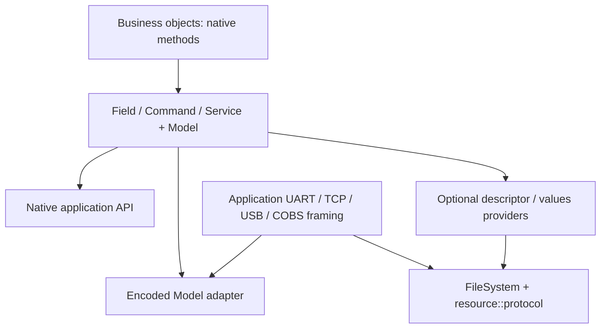

# Native API: значення, виклики, таблиці та lifetime

Автори: Ruslan Kovtun (shpegun60), codexAi. SPDX-License-Identifier: MIT.

[Посібник](README.md) · [Fields](Fields.md) · [Commands](Commands.md) ·
[Services](Services.md) · [Tables and catalogs](TablesAndCatalogs.md) ·
[API шпаргалка](API-CHEATSHEET.md)

Це суцільний reference. Для одного API family відкрийте окрему сторінку
вище; вона пояснює signatures, results, lifetime та веде до повних прикладів.

Цей посібник описує поточний C++20 API у `lib/telemetry`. Робочий приклад
[Native.cpp](../../examples/user_guide/Native.cpp) містить повну модель, усі
види slot, owning/borrowed результати, typed traversal і encoded виклики. Його
можна зібрати як звичайну консольну програму без Qt, мережі та приладу.

Короткі фрагменти далі використовують назви `WriteResult`, `CommandResult`,
`ServiceResult`, `ServiceStatus` тощо як скорочення `telemetry::...`; `Device`
і його state наведені у повному прикладі. `use`, `useName`, `useDefinition` —
місця для коду consumer, не окремі library functions. Для готової програми,
яку можна одразу компілювати, використайте саме `Native.cpp`.

Про файли descriptor/values, протокол і підключення транспорту читайте
[TransportAndResources.md](TransportAndResources.md). Native API також працює
без цих файлів: таблиця викликає звичайний C++ callback і повертає його native
тип або відповідний result wrapper.

## Навігація

- [Чотири рівні доступу](#чотири-рівні-доступу)
- [1. Що оголошує застосунок](#1-що-оголошує-застосунок)
- [2. Native тип і wire тип](#2-native-тип-і-wire-тип)
- [3. Reflection без списку member](#3-reflection-без-списку-member)
- [4. Enum: automatic, sparse, subset і свої назви](#4-enum-automatic-sparse-subset-і-свої-назви)
- [5. Field: getter, setter і дві політики результату](#5-field-getter-setter-і-дві-політики-результату)
- [6. Command: одна дія, нуль або один Request](#6-command-одна-дія-нуль-або-один-request)
- [7. Service: Request, Response і status](#7-service-request-response-і-status)
- [8. Function, method, lambda і functor](#8-function-method-lambda-і-functor)
- [9. OwnerSlot і чотири callable slots](#9-ownerslot-і-чотири-callable-slots)
- [10. Локальні таблиці та compile-time доступ](#10-локальні-таблиці-та-compile-time-доступ)
- [11. Каталоги, packed ID і Model](#11-каталоги-packed-id-і-model)
- [12. Runtime typed доступ і explicit conversions](#12-runtime-typed-доступ-і-explicit-conversions)
- [13. Iteration: erased записи й exact definitions](#13-iteration-erased-записи-й-exact-definitions)
- [14. Status: результат власника та dispatch — різні рівні](#14-status-результат-власника-та-dispatch--різні-рівні)
- [15. Encoded boundaries, Workspace і default 32 bytes](#15-encoded-boundaries-workspace-і-default-32-bytes)
- [16. Borrowed lifetime і узгоджені дані](#16-borrowed-lifetime-і-узгоджені-дані)
- [17. Що є бізнес-правилом застосунку](#17-що-є-бізнес-правилом-застосунку)
- [18. Фіксовані ceilings і build assumptions](#18-фіксовані-ceilings-і-build-assumptions)
- [19. Перевірка прикладу та сила performance evidence](#19-перевірка-прикладу-та-сила-performance-evidence)

## Чотири рівні доступу

| Рівень | Типовий API | Коли вибрати |
| --- | --- | --- |
| A. Compile-time exact | `read<Id>()`, `write<Id>(value)`, `call<Id>(request)` | Рекомендований application API, коли endpoint відомий компілятору |
| B. Typed traversal | `forEach(visitor)` | Обійти всі concrete definitions із їхніми native типами |
| C. Runtime ID, typed endpoint | `readAs<T>`, `callAs` / `callAs<Result>`, `visit(id, visitor)` | Known native type або concrete definition у runtime |
| D. Erased/encoded | `readFieldEncoded`, `writeFieldEncoded`, `executeCommandEncoded`, `callServiceEncoded` | Transport/backend має ID та bytes |

Local tables використовують Position замість global Id. Для Field також є
прямий runtime `readAs<T>/writeAs`, коли caller знає потрібний native тип.
Command має exact `callAs(id[, request])`; Service —
`callAs<Result>(id[, request])`, коли caller знає Request і result wrapper.
**`forEach` і range-for не виконують getter, Command або Service автоматично.**
`forEach/visit` викликають лише ваш visitor; сам visitor вирішує, чи потрібна
endpoint operation. [API шпаргалка](API-CHEATSHEET.md) зводить ці виклики.

## 1. Що оголошує застосунок

В API є три види endpoint:

| Вид | Для чого | Callback | Native результат |
| --- | --- | --- | --- |
| Field | Прочитати значення; за потреби записати його | Getter без аргументів і необов'язковий setter | `optional<T>` або `BorrowedValue<T>`; запис — `WriteResult` |
| Command | Виконати дію | Нуль аргументів або один aggregate Request | `CommandResult` |
| Service | Виконати запит і отримати відповідь | Нуль аргументів або один aggregate Request | `ServiceResult<Response>` або `BorrowedServiceResult<Response>` |

Кожний endpoint має ім'я та binding. Таблиця містить endpoint у порядку
оголошення. Каталог групує локальні таблиці; `Model` об'єднує каталоги та
автоматично будує реєстр усіх структурних типів, що з них досяжні.

Мінімальний getter:

```cpp
#include <telemetry/Telemetry.hpp>

float readVoltage() noexcept { return 230.0f; }
inline constexpr auto voltage = telemetry::field<&readVoltage>("Voltage");

auto value = voltage.read(); // std::optional<float>
if (value) {
    const float measured = *value;
    // Використати measured у застосунку.
}
```

У getter, setter, Command і Service має бути `noexcept`. Це перевіряється з
сигнатури; функція, що може кинути виняток, не є endpoint цього API.
`noexcept` не прибирає потреби перевіряти аргументи та повертати відмову:
звичайна відмова описується result/status, а не винятком.

Імена endpoint і груп — непорожні NUL-terminated UTF-8 рядки до 4096 байтів.
Рядкові літерали — найпростіший варіант. Factory перевіряє форму імені, але
зберігає його адресу: ім'я має жити й залишатися стабільним, поки доступне
оголошення. Не передавайте `temporaryString.c_str()`. Для invalid runtime
імені контракт завершує виконання; invalid constexpr ім'я не компілюється.

## 2. Native тип і wire тип

Field не перетворює будь-яке значення на універсальний numeric container.
Тип `T` виводиться із сигнатури getter. Для `const T&` canonical
`FieldDefinition::Value` також дорівнює `T`; reference і view не стають окремим
структурним типом. Service аналогічно виводить Request і Response та розгортає
`ServiceResult<T>` / `BorrowedServiceResult<T>` до canonical `T`.

Підтримані дані мають фіксовану wire форму:

| Дані | Приклад | Умова |
| --- | --- | --- |
| Boolean | `bool` | Wire байт 0 або 1 |
| Signed/unsigned integers | `uint8_t`, `int16_t`, `uint32_t`, `int64_t` | Повноширинні двійкові 1/2/4/8 байтів; signed має двійково-доповняльний діапазон |
| Floating point | `float`, `double` | IEEE binary32/binary64 |
| Scoped enum | `enum class Mode : uint16_t` | Підтриманий integer underlying type |
| Фіксований масив | `std::array<float, 3>` | Кожний element має підтриманий тип; вкладені масиви дозволені |
| Aggregate struct | `struct Point { float x; float y; };` | Standard-layout, trivially copyable/destructible aggregate; кожний member підтриманий |
| Відсутній Request/Response | `void`, alias `telemetry::Void` | Використовується для відсутності даних, не як Field value чи member |

Звичайні integer типи C++ також класифікуються за фактичним розміром, якщо
виконують ці умови. Для переносимого інтерфейсу зручно використовувати типи
`<cstdint>`. `char`, `wchar_t`, `char8_t`, `char16_t`, `char32_t` не є
підтриманими integer scalar; `signed char` / `unsigned char` можуть бути
відповідними 8-бітними integer типами.

Структура може містити іншу структуру, enum і масив:

```cpp
enum class Mode : std::int16_t { Off = 0, Running = 1 };
struct Calibration { float gain; float offset; };
struct Settings {
    Calibration calibration;
    Mode mode;
    std::array<std::uint16_t, 3> limits;
};
```

Розмір на wire — сума форм member/element у порядку оголошення. Native padding,
адреси та вирівнювання не серіалізуються. Для `struct Snapshot { float voltage;
Mode mode; };` з `int16_t` underlying enum wire розмір дорівнює 6 байтам,
незалежно від native padding. Його дає `telemetry::wireSize<Snapshot>`.
Native розмір об'єкта для scratch при цьому лишається `sizeof(Snapshot)`.

Відхиляються pointer/reference members, C arrays, `const`/`volatile` members,
union, bit fields, непридатні packed layouts, класи з непідтриманою aggregate
формою, динамічні контейнери на кшталт `std::vector`/`std::string`, `std::span`
і `std::optional` як payload. `long double` не є підтриманим float scalar.
Зберігайте native тип простим aggregate; об'єкти з керуванням ресурсами чи
віртуальними методами перетворюйте на такий aggregate у callback.

Посилання в *сигнатурі callback* — окреме питання: `const Request&` і borrowed
`const Response&` підтримуються, хоча members самого Request/Response не можуть
бути references. Не оголошуйте wire структуру, що містить pointer на дані.

## 3. Reflection без списку member

Для підтриманої структури застосунок не оголошує список її полів, offsets,
назв member або окремий список її вкладених типів. Boost.PFR backend бере
member у порядку C++ оголошення; library facade видає їх типи та назви:

```cpp
static_assert(telemetry::reflection::memberCount<Settings> == 3);
static_assert(telemetry::reflection::memberName<0, Settings>() == "calibration");
using FirstMember = telemetry::reflection::MemberType<0, Settings>; // Calibration

Settings settings{};
auto& calibration = telemetry::reflection::get<0>(settings);
```

`reflection::get<I>` приймає lvalue aggregate і зберігає cv/reference. Для
rvalue цей шлях відхиляється, щоб не створювати приховану копію member.
Автоматично отримані назви member мають бути переносимими ASCII identifiers.
Вони описують структуру, а не одиниці виміру чи переклад для панелі.

`Model` збирає Field values, Command Requests, Service Requests/Responses,
вкладені members, underlying enum types і array element types. Повторний
точний C++ тип реєструється один раз. Виклик `model.typeId<Calibration>()`
працює, коли `Calibration` досяжний через endpoint `Settings`; не треба додавати
його до ручного type list.

Рефлексія класу callable — це аналіз його сигнатури, а не оголошення його
members як телеметрії. Неоднозначний overloaded/generic `operator()` може
потребувати typed lambda adapter. Для endpoint найпростіше явно записувати
Request і return type; у slot generic callable розв'язується щодо заданої
точної slot сигнатури.

## 4. Enum: automatic, sparse, subset і свої назви

Без specialization `telemetry::reflection::Enum<E>` отримує словник із
bundled magic_enum. Поточний стандартний автоматичний scan має діапазон
`-128..127`. Не припускайте, що sparse code `3000` автоматично потрапить у
словник лише тому, що його є в C++ enum.

```cpp
enum class State : std::uint8_t { Idle = 0, Active = 1 };
static_assert(telemetry::reflection::Enum<State>::entryCount == 2);
// EnumReflection specialization тут не потрібна.
```

Щоб явно обрати перелік кодів і зберегти їх C++ імена, оголосіть specialization
**до першого використання enum у типі/endpoint/model**:

```cpp
enum class Mode : std::int16_t { Off = 0, Running = 1, Standby = 3000 };

namespace telemetry::reflection {
template <> struct EnumReflection<Mode> {
    inline static constexpr auto entries =
        enumCodes<Mode::Off, Mode::Running, Mode::Standby>();
};
}
```

`enumCodes<...>()` перевіряє точний enum тип усіх значень, іменований code і
відсутність duplicate numeric codes. Пошук іменованого окремого code може
працювати за межами автоматичного scan. Перелік може бути subset: залиште
лише `Off` і `Running`, якщо descriptor має описувати тільки їх.

Власні UTF-8 назви задаються через поточний API `EnumReflection`,
`enumEntries` і `enumEntry`:

```cpp
namespace telemetry::reflection {
template <> struct EnumReflection<Mode> {
    inline static constexpr auto entries = enumEntries(
        enumEntry(Mode::Off, u8"Вимкнено"),
        enumEntry(Mode::Running, u8"Вимірювання"),
        enumEntry(Mode::Standby, u8"Очікування"));
};
}
```

Це альтернативна specialization, не друге оголошення тієї самої specialization.
Explicit імена копіюються у constexpr dictionary storage; назва не позичається
з тимчасового рядка. Назва має бути valid UTF-8 без embedded NUL, довжиною
1..4096 байтів. Duplicate numeric codes відхиляються. Explicit empty dictionary
задається `enumEntries<Mode>()` і також замінює automatic discovery.

Dictionary — опис кодів. Codec і numeric `readAs`/`writeAs` не використовують
його як whitelist: невідомий code, що вміщається в underlying integer, може
пройти wire/conversion. Перевірка «для цього режиму прилад дозволяє лише ці
значення» належить setter/Command/Service. Alias із тим самим numeric code
не створює другого wire значення; якщо потрібні різні UI labels, це рішення
застосунку.

Для читання словника під час компіляції:

```cpp
constexpr auto n = telemetry::reflection::Enum<Mode>::entryCount;
constexpr auto code = telemetry::reflection::Enum<Mode>::entryValue<0>();
constexpr auto name = telemetry::reflection::Enum<Mode>::entryName<0>();
```

Поточне сортування словника визначене numeric code, а не порядком аргументів
`enumEntries`. На wire зберігаються біти underlying type, включно з negative
signed codes.

## 5. Field: getter, setter і дві політики результату

Getter має рівно одну з форм:

| Getter | `field.read()` | Власність |
| --- | --- | --- |
| `T get() noexcept` | `std::optional<T>` | Результат містить власний T |
| `const T& get() noexcept` | `BorrowedValue<T>` | Результат зберігає адресу існуючого T |

Field дозволяє scalar, enum, array і struct. Getter не має аргументів.
`T&`, `T&&`, `const T&&`, pointer і `volatile` result відхиляються. Для owning
форми native return має бути unqualified `T`; видимий верхній cv/ref у
сигнатурі не використовується як альтернативна owning policy.

Setter має повернути точно `telemetry::WriteResult` і приймати той самий `T`:

```cpp
WriteResult set(T value) noexcept;
WriteResult set(const T& value) noexcept;
```

Зміна типу в setter, наприклад getter `float` і setter `double`, не є implicit
conversion contract. Getter/setter мусять збігтися. Setter не може вимагати
mutable reference, pointer або rvalue reference. Якщо параметри включають
декілька значень, запакуйте їх у struct і встановлюйте його як один T.

```cpp
inline constexpr auto field = telemetry::field<&Device::readVoltage,
    &Device::writeVoltage>("Voltage", device);

auto copied = field.read();              // optional<float>
auto result = field.write(240.0f);        // exact float -> WriteResult
auto converted = field.readAs<double>(); // optional<double>
auto checked = field.writeAs(240);       // checked int -> float
```

`write(value)` вимагає точного native типу після зняття cv/ref. Тут `write(240)`
не підходить, якщо T дорівнює `float`; використайте `write(240.0f)` або
`writeAs(240)`. Field без setter повертає `ReadOnly` під час запису. Field із
setter через порожній slot повертає `Unavailable` — capability лишається
writeable, хоча target наразі відсутній.

Borrowed getter:

```cpp
const Settings& Device::borrowSettings() const noexcept { return settings; }
inline constexpr auto settingsField =
    telemetry::field<&Device::borrowSettings>("Settings", device);

auto view = settingsField.read();             // BorrowedValue<Settings>
auto copy = settingsField.readAs<Settings>(); // optional<Settings>, копія T
if (view) use(view.value());
```

`BorrowedValue<T>` надає `hasValue()`, explicit bool, `valueOrNull()`, `value()`,
`*` і `->`. Усі payload access є const. `value()`/`*` потребують непорожнього
view; `valueOrNull()` безпечно перевірити на nullptr. Empty getter binding дає
empty view, не штучний zero-initialized T. Copied view копіює лише адресу.

`readAs<T>` завжди є owning operation, навіть коли `read()` повертає view.
Запит великого owning T може вимагати великий caller result buffer/stack.
Borrowed policy не змінює цю явну вимогу caller.

## 6. Command: одна дія, нуль або один Request

Дозволені форми:

```cpp
CommandResult reset() noexcept;
CommandResult configure(Request request) noexcept;
CommandResult configure(const Request& request) noexcept;
```

Request має бути підтриманим aggregate struct, не scalar, enum або bare
`std::array`. Потрібна одна scalar величина — зробіть `struct Request { float
limit; };`. Потрібні декілька аргументів — зробіть один Request з усіма members.
`command("Apply", callback)` не оголошує variable argument list.

```cpp
struct Configure { Settings settings; };
inline constexpr auto configure =
    telemetry::command<&Device::configure>("Configure", device);

CommandResult result = configure.call(Configure{desiredSettings});
```

Відсутній Request означає `call()` без аргументів. Non-void Request передається
як точний Request; library не перетворює довільний proxy чи structural lookalike.
Для великого Request callback `const Request&` дає змогу читати його без власної
parameter copy. Callback із Request by value може сам створювати значну копію,
незалежно від encoded Workspace policy.

`Executed` означає виконання за contract застосунку. `Accepted` означає, що
власник прийняв/поставив дію в чергу; завершення не встановлено. Queue, worker,
слідкування за завершенням та повторний status read оголошує застосунок, якщо
вони йому потрібні; Command table сама не додає їх.

## 7. Service: Request, Response і status

Request має ті самі форми, що у Command: відсутній, aggregate by value або
`const Request&`. Response має бути підтриманим aggregate struct або void.
Bare scalar/enum/array Response не підходить, хоча ті самі дані можуть бути
members Response: `struct Response { float value; };`.

| Callback result | Native `service.call(...)` |
| --- | --- |
| `Response` | `ServiceResult<Response>` зі status `Ok` і owning Response |
| `ServiceResult<Response>` | Той самий owning result та його status |
| `const Response&` | `BorrowedServiceResult<Response>` зі status `Ok` |
| `BorrowedServiceResult<Response>` | Той самий borrowed result та його status |
| `void` | `ServiceResult<void>` зі status `Ok` |
| `ServiceResult<void>` | Той самий status-only result |

Кожна форма працює і з нульовим Request, і з одним дозволеним Request.
Result wrapper повертається by value. Reference на wrapper, mutable Response
reference, rvalue reference, pointer Response, cv-qualified або reference
payload у wrapper відхиляються. `BorrowedServiceResult<void>` не підтримується:
void Service використовує status-only owning result без payload.

Прямий owning callback завжди успішний у значенні `ServiceStatus`. Для відмови
повертайте explicit wrapper:

```cpp
ServiceResult<Snapshot> query(const Query& request) noexcept {
    if (request.channel >= 3)
        return ServiceResult<Snapshot>::failure(ServiceStatus::InvalidArgument);
    return ServiceResult<Snapshot>::successFrom([&]() noexcept -> Snapshot {
        return Snapshot{device.voltage, device.settings.mode};
    });
}
```

`success(value)` зручний для малого Response. `successFrom(factory)` вимагає
точний Response prvalue і конструює payload у фінальному result storage; це
дозволяє уникнути додаткової великої матеріалізації на цьому кроці. Explicit
native result великого розміру однаково належить caller, а його stack/ABI cost
потрібно оцінювати для конкретного виклику.

Owning `ServiceResult<T>` перевіряється через `hasValue()` / `status()`, payload
читається через `value()` або nullable `valueOrNull()`. Не переносіть синтаксис
`optional` механічно: у поточного owning wrapper немає `operator bool`, `*` та
`->`. Для `ServiceResult<void>` `hasValue()` означає success; payload access
немає, бо payload відсутній.

Borrowed fallible callback:

```cpp
BorrowedServiceResult<Settings> live(const Query&) noexcept {
    if (device.busy)
        return BorrowedServiceResult<Settings>::failure(ServiceStatus::Busy);
    return BorrowedServiceResult<Settings>::success(device.settings);
}
```

Borrowed wrapper надає `status()`, `hasValue()`, explicit bool, `valueOrNull()`,
`value()`, `*`, `->`; payload const. Success містить `Ok` і адресу реального T;
failure — non-Ok status та empty view. `failure(Ok)` і невідомі status codes
порушують factory contract і завершують виконання. Public спосіб створити
`Ok + nullptr` не надається. Для void `success()` / `failure(status)` належать
`ServiceResult<void>`.

## 8. Function, method, lambda і functor

Factory виводить потрібні типи зі binding. Приклади нижче застосовуються до
Field; для Command/Service використовуйте `command`/`service` зі відповідною
сигнатурою:

| Binding form | Робоче оголошення / bind у прикладі |
| --- | --- |
| NTTP free function | `field<&readFree>("Free")` |
| Member + owner | `field<&Device::readVoltage>("Method", device)` |
| Runtime function pointer | `field("Runtime", &readFree)` |
| Captureless lambda | `field("Stateless", []() noexcept -> uint32_t { return 42; })` |
| Stateful callable lvalue | `field("Closure", closure)` |
| Reference wrapper (member owner) | `field<&Device::readVoltage>("Referenced", std::cref(device))` |
| OwnerSlot | `field<&Device::readVoltage>("Late", ownerSlot)` |
| FunctionSlot | `field("Function", functionSlot)` |
| ContextFunctionSlot | `field("Context", contextSlot)` |
| DelegateRefSlot | `field("Borrowed", referenceSlot)` |
| DelegateSlot | `field("Owned", ownedSlot)` |

Повні objects, сигнатури й виклики всіх цих форм є в
[Native.cpp](../../examples/user_guide/Native.cpp); це виконуваний CI приклад.
Owner і callable wrappers `std::ref`/`std::cref` підтримуються у всіх трьох
сімействах. Вони позичають underlying object; довільний conversion proxy
не стає owner binding.

```cpp
// Free function, target відомий у типі binding.
auto a = telemetry::field<&readFree>("Free");

// Method і живий object lvalue.
auto b = telemetry::field<&Device::readVoltage>("Method", device);

// const method може читати const owner.
const Device fixedDevice{};
auto c = telemetry::field<&Device::readVoltage>("Const", fixedDevice);

// Runtime function pointer копіюється у binding.
auto d = telemetry::field("Runtime", &readFree);

// Stateless lambda можна безпечно перетворити на function pointer.
auto e = telemetry::field("Lambda", []() noexcept -> float { return 1.0f; });

// Capturing lambda має стабільну адресу; binding позичає її.
auto getter = [&device]() noexcept -> float { return device.readVoltage(); };
auto f = telemetry::field("Captured", getter);

// Functor так само є позиченим object lvalue.
struct Getter {
    Device* owner;
    float operator()() const noexcept { return owner->readVoltage(); }
};
Getter getterObject{&device};
auto g = telemetry::field("Functor", getterObject);
```

У lambda прикладі `device` — object, що вже живе у scope і переживає binding.
Для статичної моделі зручно оголосити owner, callable і table як named objects
із відповідним порядком lifetime. `field("Captured", [&device] { ... })` із
тимчасовою stateful closure не є допустимим borrowed binding. Коли потрібно
володіти closure, виберіть `DelegateSlot`.

Runtime function pointer копіюється як значення: зміна початкової pointer
змінної не переприв'язує готове оголошення. Для runtime replacement потрібен
`FunctionSlot`. Typed null function pointer означає відсутній runtime target;
literal nullptr не задає його сигнатуру. Compile-time template target
`field<nullptr>` не є способом оголосити порожню функцію.

Method binding приймає actual owner object або `OwnerSlot` такого object,
не pointer/smart-pointer variable чи proxy, який може утворити тимчасовий
owner. Передайте `*uniqueOwner`, якщо lifetime цього реального object
гарантований застосунком. Const owner не підходить для non-const method.
Усі три factories також приймають `std::reference_wrapper` сумісного owner;
wrapper не продовжує lifetime referenced object.

Getter і setter можуть бути різними binding strategies, наприклад function
getter та delegate setter. Їх точний value type повинен збігатися. Direct
object/callable borrowing не означає володіння object або автоматичний lock.
Owner при цьому не мусить бути wire aggregate: він може мати приватний state,
методи та інше application storage. Aggregate правила застосовуються до
payload, а не до класу, метод якого формує payload.

## 9. OwnerSlot і чотири callable slots

Поточні C++ назви — `telemetry::OwnerSlot`, `FunctionSlot`,
`ContextFunctionSlot`, `DelegateRefSlot`, `DelegateSlot`. Це **п'ять** типів:
один slot для owner і чотири для callable. Назви файлів `Telemetry...Slot.h`
не є назвами C++ classes.

| Slot | Що зберігає | Lifetime target | Типовий вибір |
| --- | --- | --- | --- |
| `OwnerSlot<T>` | `T*` | Позичений T | Method відомий compile-time, owner з'являється пізніше |
| `FunctionSlot<R(Args...) noexcept>` | Function pointer | Код function | Runtime вибір free function |
| `ContextFunctionSlot<R(Args...) noexcept>` | Function pointer + `void*` | Context позичений | C callback з додатковим context |
| `DelegateRefSlot<R(Args...) noexcept>` | Borrowed delegate | Callable/method owner позичений | Named closure або method без копії target |
| `DelegateSlot<R(Args...) noexcept, Bytes, Align>` | Closure у власному inline storage | Slot володіє closure | Потрібно скопіювати/перемістити callable у slot |

Усі slots мають `bind`, `reset`, `available`, explicit bool; вони noncopyable
і nonmovable. Table позичає адресу slot. Slot потрібно оголосити до таблиці
та тримати на стабільній адресі, поки таблиця ним користується.

```cpp
telemetry::OwnerSlot<Device> owner;
auto late = telemetry::field<&Device::readVoltage>("Late", owner);
owner.bind(device);
auto value = late.read();
owner.reset(); // Тепер late.read() empty.
```

`OwnerSlot<T>::bind` бере actual T lvalue; не бере temporary owner.
`OwnerSlot<const T>` призначений для допустимих const methods. `get()` повертає
nullable owner pointer; безпосереднього dereference operator slot не надає.

```cpp
telemetry::FunctionSlot<float() noexcept> function;
function.bind(+[]() noexcept -> float { return 230.0f; });
auto fromFunction = telemetry::field("Function", function);
function.reset();

telemetry::ContextFunctionSlot<float() noexcept> context;
context.bind(+[](void* p) noexcept -> float {
    return p ? static_cast<Device*>(p)->readVoltage() : 0.0f;
}, &device);
auto fromContext = telemetry::field("Context", context);
```

Signature `ContextFunctionSlot<R(Args...) noexcept>` не включає context;
реальна bound function має перший додатковий `void*` параметр. Null context
допустимий, якщо callback його обробляє. Availability залежить від function
pointer, а не від context. `get()` цього slot повертає by-value pair snapshot.

```cpp
telemetry::DelegateRefSlot<float() noexcept> borrowed;
borrowed.bind<&Device::readVoltage>(device);
borrowed.bind(getter); // Named stable closure; не копіюється.
borrowed.bind<&readFreeFloat>(); // Exact-signature free function.

telemetry::DelegateSlot<float() noexcept, 32> owned;
owned.bind([correction = 1.02f, &device]() noexcept -> float {
    return device.readVoltage() * correction;
});
```

У фрагменті `readFreeFloat` позначає free function з exact `float() noexcept`
сигнатурою. `DelegateRefSlot` також приймає runtime function pointer та
capture-free temporary callback, що безпечно перетворюється на pointer.
Stateful callable має бути lvalue. Explicit callable type аргумент вибирає
borrowing; він не є способом сховати temporary.

`DelegateSlot` копіює lvalue closure або переміщує rvalue, зокрема move-only
closure. Construction із source, move і destruction мають бути nothrow;
signature має підходити без numeric/user-defined value conversions; callable
має вміститися в `Bytes` і `Align`. Default capacity 32 байти, alignment
`alignof(std::max_align_t)`. Slot не використовує heap для oversized target,
навіть якщо heap fallback ввімкнено у companion delegate library. Підберіть
ємність явно або зменшіть capture.

Owned slot володіє **closure**, не object, захопленим `&device` або pointer.
Direct method-owner overload у `DelegateSlot` не надається: використайте owned
closure з owner reference або borrowed `OwnerSlot`/`DelegateRefSlot`.

Slot signature задається явно як `R(Args...) noexcept`. Value типи мусять
збігатися без implicit numeric/user-defined conversion. Read-only input може
бути прочитаний через const reference або скопійований допустимим callback;
mutable-reference input не можна непомітно перетворити на by-value parameter.
Наприклад, standalone delegate slot `void(int&) noexcept` може прийняти
`[](auto& value) noexcept { ... }`, але unconstrained `[](auto value)` не
підходить як гарантія збереження mutable reference. Сумісна const reference
форма може читати цей input. Generic/overloaded callable має розв'язуватися
щодо exact slot signature; інакше додайте явний typed lambda adapter.
Endpoint shape constraints продовжують діяти поверх slot: підтримка
`int&` у standalone slot не дозволяє mutable Request reference у Command.

Порожній getter slot дає empty optional/view; порожній setter чи Command
повертає `Unavailable`; native Service — failure `ServiceStatus::Unavailable`.
Encoded операція повідомляє `DispatchStatus::Unavailable`. Reset/rebind не
змінює declared типи, write capability чи descriptor fingerprint.

Callable slots мають `get()` та `invoke()`. Direct `invoke()` потребує engaged
slot; використовуйте перевірений endpoint шлях для звичайної роботи. Delegate
`get()` є позиченим view усередину slot, а не копією target і не гарантією його
lifetime. Дістати його з temporary/xvalue delegate slot не дозволено.

Bind/reset, destruction та виклики треба серіалізувати зовні. Особливо owned
callback не повинен робити reset/rebind свого slot під час власного виконання:
це знищило б closure, яка ще працює. Замініть target після повернення. Slot
не вставляє lock, atomic lifetime management чи deferred deletion. Докладні
тонкощі generic reference parameters і weak targets наведені у
[slot README](../../lib/telemetry/slot/README.md).

## 10. Локальні таблиці та compile-time доступ

```cpp
enum class Position : unsigned { Voltage, Settings };
inline constexpr telemetry::FieldTable localFields{
    telemetry::field<&Device::readVoltage, &Device::writeVoltage>("Voltage", device),
    telemetry::field<&Device::borrowSettings>("Settings", device),
};
inline constexpr telemetry::CommandTable localCommands{
    telemetry::command<&Device::reset>("Reset", device),
};
inline constexpr telemetry::ServiceTable localServices{
    telemetry::service<&Device::sample>("Sample", device),
};

auto voltage = localFields.read<Position::Voltage>();
auto write = localFields.write<Position::Voltage>(240.0f);
auto converted = localFields.readAs<double, Position::Voltage>();
auto checked = localFields.writeAs<Position::Voltage>(240);
auto commandStatus = localCommands.call<0>();
auto response = localServices.call<0>();
const auto& definition = localFields.get<Position::Settings>();
```

Local position — integer або scoped position enum. `get<Position>()` повертає
const reference на точне definition. Compile-time position поза таблицею
відхиляється при компіляції. Це не список довільно призначених register numbers:
position визначає порядок оголошення.

Таблиці noncopyable/nonmovable: частина erased contexts може вказувати на
bindings усередині самої table. Тримайте таблиці на стабільних адресах.
Interfaces, що повертають borrowed definitions/iteration views, відхиляють
використання через temporary/xvalue table.

## 11. Каталоги, packed ID і Model

```cpp
inline constexpr telemetry::FieldCatalogTable fields{
    telemetry::group("meter", localFields),
};
inline constexpr telemetry::CommandCatalogTable commands{
    telemetry::group("control", localCommands),
};
inline constexpr telemetry::ServiceCatalogTable services{
    telemetry::group("queries", localServices),
};
inline constexpr telemetry::Model model{fields, commands, services};

constexpr auto voltageId = telemetry::makeId<0, Position::Voltage>();
auto value = fields.read<voltageId>();
auto write = fields.write<voltageId>(240.0f);
auto commandStatus = commands.call<telemetry::makeId<0, 0>()>();
auto response = services.call<telemetry::makeId<0, 0>()>();
```

`group` позичає named lvalue table. Каталог позичає ці таблиці, Model позичає
lvalue каталоги. Тимчасові каталоги не підходять для Model constructor.
Для порожніх категорій можна оголосити empty catalog table, а для Fields і
Commands також є `telemetry::emptyFields` / `telemetry::emptyCommands`.

Packed ID — `uint32_t`: верхні 16 біт є group position, нижні 16 — local entry
position. `makeId<Group, Position>()` перевіряє ширину compile-time, а table
перевіряє реальні межі каталогу. Перестановка оголошень може змінити IDs і
descriptor; це зміна інтерфейсу, навіть якщо method names лишилися ті самі.

Для неперевірених runtime чисел використайте `tryMakeId(group, entry)`:
він поверне empty optional, якщо component не вміщається у 16 біт. Він ще не
підтверджує, що така group/entry існує: це встановлює `index().find(id)`.
Runtime global API приймає integral packed ID, не локальний enum. Локальний
enum спочатку запакуйте через `makeId`.

`groupOf(id)` / `indexOf(id)` розкладають valid u32 ID на 16-бітні компоненти.
Для негативного або wider runtime числа поза u32 вони завершують виконання;
invalid constant expression відхиляється при компіляції. На неперевіреному
input користуйтеся `tryGroupOf(id)` / `tryIndexOf(id)`: це optional форми без
тихого narrowing. Жодна з цих функцій не встановлює існування endpoint у Model.

`model.types()` повертає `TypeRegistryView`; `model.typeId<T>()` дає compile-time
ID точного зареєстрованого T. `model.view().fieldTypeId(id)` та
`commandTypeId(id)` повертають optional TypeId; `serviceTypeIds(id)` — optional
pair Request/Response. Invalid ID не звужується мовчки до valid position.

Model не є сховищем усіх значень і не знімає snapshot застосунку. Для доступу
до endpoints використовуйте власні named каталоги або його runtime indexes.

| Public object / API | Що належить object, що позичено | Час / callbacks |
| --- | --- | --- |
| Field/Command/Service definition | Власний binding state, позичені names та owner/callable/slot відповідно до binding form | Типи compile-time; `read/write/call` можуть викликати endpoint |
| Local Table | Власні definitions і erased entry array; application values не зберігаються | `get/forEach/visit` дають definitions; range-for metadata, без endpoint call |
| Catalog Table / `group` | Каталог описує свої групи та позичає named local tables | Compile-time routing або runtime indexed view |
| `Model` | Позичає named catalogs, формує спільний structural registry | `view/types/index` не виконують endpoint |
| `ModelView`, Index, `TypeRegistryView`, metadata descriptors | Borrowed arrays/names/function metadata; lifetime продовжити не можуть | Runtime access; metadata lookup сам не викликає endpoint |
| `Workspace`, `Lease<T>` | Workspace позичає caller byte span; Lease володіє lifetime constructed T у span | Runtime reserve/construct/destroy, без heap |
| `ServiceResult<T>` / `optional<T>` | Власний T, якщо результат успішний | Операції result не виконують endpoint |
| `NativeCallResult<Result>` | Власний exact endpoint Result лише при successful selection | Selection success не означає application success |
| `BorrowedValue<T>` / `BorrowedServiceResult<T>` | Адреса існуючого const T, не ownership T | Access потребує live/stable target |
| Reflection / `Type<T>` / `TypeRegistry<...>` | Compile-time факти й immutable generated metadata | Shape/size/type IDs, без live getter |

Library core не робить динамічних allocations. Application callback або
visitor може сам використовувати heap/locks/tasks — це його власний contract.
Compile-time знання target не означає compile-time знання live значення.

Звичайний спосіб створення runtime facade — `.index()` на каталозі та
`model.view()`. Публічні низькорівневі `FieldIndex`, `CommandIndex`,
`ServiceIndex`, `ModelView` дозволяють вручну передати arrays/counts для
adapter integration. У цьому випадку caller гарантує узгоджені counts,
non-null pointers для nonempty arrays, правильні metadata/function pointers
і lifetime backing storage. Checked `find/visit` перевіряють numeric ID,
а не доводять придатність fabricated pointer чи його allocation size.

## 12. Runtime typed доступ і explicit conversions

Field підтримує runtime numeric/exact-type operations:

```cpp
auto local = localFields.readAs<double>(Position::Voltage);
auto global = fields.readAs<double>(voltageId);
auto write = fields.writeAs(voltageId, 240);
```

Compile-time варіант має порядок template аргументів
`readAs<To, PositionOrPackedId>()`; `writeAs<PositionOrPackedId>(value)` виводить
тип source. Global/local runtime `readAs<To>(id)` і `writeAs(id, value)`
перевіряють оригінальну ширину ID перед індексуванням.

`readAs`/`writeAs` дозволяють numeric conversions між integer, bool, float,
double і enum underlying representations. Integer narrowing/зміна signedness
перевіряє range. Float → integer відкидає дробову частину до нуля і перевіряє
range без out-of-range cast; наприклад `12.75` → `uint16_t` дає 12, `-0.5`
може дати 0. Це правило conversion, а не округлення до найближчого.

Integer → float може округлити precision. Float → narrower float відхиляє
finite overflow; NaN та infinity зберігаються як відповідні float значення.
NaN/infinity → integer/bool відхиляються. Numeric → bool дає false для zero,
true для інших finite значень. Native scalar codec сам не оголошує NaN
invalid business measurement: це вирішує owner.

Для struct/array потрібен **точний C++ тип**, не схожа layout чи однакові
members. Runtime structural mismatch повертає empty optional / `InvalidValue`
без getter/setter callback. Invalid ID повертає empty optional / `NotFound`.
`ReadOnly` для Field без setter лишається його declared capability.
Compile-time `readAs<WrongStruct>()` не маскує incompatible shape і дає
compile-time diagnostic.

Command і Service підтримують runtime exact native calls без visitor:

| Family | Local / catalog call | Result |
| --- | --- | --- |
| Command | `callAs(position_or_id[, request])` | `NativeCallResult<CommandResult>` |
| Service | `callAs<ServiceResult<Response>>(position_or_id[, request])` | `NativeCallResult<ServiceResult<Response>>` |
| Borrowed Service | `callAs<BorrowedServiceResult<Response>>(position_or_id[, request])` | `NativeCallResult<BorrowedServiceResult<Response>>` |
| Void response Service | `callAs<ServiceResult<void>>(position_or_id[, request])` | `NativeCallResult<ServiceResult<void>>` |

Request після зняття cv/ref має точно збігатися з declaration; request та
response conversions не виконуються. Service Result — exact wrapper від
`definition.call()`, включно з owning/borrowed policy. Форму без request
застосовуйте до `Request = void`; empty struct не є void. Local input може
бути integer чи scoped position enum; global input — integral packed ID.
Original width перевіряється до narrowing, table/catalog має бути lvalue.

Наприклад, цей самостійний фрагмент показує local runtime calls:

```cpp
#include <telemetry/Telemetry.hpp>
#include <cassert>
#include <cstdint>

namespace runtime_demo {
struct Reply { std::uint32_t value; };
telemetry::CommandResult reset() noexcept {
    return telemetry::CommandResult::Executed;
}
Reply snapshot() noexcept { return {7}; }
const telemetry::CommandTable commands{telemetry::command<&reset>("Reset")};
const telemetry::ServiceTable services{telemetry::service<&snapshot>("Snapshot")};

void run(std::uint64_t position) {
    const auto action = commands.callAs(position);
    const auto reply = services.callAs<telemetry::ServiceResult<Reply>>(position);
    if (action.hasValue())
        assert(action.value() == telemetry::CommandResult::Executed);
    if (reply.hasValue() && reply.value().hasValue())
        assert(reply.value().value().value == 7);
}
} // namespace runtime_demo
```

`NativeCallStatus::NotFound` означає invalid/absent position чи ID;
`SignatureMismatch` — row існує, але exact Request або Result не збігається.
Обидві відмови не викликають callback і не конструюють endpoint Result.
`Ok` означає, що endpoint result доставлено: `Busy`, `InvalidValue` та
`Unavailable` лишаються його application status. Empty compatible slot дає
selection `Ok` та inner `Unavailable`. Outer `hasValue()` не є inner
`hasValue()`; для Service перевірте обидва перед payload access.

`NativeCallResult<Result>::successFrom(factory)` будує exact Result у final
union storage. Runtime dispatch не додає move/copy endpoint wrapper або
large response. Owning wrapper все одно містить payload bytes: caller обирає
його storage і budgets callback stack; borrowed wrapper не продовжує
request/response lifetime. Encoded Workspace/local-object policy не змінюється.

Typed `visit` лишається варіантом для custom dispatch та кількох native shapes;
static `call<Position/Id>` зберігає exact API. Для Query із відомих Command
declarations visitor alternative виглядає так:

```cpp
CommandResult status = CommandResult::NotFound;
bool selected = commands.visit(runtimeId, [&](const auto& definition) {
    using Definition = std::remove_cvref_t<decltype(definition)>;
    if constexpr (std::is_same_v<typename Definition::Request, Query>)
        status = definition.call(Query{0});
});
```

Generic visitor має компілюватися для кожного definition у visited таблицях.
`if constexpr` дозволяє явно обрати потрібний Request/Response contract. `selected`
означає, що ID вибрав definition; якщо branch нічого не викликав, це не робить
операцію успішною. Зберігайте свій endpoint status окремо від selection bool.
Before/after фрагменти з exact requests наведено у [Commands](Commands.md)
та [Services](Services.md); повне runnable coverage —
[NativeCalls.cpp](../../tests/ergonomics/NativeCalls.cpp). Для wire bytes
використовуйте `executeEncoded` / `callEncoded`.

## 13. Iteration: erased записи й exact definitions

| Потреба | API | Тип результату |
| --- | --- | --- |
| Metadata усіх local endpoints | range-for | `FieldEntry` / `CommandEntry` / `ServiceEntry` |
| Concrete definitions усіх endpoints | `forEach` | Типізована definition у visitor |
| Runtime вибір concrete definition | `visit` | Типізована definition у visitor, bool found |
| Compile-time вибір concrete definition | `get<Position/Id>()` | Const reference на definition |
| Wire operations | Index / Model adapter | Dispatch + endpoint status / byte count |

Range-for на local table проходить erased entries без виклику callback:

```cpp
for (const auto& entry : localFields) {
    useName(entry.name);
    useWireLength(entry.wireBytes);
}
```

Range-for на catalog table проходить **групи**, не flattened endpoints:

```cpp
for (const auto& catalog : fields) {
    for (std::uint32_t i = 0; i < catalog.count; ++i) {
        const auto& entry = catalog.entries[i];
        useName(entry.name);
    }
}
```

`forEach` дає typed definitions у declaration order. Local callback може
отримати compile-time index; global callback — group, entry і group name:

```cpp
localFields.forEach([]<std::size_t I>(const auto& definition) {
    useDefinition<I>(definition);
});

fields.forEach([]<std::size_t G, std::size_t I>(std::string_view groupName,
                                              const auto& definition) {
    useGlobalDefinition<G, I>(groupName, definition);
});
```

Є й форми без template index: local `(const auto& definition)`, global
`(std::string_view groupName, const auto& definition)`. Те саме працює для
Command/Service tables і catalogs. `visit(position/id, visitor)` вибирає один
exact definition; invalid input повертає false без виклику visitor. На runtime
visit callback отримує definition без compile-time index template аргументу.

Traversal позичає original definition і original visitor, не матеріалізує
його value й не викликає endpoint автоматично. Callback return value ігнорується;
`return false` не зупиняє `forEach`. Visitor може зберігати лічильник у reference
capture; move-only visitor також допустимий. Винятки visitor, якщо exceptions
увімкнені в consumer, поширюються звичайно; endpoint callback усе ще `noexcept`.

`begin`/`end`, `data`, `size`, `empty`, `operator[]` надають borrowed доступ.
`operator[]` не заміняє checked `visit`/`find`: перевірте bounds самі. Empty
таблиця має нуль visits і коректний порожній range.

Registry не має такого самого range-for interface; проходьте його view:

```cpp
const auto types = model.types();
for (std::uint32_t i = 0; i < types.count; ++i) {
    const auto* type = types.find(i);
    // type->kind, wireBytes, memberCount, enumCount, relatedTypeId.
}
```

`TypeDescriptor::member(i)` та `enumEntry(i)` є checked nullable accesses.
Metadata views позичені; вони не є копією application state.

## 14. Status: результат власника та dispatch — різні рівні

| Native enum | Значення |
| --- | --- |
| `WriteResult` | `Applied`, `NotFound`, `ReadOnly`, `InvalidValue`, `Busy`, `Unavailable` |
| `CommandResult` | `Executed`, `Accepted`, `NotFound`, `Unavailable`, `ArgumentCountMismatch`, `InvalidValue`, `Busy`, `Failed` |
| `ServiceStatus` | `Ok`, `InvalidArgument`, `Unavailable`, `Busy`, `Failed` |
| `NativeCallStatus` | `Ok`, `NotFound`, `SignatureMismatch`; native selection, не application status |

Застосунок повертає статус за своєю операцією. Library також повідомляє
відсутній binding чи invalid native lookup/conversion через відповідні наявні
коди. `ArgumentCountMismatch` не означає, що structured Command підтримує
довільну кількість параметрів: допустима сигнатура визначається при компіляції.

Encoded boundaries мають окремий `DispatchStatus`: `Ok`, `NotFound`,
`InvalidPayload`, `BufferTooSmall`, `WorkspaceTooSmall`, `InternalError`,
`Unavailable`. Він описує routing, buffer/codec/storage failure. Перевіряйте
його **перед** `endpointStatus`: default endpointStatus при dispatch failure
не означає, що callback виконався.

| Encoded result | Поля |
| --- | --- |
| `EncodedReadResult` | `dispatch`, `written` |
| `EncodedWriteResult` | `dispatch`, `endpointStatus` (`WriteResult`) |
| `EncodedCommandResult` | `dispatch`, `endpointStatus` (`CommandResult`) |
| `EncodedCallResult` | `dispatch`, `endpointStatus` (`ServiceStatus`), `written` |

`dispatch == Ok` і `endpointStatus == Busy` є штатною application відмовою.
`dispatch == Unavailable` означає, що encoded target не був доступний.
`InternalError` також дозволяє відхилити invalid status, який owner повернув
через штучний cast поза відомими codes.

## 15. Encoded boundaries, Workspace і default 32 bytes

Erased entries знають точні wire lengths. Не викликайте їх внутрішні raw
function-pointer members напряму; checked API перевіряє spans:

```cpp
std::array<std::byte, model.maxScratch()> scratch{};
telemetry::Workspace workspace{scratch};
std::array<std::byte, telemetry::wireSize<float>> output{};

auto read = model.fieldIndex().readEncoded(voltageId, output, workspace);
auto write = model.fieldIndex().writeEncoded(voltageId, input, workspace);
auto execute = model.commandIndex().executeEncoded(commandId, requestBytes, workspace);
auto call = model.serviceIndex().callEncoded(serviceId, requestBytes, responseBytes, workspace);
```

В останніх трьох рядках `input`, `requestBytes`, `responseBytes` — spans або
byte arrays потрібної форми. Повний приклад із `telemetry::encode` є у
[Native.cpp](../../examples/user_guide/Native.cpp). Encoded writes/Requests
вимагають exact input length, reads/Responses — достатню output capacity;
callback не отримує обрізаний Request. Invalid bool wire representation
відхиляється до запуску callback. Окремий public `encode<T>` вимагає exact
output length; це відмінність від endpoint output-capacity API.

Compiled adapter має public convenience functions `readFieldEncoded`,
`writeFieldEncoded`, `executeCommandEncoded`, `callServiceEncoded`, які беруть
`ModelView`. Для них лінкується `model/Adapter.cpp`; точний in-memory ABI tag
допомагає відхилити змішані layout/configuration під час лінкування. Direct
index APIs у прикладі не потребують цього compiled forwarding layer.

За замовчуванням `TELEMETRY_STRUCTURED_LOCAL_BYTES` дорівнює 32. Це compile-time
budget **локальних payload objects encoded операції**, не total stack bound.
Налаштування має збігатися в усіх translation units executable; задавайте його
однаково через build flags. Значення 0 відправляє owning payload/Request storage
у caller Workspace. Воно не означає нуль stack для control variables, callback
чи caller, і не змінює native owning return policy.

Політика storage:

| Операція | Local/Workspace |
| --- | --- |
| Owning Field read | Native T локально, якщо `sizeof(T)` у budget; інакше Workspace |
| Field write | Decoded T за тим самим size rule |
| Command | Decoded Request за size rule; absent Request не створює object |
| Owning Service | Request першим займає local budget; result wrapper має вміститись у залишок; решта у Workspace |
| Borrowed Field read | Existing T серіалізується прямо; read scratch 0 |
| Borrowed Service | Storage потрібен лише для Request; existing Response не матеріалізується |

У owning Service враховується розмір result wrapper разом із status/padding,
не лише `sizeof(Response)`. Request і Result можуть одночасно жити під час
encoding, тому це спільний local budget. Callback by-value parameter і власні
локальні objects застосунку не отримують автоматичного stack обмеження.

`telemetry::scratchBytes<T>` дорівнює `sizeof(T) + alignof(T) - 1` — достатньо
для worst initial alignment byte span. Workspace є caller-owned mutable byte
storage і не алокує його. Lease резервує aligned object storage, починає
object lifetime при construction, знищує object та повертає reservation при
виході зі scope. Живі leases звільняються у зворотному порядку (LIFO).
Не використовуйте один Workspace одночасно для незалежних викликів.

### Codec окремо від endpoints

`encode(value, output)` та `decode(input, lease, pointer)` також працюють без
Field/Command/Service. Decoder отримує вже зарезервований caller-owned Lease;
він починає lifetime decoded T і повертає pointer у цей lease:

```cpp
std::array<std::byte, telemetry::scratchBytes<Query>> storage;
telemetry::Workspace decoding{storage};
auto lease = decoding.reserve<Query>();
Query* value = nullptr;
const auto status = telemetry::decode<Query>(queryWire, lease, value);
if (status == telemetry::CodecStatus::Ok) {
    // Використати *value тільки поки lease живий.
}
```

При кожному виклику decode спочатку ставить output pointer у nullptr.
Обидві standalone codec operations вимагають exact wire length. Decode не
дозволяє input overlap із **повним** Workspace storage, навіть якщо input
не перекриває лише конкретний lease. Один lease не декодується повторно,
поки він уже містить constructed object. Lease destruction знищує object і
відновлює попередню reservation; pointer за межами lease scope недійсний.

| `CodecStatus` | Значення |
| --- | --- |
| `Ok` | Повна canonical операція завершена |
| `LengthMismatch` | Span length не дорівнює `wireSize<T>` |
| `InvalidValue` | Неканонічна representation, зокрема bool не 0/1 |
| `WorkspaceTooSmall` | Lease не зміг зарезервувати storage |
| `Overlap` | Заборонений перетин payload/object/storage spans |
| `InvalidState` | Повторний decode у constructed lease або порушення codec state |

Standalone decode, ID decomposition та reference-wrapper Service включені
до [Native.cpp](../../examples/user_guide/Native.cpp), який виконується в CI.

Default member initializers aggregate не є hook для decoded Request. Codec
заповнює кожний semantic member із bytes і у nontrivial-default case явно
будує neutral members, щоб application DMI не виконувався. У цьому внутрішньому
construction шляху є ceiling 1024 expanded construction nodes: складний DMI
тип може відхилятися, хоча його wire size вкладається в загальний format limit.
Приберіть непотрібні DMI з wire DTO або поділіть таку форму на менші payloads.

Field має незалежні `readScratchBytes` і `writeScratchBytes`. Getter великого
T може бути borrowed і вимагати 0 read scratch, але setter того самого Field
потребує storage для decoded T. `model.maxFieldScratch()` враховує обидва,
`model.maxCommandScratch()` / `maxServiceScratch()` — відповідні операції,
`maxScratch()` — максимум для одного виклику. Для вкладених викликів із
активними outer leases потрібно враховувати сумарний одночасний storage.
Values provider враховує тільки Field reads; докладніше в transport посібнику.

Input/output не повинні перетинатися з використаним Workspace storage за
checked boundary contract. Service input і output можуть ділити bytes після
повного Request decoding. Borrowed payload encoder додатково перевіряє
перетин усіх native bytes referenced T, включно з padding, із written output
prefix; overlap повертає `InvalidPayload` без payload writes. Для Values та
Exchange **повний output buffer**, включно з header/status, має бути disjoint
від live application objects: це caller precondition, яку payload-only check
не може встановити до callback.

## 16. Borrowed lifetime і узгоджені дані

Нативний borrowed result живе як view після повернення `read`/`call`.
Застосунок тримає T живим і стабільним до останнього використання view.
Знищення result не знищує T; копія result не створює snapshot і не подовжує
lifetime T. Reset/rebind slot не зберігає старий owner.

`BorrowedValue<T>::from(value)` та `BorrowedServiceResult<T>::success(value)`
приймають exact nonvolatile lvalue T або const T. Temporary, `std::move(t)`,
proxy conversion, pointer і explicit-template обходи відхиляються. Вони
зберігають `const T*` навіть якщо source lvalue mutable.

Це не доводить lifetime, прихований у тілі callback. Наприклад, helper може
повернути view на локальний T; C++ допускає такі помилки, і library не може
універсально їх виявити. Повертайте reference на member/live storage owner,
а computed temporary повертайте by value.

Service Response може бути reference на частину **const-reference Request**.
Native caller мусить зберігати цей Request: temporary Request не живе довше
тільки через те, що result на нього посилається. By-value callback parameter
зникає до encoding і не є допустимим borrowed source.

В encoded Service decoded Request object/lease живий до закінчення Response
encoding. Reference на нього з callback `const Request&` допустимий у цьому
виклику. Після encoding pointer не зберігається у Definition/Table/Model/provider.
Докладний contract наведений у [BorrowedNativeValues.md](../BorrowedNativeValues.md).

Синхронізація зовнішня для owning і borrowed access. Копіювання структури з
одночасним writer саме по собі не дає coherent snapshot. Різні Field getters
викликаються окремо; читання всього каталогу не гарантує одного measurement
instant. Якщо потрібен узгоджений набір, owner має сформувати snapshot під
своїм lock/sequence contract і повернути його як aggregate або позичити
стабільний узгоджений snapshot на час encoding. `volatile` не заміняє цей
contract; отримуйте data з hardware/atomic storage у звичайні supported values.

## 17. Що є бізнес-правилом застосунку

Рекомендована залежність: business object надає native methods, telemetry
прив'язує їх, а transport обробляє frame/envelope та звертається до adapter.
`Device/Motor/Calibration` не включають packet protocol і не читають UART/TCP.



Declaration не приймає units, min/max, scale, visibility, access rights,
формулу перерахунку чи «тип приладу» як semantic metadata. Structural schema
описує форму T, names, categories, IDs і declared write capability.

Library перевіряє wire форму, C++ type agreement, bounds storage/IDs та explicit
numeric conversions. Setter вирішує, що voltage має бути finite й у діапазоні
0..300 V, enum дозволений саме зараз, зміна вимагає Apply чи прилад Busy.
Command/Service вирішують, що було виконано/прийнято/відхилено. Units, labels,
permissions, persistence, queues і transaction lifecycle розміщуються у тому
шарі застосунку, який володіє цими правилами.

## 18. Фіксовані ceilings і build assumptions

Поточні compile-time ceilings `telemetry::Limits`:

| Limit | Значення |
| --- | ---: |
| `maxTypeDepth` | 32 |
| `maxTypeCount` | 4096 |
| `maxStructMembers` | 256 |
| `maxArrayElements` | 65536 |
| `maxDescriptorBytes` | 4194304 |
| `maxStringBytes` | 4096 |
| `maxEnumEntriesTotal` | 65536 |
| `maxCatalogCountTotal` | 65536 |
| `maxEndpointCountTotal` | 65536 |
| `maxValueWireBytes` | 1048576 |
| `maxExpandedValueNodes` | 262144 |

Це ceilings supported format/model, а не рекомендований розмір payload для
кожного MCU. Transport capacity, RAM, decoder construction complexity та
час callback/encoding мають власні бюджети. Порівнюйте це з реальним build.

C++20 та підтриманий reflection backend потрібні для aggregate member names.
Не змішуйте configuration macros різних translation units. Не застосовуйте
fast-math/finite-math-only чи режими, що прибирають NaN/infinity semantics:
checked conversions спираються на IEEE правила, і частина таких build modes
має compile-time diagnostics. Vendor delegate configuration також повинна
бути однакова для consumer, що використовує delegate slots.

## 19. Перевірка прикладу та сила performance evidence

Збирання з кореня репозиторію:

```sh
g++ -std=c++20 -O2 -Wall -Wextra -Werror -pedantic-errors \
  -Ilib -Ilib/boost_pfr/include -Ilib/magic_enum \
  examples/user_guide/Native.cpp -o /path/to/artifacts/Native
/path/to/artifacts/Native
```

`/path/to/artifacts` — наявний каталог результатів поза source tree. На Windows
виберіть g++ із Qt MinGW kit і executable `.exe`; його bin directory потрібна
у PATH під час запуску. Конкретну встановлену версію/toolchain знаходьте на
цій машині, а не переносьте чужий абсолютний path.

Приклад перевіряє допустимість наведених template API і виконує representative
native/encoded operations. Успішний host запуск підтверджує цей приклад; він
не є timing/stack measurement прошивки і не підтверджує lifetime довільного
application callback.

Native known-target calls можуть оптимізуватися до звичайного прямого C++
виклику; runtime ID, slots, encoded boundaries та owning copies мають свою
ціну. Compiler codegen/stack receipts і H7S вимірювання для конкретних fixtures
описані у [BorrowedNativeValues.md](../BorrowedNativeValues.md) та
[evidence README](../../tests/resources/evidence/README.md). Borrowed results
прибирають payload materialization із відповідного encoded/native view шляху,
але не обіцяють універсально найменший час чи total stack для будь-якого owner.
Самі assertions, descriptor hashes або однакові instruction bytes не є новим
апаратним вимірюванням часу. Вимірюйте цікавий вам application path з його
callback, synchronization, consumers і вибраними compiler flags.
