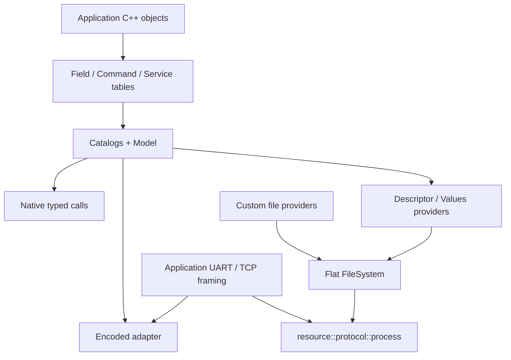

# Посібник користувача

Це вхідна сторінка документації **поточного C++20 API**. Для першої інтеграції
не потрібно читати звіти агентів або весь план реалізації.

Потрібно швидко згадати назви викликів — відкрийте
[односторінкову API шпаргалку](API-CHEATSHEET.md).

| Завдання | Де читати | Повна програма |
| --- | --- | --- |
| Оголосити Field, Command, Service; працювати з native типами | [Native API](NativeApi.md) | [Native.cpp](../../examples/user_guide/Native.cpp) |
| Локальні/глобальні ID, `readAs`/`writeAs`, iteration, slots, borrowed outputs | [Native API](NativeApi.md) | [Native.cpp](../../examples/user_guide/Native.cpp) |
| Оголосити масив файлів і власний provider, вибрати шляхи | [Транспорт і ресурси](TransportAndResources.md) | [Resources.cpp](../../examples/user_guide/Resources.cpp) |
| LIST/STAT/READ/WRITE, порційний transfer і cursor | [Транспорт і ресурси](TransportAndResources.md) | [Resources.cpp](../../examples/user_guide/Resources.cpp) |
| Прийняти UART/TCP frame і звернутися до Model без файлів | [Транспорт і ресурси](TransportAndResources.md) | [Encoded.cpp](../../examples/user_guide/Encoded.cpp) |
| Descriptor/Values та browser decoding | [v3 provider](../../lib/resource/telemetry/v3/README.md) | [Клієнти](../../examples/structured_client/README.md) |
| Узгодити descriptor один раз на з'єднання | [Bind/Exchange example](../../examples/structured_protocol/README.md) | [Транспорт і ресурси](TransportAndResources.md) |
| Зібрати й виконати приклади | [Приклади посібника](../../examples/user_guide/README.md) | [Runner](../../tests/docs/README.md) |

## Три незалежні способи користування

**Локальна бізнес-логіка:** викликайте native API таблиць/каталогів. Файли,
протокол і Workspace для звичайних typed викликів не потрібні.

**Власний транспорт без файлів:** після складання повного frame розберіть
операцію/ID та передайте payload у encoded adapter. Model виконує callback;
ваш transport відповідає за framing, connection state і delivery.

**Файловий інтерфейс:** додайте providers до `resource::filesystem(...)` і
передайте повний packet у `resource::protocol::process(...)`. Provider може
віддавати bytes з Flash/RAM, генерувати їх або звертатися до storage.

## Правила, які потрібно пам'ятати

- Назви й borrowed objects живуть довше за таблиці. Slots дозволяють
  перев'язати target, але не керують зовнішньою синхронізацією.
- Локальна позиція — індекс у таблиці. Глобальний ID — packed u32 із двох
  16-бітних позицій; runtime lookup індексує масиви.
- Field повертає `T` або `const T&`. Setter повертає `WriteResult`; Command —
  `CommandResult`. Callback має бути `noexcept`.
- Межі прикладних значень, units, defaults і persistence не додаються до
  descriptor: їх реалізує застосунок.
- Local storage budget 32 B задається при компіляції; більші encoded об'єкти
  використовують caller-owned Workspace. Budget не змінює wire semantics.
- UART/TCP callback може отримати лише частину packet або кілька packets
  одразу. Збирайте frame до виклику library processor.

API reference доступний у [telemetry](../../lib/telemetry/README.md),
[resource](../../lib/resource/README.md) і [slot](../../lib/telemetry/slot/README.md).
Інженерні рішення та історичні вимірювання мають окремий
[індекс документів](../README.md).
