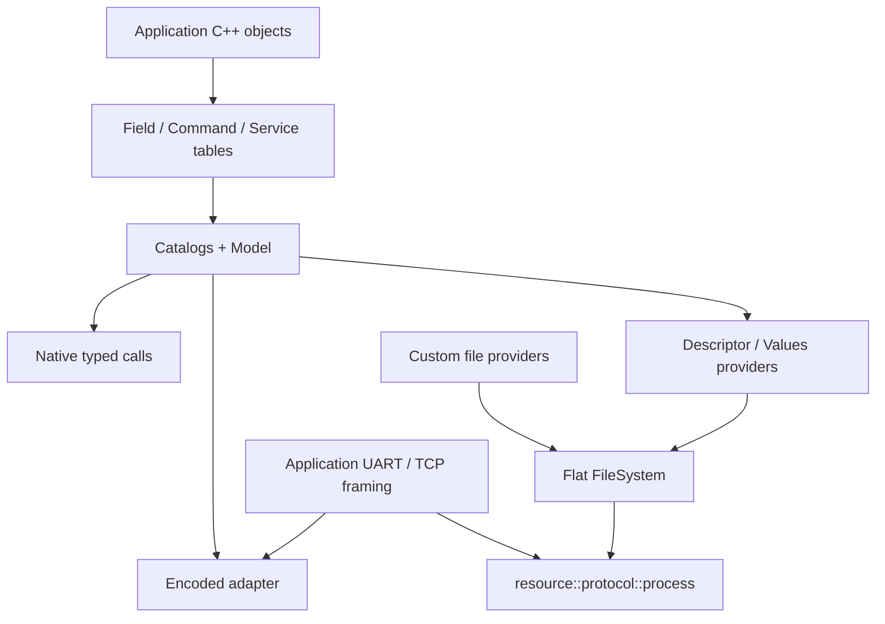

# Посібник користувача

[Репозиторій](../../README.md) · [Індекс документів](../README.md) ·
[API шпаргалка](API-CHEATSHEET.md) · [Архітектура](../Architecture.md)

Це вхідна сторінка документації **поточного C++20 API**. Для першої інтеграції
не потрібно читати звіти агентів або весь план реалізації.

Потрібно швидко згадати назви викликів — відкрийте
[односторінкову API шпаргалку](API-CHEATSHEET.md).

## Навігація

- [Маршрут від першого запуску до своєї прошивки](#маршрут-від-першого-запуску-до-своєї-прошивки)
- [Окремі API за сімейством](#окремі-api-за-сімейством)
- [Довідник за завданням](#довідник-за-завданням)
- [Три незалежні способи користування](#три-незалежні-способи-користування)
- [Правила, які потрібно пам'ятати](#правила-які-потрібно-памятати)

## Маршрут від першого запуску до своєї прошивки

| Порядок | Практичний розділ | Що буде готове після нього |
| --- | --- | --- |
| 1 | [Перша інтеграція](GettingStarted.md) | Build settings, свій клас, local/global tables і native read/write/call |
| 2 | [Application integration](ApplicationIntegration.md) | Прикладні правила, lifetime, bindings/slots, task synchronization та status handling |
| 3 | [Transport walkthrough](TransportWalkthrough.md) | Повний receive → framing → telemetry/resource operation → reply шлях |
| 4 | [Device integration example](../../examples/device_integration/README.md) | Готовий проєкт із кількох файлів, CMake та host перевірками |
| 5 | [Питання та діагностика](Troubleshooting.md) | Рішення типових build, signature, ID, Workspace і transport проблем |

`NativeApi` нижче — reference для всіх форм API. Для першої інтеграції
почніть з кроку 1; повні declarations і callbacks є у runnable programs.

## Окремі API за сімейством

| Розділ | Що пояснює | Наступний крок |
| --- | --- | --- |
| [Fields](Fields.md) | Getter/setter forms, exact/As доступ, owning/borrowed results і callbacks | [Tables and catalogs](TablesAndCatalogs.md) |
| [Runtime native API та обхід](Ergonomics.md) | callAs, readBorrowed, readAsResult, flat traversal і caller buffer maxima | [Runnable example](../../examples/user_guide/Ergonomics.cpp) |
| [Commands](Commands.md) | Дії без response payload, Request, Executed/Accepted/refusal і повтори | [Tables and catalogs](TablesAndCatalogs.md) |
| [Services](Services.md) | Request/Response, status, owning/borrowed результат і encoded reply | [Tables and catalogs](TablesAndCatalogs.md) |
| [Tables and catalogs](TablesAndCatalogs.md) | Local Position, global PackedId, групи, typed traversal і runtime indexes | [Model](Model.md) |
| [Model](Model.md) | Спільний structural registry, ModelView, TypeIds і encoded access | [Codec and Workspace](CodecAndWorkspace.md) |
| [Codec and Workspace](CodecAndWorkspace.md) | Canonical bytes, Lease lifetime, storage budget, scratch і overlap | [Descriptor and Values](DescriptorAndValues.md) |
| [Resource files](Resources.md) | Provider signatures, FileSystem/FileView, cursor, partial transfer і capability | [Descriptor and Values](DescriptorAndValues.md) |
| [Descriptor and Values](DescriptorAndValues.md) | Model metadata, live Fields, fingerprint, buffers і token boundaries | [Wire v3.0](../WireV3.md) |
| [Resource packet protocol](../../lib/resource/protocol/README.md) | Exact LIST/STAT/READ/WRITE envelopes і errors | [Transport walkthrough](TransportWalkthrough.md) |
| [COBS integration](COBSIntegration.md) | Real `cobs::Endpoint`, pending TX ownership і повний resource round trip | [COBS example](../../examples/cobs_integration/README.md) |
| [Native reference](NativeApi.md) | Суцільний повний reference типів, bindings, slots, conversions та views | [API шпаргалка](API-CHEATSHEET.md) |

Окремі сторінки мають API tables, значення результатів і lifetime.
Зразки statements позначені як fragments; готові translation units та
project sources наведені у [прикладах](../../examples/user_guide/README.md).

## Довідник за завданням

| Завдання | Де читати | Повна програма |
| --- | --- | --- |
| Оголосити Field, Command, Service; працювати з native типами | [Fields](Fields.md), [Commands](Commands.md), [Services](Services.md) | [Native.cpp](../../examples/user_guide/Native.cpp) |
| Локальні/глобальні ID, iteration і indexes | [Tables and catalogs](TablesAndCatalogs.md) | [Native.cpp](../../examples/user_guide/Native.cpp) |
| Model, TypeRegistry, runtime view та encoded buffers | [Model](Model.md), [Codec and Workspace](CodecAndWorkspace.md) | [Encoded.cpp](../../examples/user_guide/Encoded.cpp) |
| Оголосити масив файлів і власний provider, вибрати шляхи | [Resource files](Resources.md) | [Resources.cpp](../../examples/user_guide/Resources.cpp) |
| LIST/STAT/READ/WRITE, порційний transfer і cursor | [Resource files](Resources.md), [protocol](../../lib/resource/protocol/README.md) | [Resources.cpp](../../examples/user_guide/Resources.cpp) |
| Прийняти UART/TCP frame і звернутися до Model без файлів | [Транспорт і ресурси](TransportAndResources.md) | [Encoded.cpp](../../examples/user_guide/Encoded.cpp) |
| Descriptor/Values та browser decoding | [Descriptor and Values](DescriptorAndValues.md) | [Клієнти](../../examples/structured_client/README.md) |
| Узгодити descriptor один раз на з'єднання | [Bind/Exchange example](../../examples/structured_protocol/README.md) | [Транспорт і ресурси](TransportAndResources.md) |
| Передати resource packets через чинний COBS endpoint | [COBS integration](COBSIntegration.md) | [Cobs example](../../examples/cobs_integration/README.md) |
| Зібрати й виконати приклади | [Приклади посібника](../../examples/user_guide/README.md) | [Runner](../../tests/docs/README.md) |

## Три незалежні способи користування

**Локальна бізнес-логіка:** викликайте native API таблиць/каталогів. Файли,
протокол і Workspace для звичайних typed викликів не потрібні.

**Власний транспорт без файлів:** після складання повного frame розберіть
операцію/ID та передайте payload у encoded adapter. Model виконує callback;
ваш transport відповідає за framing, connection state і delivery.

**Файловий інтерфейс:** додайте providers до `resource::filesystem(...)` і
передайте повний packet у `resource::protocol::process(...)`. Provider може
віддавати bytes з Flash/RAM, генерувати їх або звертатися до storage.

## Правила, які потрібно пам'ятати

- Назви й borrowed objects живуть довше за таблиці. Slots дозволяють
  перев'язати target, але не керують зовнішньою синхронізацією.
- Локальна позиція — індекс у таблиці. Глобальний ID — packed u32 із двох
  16-бітних позицій; runtime lookup індексує масиви.
- Field повертає `T` або `const T&`. Setter повертає `WriteResult`; Command —
  `CommandResult`. Callback має бути `noexcept`.
- Межі прикладних значень, units, defaults і persistence не додаються до
  descriptor: їх реалізує застосунок.
- Local storage budget 32 B задається при компіляції; більші encoded об'єкти
  використовують caller-owned Workspace. Budget не змінює wire semantics.
- UART/TCP callback може отримати лише частину packet або кілька packets
  одразу. Збирайте frame до виклику library processor.

API reference доступний у [telemetry](../../lib/telemetry/README.md),
[resource](../../lib/resource/README.md) і [slot](../../lib/telemetry/slot/README.md).
Інженерні рішення та історичні вимірювання мають окремий
[індекс документів](../README.md).
