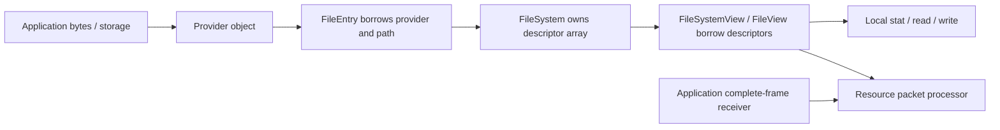

# Ресурсні файли та providers

Автори: Ruslan Kovtun (shpegun60), codexAi. SPDX-License-Identifier: MIT.

[Посібник](README.md) · [Resource API](../../lib/resource/README.md) ·
[Transport reference](TransportAndResources.md) · [Descriptor/Values](DescriptorAndValues.md)

`resource` реєструє плоский список імен файлів і callbacks. Provider
визначає, звідки bytes беруться та як записуються: RAM, Flash backend,
serializer або інше application storage. Реєстрація path не створює
файл у FatFs чи каталог на носії. Generic resource працює незалежно від
telemetry. Повний runnable приклад —
[Resources.cpp](../../examples/user_guide/Resources.cpp).

## Навігація

- [Об'єкти й ownership](#обєкти-й-ownership)
- [Зареєструвати read-only bytes](#зареєструвати-read-only-bytes)
- [Provider signatures](#provider-signatures)
- [ChunkWriter для bounded output](#chunkwriter-для-bounded-output)
- [Filesystem і FileView API](#filesystem-і-fileview-api)
- [Read, cursor та EOF](#read-cursor-та-eof)
- [Write, consumed та final](#write-consumed-та-final)
- [Status і declared capability](#status-і-declared-capability)
- [Шлях через packet protocol](#шлях-через-packet-protocol)
- [Приклади й перевірки](#приклади-й-перевірки)

## Об'єкти й ownership



`FileSystem` володіє descriptor array, provider та path storage — зовнішні.
Views/iterators позичають цей array; copying view не копіює provider.
Зберігайте FileSystem, paths і providers на стабільних адресах до
завершення всіх consumers. Existing views лишаються прив'язаними до
початкового descriptor storage після copy/move filesystem.

Resource core не додає locks. Provider/application синхронізує mutable storage,
паралельні reads/writes і власний continuation state; `const read()` саме по
собі не гарантує coherent snapshot чи безпечне одночасне оновлення bytes.

## Зареєструвати read-only bytes

Повні declarations і маленька функція local read:

```cpp
#include <resource/Resource.hpp>
#include <array>

namespace file_demo {
inline constexpr std::array versionBytes{
    std::byte{1}, std::byte{0}, std::byte{0}, std::byte{0}};
inline constexpr resource::BytesFile version{versionBytes};
inline constexpr auto files = resource::filesystem(
    resource::file("/device/version.bin", version));

inline bool readVersion(std::array<std::byte, 4>& output) noexcept {
    const auto result = files[0].read(0, output);
    return result.status == resource::Status::Ok &&
           result.written == output.size() && result.eof;
}
} // namespace file_demo
```

`BytesFile` має read-only interface, але source може бути mutable. Він приймає
`std::span<std::byte, N>` або `std::span<const std::byte, N>` (також dynamic
extent), lvalue `std::array<std::byte, N>` і lvalue C array `std::byte[N]`,
включно з const arrays. Копіюється тільки span; наступні зміни source видно
на пізніших reads. Bytes storage живе довше за provider і кожний read;
application синхронізує його зміни. `read()` використовує `memmove`, тому
дозволяє перекриття source/output, але тоді запис може змінити mutable source.

Direct owning array temporaries та conversion proxies відхиляються. Explicit
span уже є borrowed view, тому caller відповідає за storage навіть якщо сам
span переданий як temporary. Size понад `FileSize`/u32 є definition error:
constexpr construction не компілюється, runtime construction завершує виконання.
Не передавайте temporary provider чи path із temporary string.
Path починається з `/`, не закінчується `/`, не містить порожніх `//`,
`.`/`..` components, backslash або control bytes. Paths у filesystem
унікальні. Invalid constexpr definition не компілюється; invalid
runtime definition порушує контракт і завершує виконання.

FileIndex — u32 position в порядку declarations. Path не є tree traversal
чи автоматичним path lookup backend. Для remote consumer LIST пов'язує
paths із indexes; локальний consumer може закріпити named index constant.

## Provider signatures

Provider має exact return types і `noexcept`. `size()` required;
принаймні одна з read/write operations required.

| Signature | Коли викликається | Контракт |
| --- | --- | --- |
| `resource::FileSize size() const noexcept` | Explicit STAT/size operation | Поточний file size, u32 |
| `resource::ReadResult read(resource::Cursor, resource::Output) const noexcept` | READ | Записати bounded prefix, повернути `next`, `written`, `eof` |
| `resource::WriteResult write(resource::Cursor, resource::Input, bool final) noexcept` | WRITE | Прийняти bounded prefix, повернути `next`, `consumed`, `complete` |

`Cursor` — u64 opaque provider state; `Input` — `span<const byte>`,
`Output` — `span<byte>`. Byte provider часто використовує offset;
streaming serializer може використовувати свій state. Generic core
не підмінює returned cursor арифметикою.

Read-only provider може бути const. WRITE можливий лише якщо exact
операція викликається з реальною constness provider. Файл, що має тільки
write, також потребує `size()`. Відсутня operation callback визначає
capability; окремий runtime flags registry не додається.

Для compile-time перевірки custom provider є чотири public predicates:

| Predicate | Умова |
| --- | --- |
| `resource::SizedProvider<T>` | Exact const/noexcept `size()` із наведеної таблиці |
| `resource::ReadableProvider<T>` | Exact const/noexcept `read(cursor, output)` |
| `resource::WritableProvider<T>` | Exact noexcept `write(cursor, input, final)`, callable на `T&` |
| `resource::Provider<T>` | `T` не volatile, має size і хоча б одну read/write operation |

Наприклад, `static_assert(resource::Provider<MyProvider>);` перевіряє
declaration contract до реєстрації. `FileOps` — generated low-level record
function pointers; opaque `FileEntry` зв'язується через `resource::file()`,
без ручного складання callbacks чи descriptor internals.

## ChunkWriter для bounded output

`resource::ChunkWriter` допомагає provider компонувати bytes у borrowed output.
Він рахує committed bytes, але не зберігає resource cursor: provider сам
повертає continuation через `ReadResult::next` або `WriteResult::next`.

| API | Контракт |
| --- | --- |
| `explicit ChunkWriter(Output output) noexcept` | Позичає span; storage залишається доступним протягом використання writer |
| `std::size_t written() const noexcept` | Загальне число committed bytes |
| `std::size_t remaining() const noexcept` | Вільна capacity у output |
| `bool empty() const noexcept` | `written()==0`, незалежно від повної capacity |
| `bool writeAtomic(Input input) noexcept` | Копіює весь input і повертає true; якщо він не вміщається, false без змін bytes і count |
| `std::size_t writePartial(Input input) noexcept` | Копіює prefix, що вміщається; повертає count саме цього input |

Обидві write operations використовують `memmove` і дозволяють overlap
input/output. Atomic operation підходить для цілого token, partial — для
byte-stream prefix. Writer не додає allocation, synchronization чи commit
до storage backend.

## Filesystem і FileView API

`FileSystemView` — невеликий copyable facade; `FileView` — один file
descriptor. Обидва borrow backing storage.

| API | Результат / callback |
| --- | --- |
| `resource::file(path, provider)` | Borrowed FileEntry; construction не читає storage |
| `resource::filesystem(entries...)` | FileSystem із fixed descriptor array |
| `files.view()` | FileSystemView, borrowing лише з lvalue filesystem |
| `files.fileCount()` / `files.size()` / `files.empty()` | Число descriptors; без provider callback |
| `files.path(index)` | String view; invalid index дає empty view |
| `files[index]` | Lazy FileView; invalid index зберігається в invalid view |
| `files.stat(index)` | FileStat; викликає provider `size()` тільки для valid file |
| `files.read(index, cursor, output)` | ReadResult |
| `files.write(index, cursor, input, final=false)` | WriteResult |
| `FileView::valid()` / explicit bool | Descriptor існує; без provider callback |
| `FileView::index()` / `path()` | Metadata без provider callback |
| `FileView::readable()` / `writable()` | Declared operation capability без provider callback |
| `FileView::stat()` / `read(cursor, output)` / `write(cursor, input, final=false)` | Explicit provider operation |
| range-for по files/view | Lazy FileViews у declaration order; без provider callback |

У таблиці `files` може бути FileSystem або FileSystemView.
Enumeration не викликає `size`, getter чи storage operation.
Фрагмент із declarations `file_demo` вище:

```cpp
void inspectFiles() {
    for (const auto file : file_demo::files.view()) {
        const auto index = file.index();
        const auto path = file.path();
        const bool readable = file.readable();
        const bool writable = file.writable();
        const auto stat = file.stat(); // explicit provider.size()
        (void)index;
        (void)path;
        (void)readable;
        (void)writable;
        (void)stat;
    }
}
```

## Read, cursor та EOF

`ReadResult` поля: `status`, `next`, `written`, `eof`. Constructor order:
`{status, nextCursor, byteCount, atEnd}` незалежно від in-memory layout.
Успішний provider не може повернути written > output.size().

Почніть із cursor 0. Використайте рівно `written` bytes, потім продовжіть
із `next`. EOF може прийти разом із останніми bytes; це не окремий
порожній read. На EOF byte provider повертає Ok, written=0, eof=true.
Перед cursor > size BytesFile дає InvalidCursor.

```cpp
bool readVersionInParts() {
    resource::Cursor cursor = 0;
    std::array<std::byte, 2> chunk{};
    std::size_t received = 0;
    for (;;) {
        const auto result = file_demo::files[0].read(cursor, chunk);
        if (result.status != resource::Status::Ok || result.written > chunk.size())
            return false;
        received += result.written;
        cursor = result.next;
        if (result.eof) return received == file_demo::versionBytes.size();
        if (result.written == 0) return false; // application avoids a stalled loop
    }
}
```

Це byte-provider recipe. Для Values tokens chunk має вміщати
`maxTokenSize()`; header і цілий value token мають різні cursor rules.
Докладніше — [Descriptor/Values](DescriptorAndValues.md).

## Write, consumed та final

`WriteResult` поля: `status`, `next`, `consumed`, `complete`. Constructor:
`{status, nextCursor, byteCount, finished}`. `final=true` повідомляє, що
submitted input завершує transfer; provider вирішує, коли commit завершений.
Generic core не додає transactions, persistence чи rollback.

Provider може прийняти тільки prefix. Збережіть решту input й повторіть
WRITE з returned `next`; знову подайте final=true, якщо suffix усе ще є
останнім. Не відкидайте непоглинуті bytes і не робіть cursor += input.size().

Повний [SettingsFile](../../examples/user_guide/Resources.cpp) приймає не
більш як два bytes за один WRITE. Excerpt його local consumer після
declarations із того файла:

```cpp
resource::Cursor cursor = 0;
const std::array data{std::byte{1}, std::byte{2}, std::byte{3}, std::byte{4}};
resource::Input remaining{data};
while (!remaining.empty()) {
    const auto result = guide::files[guide::Settings].write(cursor, remaining, true);
    if (result.status != resource::Status::Ok || result.consumed == 0 ||
        result.consumed > remaining.size()) break;
    cursor = result.next;
    remaining = remaining.subspan(result.consumed);
    if (result.complete) break;
}
```

Цей fragment демонструє progress; production consumer також повідомляє
успіх лише коли всі bytes consumed і provider.complete=true. RAM storage
прикладу не переживає reset. [Device NoteFile](../../examples/device_integration/Api.cpp)
демонструє той самий contract за application facade.

## Status і declared capability

| Status | Значення |
| --- | --- |
| `Ok` | Operation повернула нормальний result; перевірте count і eof/complete |
| `InvalidFile` | Index не належить filesystem |
| `NotReadable` / `NotWritable` | Operation callback відсутній |
| `InvalidCursor` | Provider відхилив continuation position/state |
| `CursorExpired` | Provider більше не має requested continuation state |
| `BufferTooSmall` | Provider/protocol не може почати потрібний progress у span |
| `InvalidData` | Provider/protocol відхилив input |
| `InternalError` | Внутрішня/provider configuration помилка |

На core InvalidFile/NotReadable/NotWritable provider не викликається,
cursor unchanged, byte count 0. Declared writable не означає, що кожний
request буде прийнятий: provider може відмовити за своїми правилами.
`resource::WriteResult` і `telemetry::WriteResult` — різні типи та domains.

`FileFlags` — alias `FileFlag`: `None=0`, `Readable=1`, `Writable=2`.
`operator|` об'єднує capabilities; `resource::has(flags, bit)` перевіряє,
що всі bits аргументу `bit` встановлені. Наприклад,
`resource::has(file.stat().flags, resource::FileFlag::Readable)` перевіряє
declared read capability. Для enumeration без provider `size()` callback
використайте `FileView::readable()`/`writable()`.

## Шлях через packet protocol

`resource::protocol::process(FileSystemView, Input request, Output response)`
приймає **один повний packet** і повертає `Reply{status, written}`.
Processor підтримує LIST/STAT/READ/WRITE; transport збирає frames,
визначає delivery/retries й надсилає рівно written bytes.

```text
Byte stream chunks → application framer → one resource packet
    → protocol::process → filesystem → provider operation
    → committed reply prefix → application transport
```

Перед WRITE processor перевіряє місце для повного reply, тому не виконує
write, якщо відповідь не поміщається. Packet encoding, header lengths,
flags і error envelopes належать
[resource protocol reference](../../lib/resource/protocol/README.md).
[TransportWalkthrough](TransportWalkthrough.md) проходить client-side
LIST/path selection і порційний READ/WRITE. Неповний UART/TCP chunk
не передається прямо у processor.

## Приклади й перевірки

| Потрібно | Приклад / contract |
| --- | --- |
| Read-only bytes, RAM writable file, partial transfer та packet round trip | [Resources.cpp](../../examples/user_guide/Resources.cpp) |
| Files behind a public application facade | [Device integration](../../examples/device_integration/README.md) |
| Resource packets через реальний COBS endpoint | [COBS integration](COBSIntegration.md), [host example](../../examples/cobs_integration/README.md) |
| Власні paths/providers без telemetry | [Custom resources](../../examples/resources/README.md) |
| Read-only Model descriptor/live values | [Descriptor and Values](DescriptorAndValues.md) |
| Exact local API/provider signatures | [Resource README](../../lib/resource/README.md) |
| Run examples / independent resource suite | [Example checks](../../tests/docs/README.md), [resource checks](../../tests/resources/README.md) |
