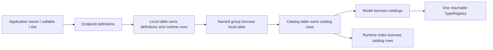

# Таблиці, каталоги й IDs

Автори: Ruslan Kovtun (shpegun60), codexAi. SPDX-License-Identifier: MIT.

[Посібник](README.md) · [Native reference](NativeApi.md) ·
[API шпаргалка](API-CHEATSHEET.md) · [Архітектура](../Architecture.md)

Наступний рівень над catalogs — [Model](Model.md); canonical byte
operations і caller-owned scratch описує [Codec and Workspace](CodecAndWorkspace.md).

Definition описує один endpoint. Local table зберігає definitions у
порядку оголошення; catalog table групує named local tables. Ці об'єкти
дають compile-time typed виклик і checked runtime selection до тих самих
callbacks. Повний приклад із усіма families —
[Native.cpp](../../examples/user_guide/Native.cpp); multi-file розкладка —
[Api.cpp](../../examples/device_integration/Api.cpp).

## Навігація

- [Як пов'язані об'єкти](#як-повязані-обєкти)
- [Оголосити таблиці та каталоги](#оголосити-таблиці-та-каталоги)
- [Local table API](#local-table-api)
- [Catalog table API](#catalog-table-api)
- [Побудувати та перевірити IDs](#побудувати-та-перевірити-ids)
- [Обійти definitions або metadata](#обійти-definitions-або-metadata)
- [Runtime indexes](#runtime-indexes)
- [Lifetime та порядок declarations](#lifetime-та-порядок-declarations)
- [Приклади й наступний крок](#приклади-й-наступний-крок)

## Як пов'язані об'єкти



Field, Command і Service мають окремі table/catalog/index families.
Table не зберігає копії live device values. Catalog не створює нові
owners; group позичає named lvalue local table. Model формує спільний
structural registry, а callable access лишається у declarations/indexes.

## Оголосити таблиці та каталоги

Нижче повні declarations простого consumer; statements у наступних
фрагментах використовують ці named objects. Для runnable `main` і всієї
перевірки використайте [Native.cpp](../../examples/user_guide/Native.cpp).

```cpp
#include <telemetry/Telemetry.hpp>
#include <cstdint>

namespace table_demo {
namespace ts = telemetry;

struct Snapshot { std::uint32_t count; };
inline std::uint32_t count = 7;
inline std::uint32_t readCount() noexcept { return count; }
inline ts::WriteResult writeCount(std::uint32_t next) noexcept {
    count = next;
    return ts::WriteResult::Applied;
}
inline ts::CommandResult reset() noexcept {
    count = 0;
    return ts::CommandResult::Executed;
}
inline Snapshot snapshot() noexcept { return {count}; }

inline constexpr ts::FieldTable localFields{
    ts::field<&readCount, &writeCount>("Count")};
inline constexpr ts::CommandTable localCommands{ts::command<&reset>("Reset")};
inline constexpr ts::ServiceTable localServices{ts::service<&snapshot>("Snapshot")};

inline constexpr ts::FieldCatalogTable fields{ts::group("state", localFields)};
inline constexpr ts::CommandCatalogTable commands{ts::group("control", localCommands)};
inline constexpr ts::ServiceCatalogTable services{ts::group("queries", localServices)};
inline constexpr ts::Model model{fields, commands, services};
} // namespace table_demo
```

Порядок entry у local table визначає Position. Порядок `group` у catalog
визначає Group. Reordering змінює IDs і descriptor навіть при незмінних
callback names. Для кожної категорії ведіть власні named Position/Group
constants; не переносіть local enum прямо у runtime packed-ID API.

## Local table API

`Position` далі — compile-time index чи local scoped enum position.
`position` — runtime integral/local enum input. Typed `get` повертає
const reference на concrete definition.

| Family | Signature / call form | Результат і дія |
| --- | --- | --- |
| Field | `read<Position>()` | Exact owning/borrowed getter result |
| Field | `write<Position>(value)` | Exact setter input; `WriteResult` |
| Field | `readAs<To, Position>()`, `readAs<To>(position)` | Owning `optional<To>` із checked numeric/exact structural access |
| Field | `writeAs<Position>(value)`, `writeAs(position, value)` | Checked conversion до endpoint T; `WriteResult` |
| Command | `call<Position>()`, `call<Position>(request)` | `CommandResult` |
| Command | `call(position[, request])` | Рекомендований runtime `CommandCallStatus` |
| Command | Low-level `callAs(position[, request])` | `NativeCallResult<CommandResult>` із checked exact selection |
| Service | `call<Position>()`, `call<Position>(request)` | Exact owning/borrowed Service result |
| Service | `callAs<Response>(position[, request])` | Рекомендований owning `ServiceCallResult<Response>`, також для `void` |
| Service | `callBorrowed<Response>(position[, request])` | Рекомендований `BorrowedServiceCallResult<Response>` const view |
| Service | Low-level `callAs<Result>(position[, request])` | `NativeCallResult<Result>` із exact Request/Result |
| Усі | `get<Position>()` | Concrete definition; endpoint не виконується |
| Усі | `forEach(visitor)` | Ordered typed visitor на кожну definition |
| Усі | `forEachWhile(visitor)` | Exact-`bool` visitor; false зупиняє обхід, результат означає повний прохід |
| Усі | `visit(position, visitor)` | `bool` знайдено; visitor отримує concrete definition |
| Усі | `size()`, `empty()`, `data()`, `begin()`, `end()` | Erased rows/metadata; callbacks не викликаються |
| Усі | `operator[](std::size_t)` | Unchecked erased row; caller забезпечує index < size |

Для runtime ID використовуйте Command `call`, owning Service `callAs<Response>`
і borrowed Service `callBorrowed<Response>`. Service має один `hasValue()` /
explicit `bool` для routing **та** application success, один `value()` та
спільний `ServiceCallStatus`. Command повертає один `CommandCallStatus`.
Exact Request/Response/ownership mismatch дає `SignatureMismatch` до callback;
invalid/absent ID дає `NotFound`. Borrowed lifetime/synchronization rules
збережено, response copy/move чи heap фасад не додає.
Signatures та mapping: [Flat runtime API](FlatNative.md).

Збережені low-level Command `callAs` і Service `callAs<Result>` підтримують один exact
native Request та exact result wrapper caller. `NotFound` означає invalid або
absent position/ID; `SignatureMismatch` — інший declared Request/Result без
callback. Selection `Ok` доставляє endpoint result, також `Busy`/`Unavailable`;
outer `hasValue()` не є Service payload `hasValue()`. Для custom typed branches
лишається `visit`; для bytes — encoded index. Getter ownership і result
handling описані в [Native API](NativeApi.md).

Фрагмент application function після declarations вище:

```cpp
void useLocalTable() {
    using namespace table_demo;
    const auto value = localFields.read<0>();
    const auto written = localFields.write<0>(std::uint32_t{9});
    const auto resetStatus = localCommands.call<0>();
    const auto reply = localServices.call<0>();
    if (value && written == ts::WriteResult::Applied &&
        resetStatus == ts::CommandResult::Executed && reply.hasValue()) {
        const auto observed = reply.value().count;
        (void)observed;
    }
}
```

## Catalog table API

`Id` — compile-time packed u32 ID; `id` — runtime integral packed ID.
У table Position local; у catalog Id global. Signatures не вимагають
пошуку за name.

| Family | Signature / call form | Результат |
| --- | --- | --- |
| Field | `read<Id>()`, `write<Id>(value)` | Exact getter result / `WriteResult` |
| Field | `readAs<To, Id>()`, `readAs<To>(id)` | Owning `optional<To>` |
| Field | `writeAs<Id>(value)`, `writeAs(id, value)` | Checked `WriteResult` |
| Command | `call<Id>(request)` або `call<Id>()` | `CommandResult` |
| Command | `call(id[, request])` | Рекомендований runtime `CommandCallStatus` |
| Command | Low-level `callAs(id[, request])` | `NativeCallResult<CommandResult>` |
| Service | `call<Id>(request)` або `call<Id>()` | Endpoint-specific Service result |
| Service | `callAs<Response>(id[, request])` | Рекомендований owning `ServiceCallResult<Response>` |
| Service | `callBorrowed<Response>(id[, request])` | Рекомендований borrowed `BorrowedServiceCallResult<Response>` |
| Service | Low-level `callAs<Result>(id[, request])` | `NativeCallResult<Result>` |
| Усі | `get<Id>()` | Concrete definition у вибраній local table |
| Усі | `forEach(visitor)` | Group name та concrete definition |
| Усі | `forEachWhile(visitor)` | Group name та concrete definition; exact-`bool` continuation |
| Усі | `forEachEntry(visitor)` | Packed ID, group name та borrowed erased row |
| Усі | `forEachEntryWhile(visitor)` | Erased row visitor з exact-`bool` continuation |
| Усі | `visit(id, visitor)` | `bool` selection, concrete definition |
| Усі | `index()` | Copyable borrowed FieldIndex/CommandIndex/ServiceIndex |
| Усі | `size()`, `empty()`, range-for, `operator[]` | Metadata груп; `size()` рахує groups, не endpoints |

Compile-time Group/Position поза actual tables відхиляється при compilation.
Runtime `visit` повертає false без visitor для invalid ID. `forEach` і `visit`
ігнорують callback result; `bool` selection від `visit` не є endpoint result.

## Побудувати та перевірити IDs

`PackedId` — u32; старші 16 bits — Group, молодші — Position. Field,
Command і Service мають окремі spaces: той самий numeric ID може існувати
в усіх трьох із різним змістом.

| API | Контракт |
| --- | --- |
| `makeId<Group, Position>()` | Compile-time width validation компонентів |
| `makeId(group, position)` | Packing valid 16-bit components; wider inputs перевіряються до narrowing |
| `tryMakeId(group, position)` | `optional<PackedId>`; refusal для negative/>65535 components |
| `groupOf(id)`, `indexOf(id)` | Decompose valid u32 ID; invalid input порушує контракт |
| `tryGroupOf(id)`, `tryIndexOf(id)` | Optional decomposition для external input |
| `catalog.index().find(id)` | Pointer на row або nullptr; перевіряє існування Group/Position |

Width check не перевіряє існування endpoint. Фрагмент із declarations вище:

```cpp
void selectCount(std::uint64_t group, std::uint64_t position) {
    using namespace table_demo;
    constexpr auto countId = ts::makeId<0, 0>();
    const auto exact = fields.read<countId>();
    const auto runtimeId = ts::tryMakeId(group, position);
    if (runtimeId && fields.index().find(*runtimeId)) {
        const auto number = fields.readAs<double>(*runtimeId);
        (void)number;
    }
    (void)exact;
}
```

## Обійти definitions або metadata

Typed traversal зберігає exact native type. Звичайний visitor приймає
definition; templated visitor додатково дістає compile-time position.
Catalog visitor отримує group name та definition, і може мати `<G, I>`.

`forEachWhile` приймає ті самі typed signatures. Visitor повертає саме `bool`:
`true` продовжує, `false` зупиняє наступні invocations у всіх наступних groups.
Метод повертає `true` після повного обходу, також для порожньої table/catalog;
повернений visitor-ом `false` дає результат `false`, навіть на останньому row.
Усі typed branches мають компілюватися незалежно від runtime зупинки.

```cpp
void inspectDefinitions() {
    using namespace table_demo;
    localFields.forEach([]<std::size_t I>(const auto& definition) {
        const auto value = definition.read(); // explicit callback
        (void)I;
        (void)value;
    });
    fields.forEach([]<std::size_t G, std::size_t I>(
                       std::string_view group, const auto& definition) {
        constexpr auto id = ts::makeId<G, I>();
        (void)group;
        (void)definition;
        (void)id;
    });
    const bool found = fields.visit(ts::makeId<0, 0>(), [](const auto& definition) {
        const auto result = definition.read();
        (void)result;
    });
    (void)found;
}
```

Range-for дає erased metadata rows. Він не читає live values:

```cpp
void inspectRows() {
    for (const auto& group : table_demo::fields) {
        const std::string_view name = group.name;
        for (std::uint32_t i = 0; i < group.count; ++i) {
            const auto& entry = group.entries[i];
            const auto bytes = entry.wireBytes;
            (void)bytes;
        }
        (void)name;
    }
}
```

Для плоского обходу catalog та його runtime index мають `forEachEntry`.
Callback отримує `(PackedId, std::string_view, const Entry&)`; `Entry` —
`FieldEntry`, `CommandEntry` чи `ServiceEntry` відповідної family. Rows ідуть
у порядку group/entry declaration; порожні groups пропускаються, ID зберігає
actual group position. Callback result ігнорується. `forEachEntryWhile` має
таку саму signature та exact-`bool` continuation, як typed `forEachWhile`.

```cpp
void inspectFlatRows() {
    table_demo::fields.index().forEachEntry(
        [](telemetry::PackedId id, std::string_view group,
           const telemetry::FieldEntry& entry) {
            (void)id;
            (void)group;
            (void)entry.wireBytes;
        });
}
```

Visitors позичають original definitions/rows, не копіюються і не викликають
endpoint самі по собі. Table/catalog traversal потребує lvalue; copyable
runtime index можна використати як temporary, доки backing tables живуть.

Visitor exceptions, якщо вони увімкнені, передаються caller. Endpoint
callbacks лишаються `noexcept`. Не обробляйте erased raw function pointers
як checked API: відповідні `readEncoded`/`writeEncoded`/`executeEncoded`/
`callEncoded` methods виконують required buffer checks.

## Runtime indexes

| Index | Checked method | Input/output |
| --- | --- | --- |
| `FieldIndex` | `readEncoded(id, output, workspace)` | `EncodedReadResult` із dispatch та written |
| `FieldIndex` | `writeEncoded(id, input, workspace)` | `EncodedWriteResult` із dispatch і endpoint status |
| `CommandIndex` | `executeEncoded(id, input, workspace)` | `EncodedCommandResult` |
| `ServiceIndex` | `callEncoded(id, input, output, workspace)` | `EncodedCallResult` |
| Усі | `find(id)`, `count()`, `catalogs()` | Lookup pointer; число groups; borrowed metadata array |
| Усі | `forEachEntry(visitor)`, `forEachEntryWhile(visitor)` | Flat borrowed rows у packed-ID порядку; continuation лише в `While` |

Index copy позичає ті самі backing rows; він не подовжує lifetime чи
серіалізує owners. [Encoded.cpp](../../examples/user_guide/Encoded.cpp)
показує альтернативний compiled Model adapter і перевірку результатів.

## Lifetime та порядок declarations

Local tables і catalog tables **noncopyable/nonmovable**. Runtime
contexts/indexes можуть вказувати на їхні власні arrays/definitions.
Names, owner/callable/slot storage, local tables і catalogs мають жити
довше за всі views і операції consumers. Borrowing APIs відхиляють
temporary/xvalue tables, але не можуть подовжити lifetime object,
прихованого всередині application helper.

```text
owner / callable / slot storage
    → local tables
    → catalog tables
    → Model / indexes / providers
    → consumers
```

Можна тримати tables/catalogs у integration `.cpp` і віддати public
facade functions або `ModelView`. Consumer compile-time `read<Id>`
потребує concrete declaration; erased `ModelView` дає runtime access.
Такий facade показує [device integration](../../examples/device_integration/README.md).

## Приклади й наступний крок

| Задача | Повна програма / guide |
| --- | --- |
| Всі exact/As/traversal/slot форми | [Native.cpp](../../examples/user_guide/Native.cpp), [Native API](NativeApi.md) |
| Приховати tables за `.hpp/.cpp` facade | [Api.hpp](../../examples/device_integration/Api.hpp), [Api.cpp](../../examples/device_integration/Api.cpp) |
| Додати structural metadata та encoded operations | [Architecture](../Architecture.md), [Encoded.cpp](../../examples/user_guide/Encoded.cpp) |
| Віддати descriptor/values як файли | [Descriptor and Values](DescriptorAndValues.md) |
| Run/build commands | [Example README](../../examples/user_guide/README.md), [example checks](../../tests/docs/README.md) |
